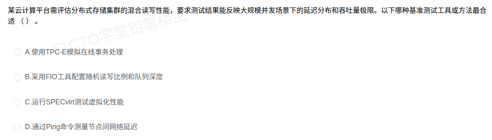

# 备考笔记：存储性能基准测试工具-FIO

## 一、题目

> 某云计算平台需评估分布式存储集群的混合读写性能，要求测试结果能反映大规模并发场景下的延迟分布和吞吐量极限。以下哪种基准测试工具或方法最合适（ ）。
> A. 使用TPC-E模拟在线事务处理
> B. 采用FIO工具配置随机读写比例和队列深度
> C. 运行SPECvirt测试虚拟化性能
> D. 通过Ping命令测量节点间网络延迟

**答案：B. 采用FIO工具配置随机读写比例和队列深度**

## 二、知识点：存储性能基准测试工具-FIO

### 1. 核心原理

FIO（Flexible I/O Tester）是一款灵活的 I/O 基准测试工具，可对块设备、文件系统、网络存储发起受控的读写负载，并能输出**延迟百分位（p99/p99.9）**、**IOPS**、**带宽吞吐量（BW）** 等关键指标。在大规模并发场景下，通过调整队列深度（iodepth）和线程数（numjobs），可模拟从单线程低并发到数百线程高并发的负载谱，从而刻画存储系统在压力下的真实表现。

### 2. 关键公式/规则

| 名称 | 表达式/规则 |
| --- | --- |
| IOPS | 每秒完成的 I/O 操作数，FIO 中由 `iops` 字段直接统计 |
| 带宽吞吐量 | BW = IOPS × 单 I/O 大小（如 4KB），FIO 由 `bw` 字段给出 |
| 延迟百分位 | FIO 输出 `lat_ns` 分布；常用 `clat_percentiles=1:99:99.9:99.99` |
| 队列深度 | `--iodepth=N`，控制单线程并发未完成 I/O 数 |
| 读写混合比 | `--rwmixread=70` 表示 70% 读、30% 写（典型 OLTP 比例） |
| IO 引擎 | `--ioengine=libaio`（异步 Linux AIO）、`psync`、`io_uring` |

### 3. 解题步骤

1. **识别题干关键词**：题目强调「分布式存储集群」「混合读写」「大规模并发」「延迟分布」「吞吐量极限」→ 锁定存储 I/O 性能测试维度。
2. **排除非存储类工具**：TPC-E（事务处理）、SPECvirt（虚拟化综合）、Ping（网络 RTT）均与「存储读写性能」主题不相关。
3. **匹配工具特性**：FIO 原生支持配置随机/顺序读写比例、队列深度、块大小，能同时输出延迟分布与吞吐量 → 与需求完全契合。
4. **判定答案**：选 B。

## 三、易错点

1. **TPC-E ≠ 存储读写测试**：TPC-E 是 OLTP 事务型基准，衡量 TPS（每秒事务数），其内部虽有读写，但负载模型与「存储集群读写性能评估」不是同一维度。
2. **SPECvirt 是虚拟化综合测试**：测的是整台虚拟化服务器的吞吐能力（含 CPU/内存/IO），并非存储读写专精工具。
3. **Ping 仅测网络延迟**：节点间 RTT 反映的是网络路径，与存储节点内部 IO 调度、磁盘介质延迟无关。
4. **延迟分布 ≠ 平均延迟**：测试报告中只有平均值会掩盖长尾问题，必须关注 p99/p999 等百分位，FIO 支持该输出。

## 四、扩展延伸

- **TPC 系列对比**：
  - TPC-C：OLTP 经典基准
  - TPC-E：金融事务型 OLTP（替代 TPC-C）
  - TPC-H：决策支持（DSS/分析型）
  - TPC-DS：大数据决策支持
- **其他存储测试工具**：
  - **vdbench**：与 FIO 类似的企业级工具
  - **iozone**：侧重文件系统级测试
  - **dd**：粗粒度顺序读写测试，测试管道性能差（受 page cache 影响大）
  - **fio-3.30+**：支持 io_uring 引擎，NVMe 性能更准确
- **队列深度的意义**：队列深度越大，设备并行能力越被压榨，IOPS 提升但单 IO 延迟可能上升——典型的「并发 vs 延迟」取舍。
- **现实类比**：FIO 像「可调参数的汽车马力测试台」，能精确测出 0-100km/h 加速（延迟）、极速（吞吐）、极限工况（队列深度）下的稳定性。

## 五、错题归档

| 题号 | 题型 | 考点 | 难度 | 掌握度 |
| --- | --- | --- | --- | --- |
| 截图 2026-09-17 23-07-19 | 选择题 | 基准测试工具与适用场景 | 中 | 已掌握 |

## 六、相关图片

原题截图保存：`./images/01-存储性能基准测试工具-FIO.png`

