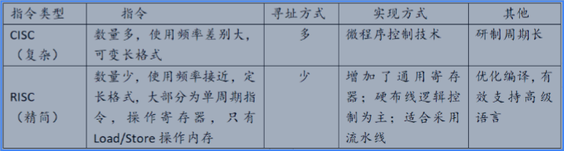

# 备考笔记：CISC与RISC指令集对比

## 一、题目

> （本题为知识点对照表，非选择题）CISC 与 RISC 在指令类型、指令特征、寻址方式、实现方式及其他方面的对比：
>
> | 指令类型 | 指令 | 寻址方式 | 实现方式 | 其他 |
> | --- | --- | --- | --- | --- |
> | CISC（复杂） | 数量多，使用频率差别大，可变长格式 | 多 | 微程序控制技术 | 研制周期长 |
> | RISC（精简） | 数量少，使用频率接近，定长格式，大部分为单周期指令，操作寄存器，只有 Load/Store 操作内存 | 少 | 增加了通用寄存器；硬布线逻辑控制为主；适合采用流水线 | 优化编译，有效支持高级语言 |

**答案：核心结论——CISC 走「指令多而全、微程序解释、研制周期长」的复杂路线；RISC 走「指令少而齐、定长单周期、硬布线+流水线、优化编译器」的精简路线。**

## 二、知识点：CISC与RISC指令集对比

### 1. 核心原理

**CISC（Complex Instruction Set Computer，复杂指令集计算机）** 的设计思路是「用一条指令完成一个复杂动作」：指令数量庞大（常有几百条），使用频率差异很大（20% 的指令占了 80% 的执行次数），指令长度可变，寻址方式繁多。因为指令复杂，硬件难以直接用组合逻辑实现，故多采用**微程序控制技术**——把一条机器指令翻译成一段微指令序列来执行，代价是速度较慢、设计验证工作量大、**研制周期长**。典型代表：x86。

**RISC（Reduced Instruction Set Computer，精简指令集计算机）** 的设计思路是「只保留高频简单指令，把复杂动作交给多条指令组合」：指令数量少、使用频率接近，采用**定长格式**，绝大多数指令可在**单周期**内完成。计算只在**寄存器**之间进行，访存仅由 **Load/Store** 两条指令承担（Load/Store 架构）。由于指令简单规整，用**硬布线逻辑控制**（组合逻辑电路）即可实现，速度快，并且特别适合**流水线（pipeline）** 执行；同时指令规整让编译器更容易做优化，从而**有效支持高级语言**。典型代表：ARM、MIPS、RISC-V。

### 2. 关键公式/规则

| 维度 | CISC（复杂） | RISC（精简） |
| --- | --- | --- |
| 指令数量 | 多 | 少 |
| 使用频率 | 差别大 | 接近 |
| 指令格式 | 可变长 | 定长 |
| 执行周期 | 多为多周期 | 大部分为单周期 |
| 寻址方式 | 多 | 少 |
| 访存方式 | 多数指令可直接访存 | 只有 Load/Store 访存，其余操作寄存器 |
| 控制实现 | 微程序控制技术 | 硬布线逻辑控制为主 |
| 寄存器 | 较少 | 增加了通用寄存器 |
| 流水线 | 不易/受限 | 适合采用流水线 |
| 编译器/高级语言 | 支持一般 | 优化编译，有效支持高级语言 |
| 研制周期 | 长 | 较短 |
| 代表 | x86 | ARM、MIPS、RISC-V |

一句话记忆法：**CISC「多、变、微程序、周期长」；RISC「少、定、硬布线、流水线」。**

### 3. 解题步骤

1. **看指令数量与格式**：出现「数量多、可变长」→ 判 CISC；「数量少、定长」→ 判 RISC。
2. **看访存与周期**：「只有 Load/Store 操作内存」「大部分单周期指令」→ RISC 的标志性特征。
3. **看控制方式**：「微程序控制」→ CISC；「硬布线逻辑控制」「增加通用寄存器」→ RISC。
4. **看流水线适配性**：「适合采用流水线」「优化编译、支持高级语言」→ RISC 的衍生优势。
5. **反推校验**：若题目描述中出现「研制周期长」，往往是从 CISC 复杂度的缺点出发的考点。

## 三、易错点

1. **「RISC 指令少所以性能差」是错的**：RISC 靠流水线、硬布线控制和编译器优化，单位时间吞吐反而更高；指令少是指令集精简，不代表能力弱。
2. **寻址方式数量别记反**：CISC 寻址方式**多**，RISC 寻址方式**少**（这也是 RISC 能定长编码的前提）。
3. **访存限制只属于 RISC**：RISC 中只有 Load/Store 能访问内存，运算指令只作用于寄存器；CISC 则允许算术/逻辑指令直接以内存为操作数。
4. **微程序 ≠ 更快**：微程序控制扩大指令集的灵活性，但需多级微指令解释，执行速度慢于硬布线逻辑控制，这是 CISC 的固有取舍。
5. **定长与单周期不是同一概念**：定长格式是「编码长度一致」，单周期是「执行所需时钟周期数」，二者都是 RISC 特征但描述的是不同维度。
6. **别把「使用频率差别大」记成 RISC**：CISC 中指令使用频率差别大（少数指令高频），RISC 中各指令使用频率接近——这一句常在选择题里设成干扰项。

## 四、扩展延伸

- **指令集演进的「融合」趋势**：现代 x86 处理器内部把复杂指令译码成类 RISC 的微操作（micro-ops）再乱序执行，即「CISC 外壳 + RISC 内核」；而 ARM 也在不断扩充指令集（如 SIMD/NEON），二者界限逐渐模糊。
- **一个常被考的配套考点——指令周期**：取指 → 译码 → 执行 → 访存 → 写回，RISC 的定长指令让各阶段耗时均衡，这正是流水线不易断流的原因；CISC 可变长指令会造成流水线气泡。
- **流水线（pipeline）三种相关**：结构相关、数据相关、控制相关，RISC 定长、单周期、Load/Store 的设计恰好把这三类相关降到最低。
- **Load/Store 架构**：也叫寄存器-寄存器架构（R-R 架构），与之相对的是寄存器-存储器架构（R-S 架构）。
- **现实类比**：CISC 像「一个按键完成一键下单」的功能机（功能多但每个键硬件复杂）；RISC 像「只保留几个基础按键 + 靠组合快捷键完成任务」的极简遥控器（按键简单，但靠流水线般的连击快速完成）。
- **国产化语境**：RISC-V 作为开放指令集，正是 RISC 思想在当下的代表，也是信创与嵌入式/物联网方向的高频考点。

## 五、错题归档

| 题号 | 题型 | 考点 | 难度 | 掌握度 |
| --- | --- | --- | --- | --- |
| 用户上传图（CISC/RISC 对照表） | 知识点对照表 | 计算机体系结构-指令系统 CISC/RISC 特性辨析 | 中 | 待复习 |

## 六、相关图片

原题截图保存：`./images/02-CISC与RISC指令集对比.png`

