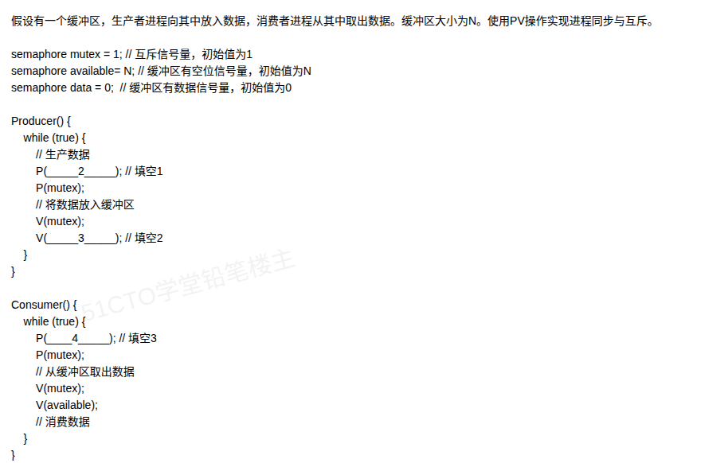
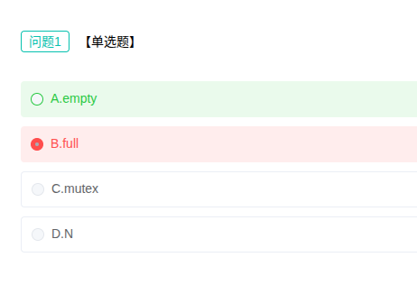

# 备考笔记：生产者消费者问题-PV操作

## 一、题目

> 假设有一个缓冲区，生产者进程向其中放入数据，消费者进程从中取出数据。缓冲区大小为 N。使用 PV 操作实现进程同步与互斥。
>
> ```
> semaphore mutex = 1;        // 互斥信号量，初始值为1
> semaphore available = N;    // 缓冲区有空位信号量，初始值为N
> semaphore data = 0;         // 缓冲区有数据信号量，初始值为0
>
> Producer() {
>     while (true) {
>         // 生产数据
>         P(____2____);       // 填空1
>         P(mutex);
>         // 将数据放入缓冲区
>         V(mutex);
>         V(____3____);       // 填空2
>     }
> }
>
> Consumer() {
>     while (true) {
>         P(____4____);       // 填空3
>         P(mutex);
>         // 从缓冲区取出数据
>         V(mutex);
>         V(available);
>         // 消费数据
>     }
> }
> ```
>
> 问题1【单选题】：填空1 应填入（ ）。
> A. empty　B. full　C. mutex　D. N

**答案：填空1 = A. empty（即代码中的 `available`，写全为 P(available)）；填空2 = full（即 V(data)）；填空3 = full（即 P(data)）**

> **命名说明（本题关键）**：`empty` / `full` 不是本题声明的变量，而是操作系统教材对生产者-消费者问题的**标准信号量命名**——`empty` = 空位个数（初值 N），`full` = 已有数据个数（初值 0）。本题代码把这两个信号量改名成了 `available`（初值 N）和 `data`（初值 0），二者语义一一对应：`available ≡ empty`，`data ≡ full`。

## 二、知识点：生产者消费者问题-PV操作

### 1. 核心原理

生产者-消费者问题是**进程同步与互斥**的经典模型。缓冲区是临界资源，两类进程对它的约束有两条：

- **互斥约束**：同一时刻只能有一个进程操作缓冲区 → 用互斥信号量 `mutex` 把「放入/取出」动作包在 `P(mutex)…V(mutex)` 之间。
- **同步约束**：生产者不能在缓冲区满时放入，消费者不能在缓冲区空时取出 → 用两个**资源计数信号量**描述缓冲区里的「空位数」和「数据数」。

本题声明了三个信号量：

- `mutex = 1`：互斥信号量；
- `available = N`：**空位**计数信号量（初始有 N 个空位），语义上就是教科书里的 `empty`；
- `data = 0`：**数据**计数信号量（初始没有产品），语义上就是教科书里的 `full`。

**PV 动作的配对规律**：生产者「申请一个空位 → 放入 → 增加一个数据」；消费者「申请一个数据 → 取出 → 归还一个空位」。所以：

```
Producer:  P(empty/available) → P(mutex) → 放入 → V(mutex) → V(full/data)
Consumer:  P(full/data)       → P(mutex) → 取出 → V(mutex) → V(empty/available)
```

### 2. 关键公式/规则

| 名称 | 作用 | 初值 | 生产者动作 | 消费者动作 |
| --- | --- | --- | --- | --- |
| mutex | 缓冲区互斥 | 1 | P 后 V | P 后 V |
| empty（本题写作 available） | 空位计数 | N | **先 P**（占一个空位） | **最后 V**（还一个空位） |
| full（本题写作 data） | 数据计数 | 0 | **最后 V**（多一个数据） | **先 P**（等一个数据） |

三条铁律：

1. **同步信号量的 P 在互斥 P 之前**：`P(empty)` → `P(mutex)`，两把锁的加锁顺序不能颠倒；
2. **同步信号量的 V 在互斥 V 之后**：`V(mutex)` → `V(full)`，先出临界区再唤醒对方；
3. **mutex 的 P、V 必须成对**出现在同一进程内，且紧包临界区。

### 3. 解题步骤

1. **认信号量语义**：初值为 N 的是「空位」（empty/available），初值为 0 的是「数据」（full/data），初值为 1 的是互斥量 mutex。
2. **看谁在等**：生产者等空位 → 填空1 = **empty**；消费者等数据 → 填空3 = **full**。
3. **看谁在放**：生产者放完数据要通知消费者「有数据了」→ 填空2 = **full**。
4. **校验配对**：生产者 P(empty)/V(full)，消费者 P(full)/V(available)，一进一出正好抵消，缓冲区计数守恒。
5. **对照选项**：填空1 选 A. empty。

## 三、易错点

1. **填空1 别选 mutex**：`mutex` 已经写在了下一行 `P(mutex)`，同一个进程不可能连加两次互斥锁；`N` 是初值不是信号量名，不能填。
2. **两个 P 的顺序不能反**：必须 `P(empty)` 在 `P(mutex)` 之前。若写成 `P(mutex); P(empty);`，一旦缓冲区满，生产者会抱着 mutex 去等 empty，导致消费者永远拿不到 mutex 而**死锁**。
3. **两个 V 的顺序不能反**：生产者必须 `V(mutex)` 在前、`V(full)` 在后。若先 `V(full)` 再 `V(mutex)`，消费者可能被唤醒后立刻阻塞在 mutex 上，虽不致命但会产生无谓的上下文切换（部分教材判为错误写法）。
4. **填空2 与填空3 同名但动作不同**：填空2 是 `V(full)`（生产者释放资源），填空3 是 `P(full)`（消费者申请资源）。V 是加一、P 是减一，别把 V 当 P。
5. **本题命名前后不一致（最易卡壳处）**：题干声明的是 `available`/`data`，选项与答案用的却是 `empty`/`full`，两套名字混用。原因是 `empty`/`full` 是教材对这两个信号量的**标准命名**，出题人沿用了标准答案的说法。做题时按**语义**映射：空位 → `empty`（=available），数据 → `full`（=data）。三条对应证据：① 初值 `available=N` / `data=0` 与 `empty=N` / `full=0` 完全一致；② 注释「空位信号量」「数据信号量」就是二者的定义；③ 消费者中已写好的 `V(available)` 即标准写法里的 `V(empty)`。切勿因为代码里搜不到 `empty` 字样就改选 `mutex` 或 `N`。
6. **PS 与 PV 的位置**：消费者里已经给出了 `V(available)`，说明「取完数据归还空位」是它负责的动作，正好与生产者 `P(empty)` 呼应，可作为自查锚点。

## 四、扩展延伸

- **同一模型的三种变体**（软考高频）：
  - 缓冲区大小为 1 → 退化为「互斥即同步」，可省掉 mutex；
  - 多个缓冲区、多生产者/多消费者 → 三信号量版本即本题；
  - 读者-写者问题 → 用 `rcount` + `mutex` 控制读者计数，写者独占。
- **信号量取值范围**：`empty` 取值 [0, N]，`full` 取值 [0, N]，且恒有 `empty + full = N`（本题即 `available + data = N`），这是检查答案是否写反的快捷质检式。
- **PV 操作的本质**：P 是「申请资源 / 减一 / 可能阻塞」，V 是「释放资源 / 加一 / 可能唤醒」。同步是「有先后约束」，互斥是「有排他约束」，二者常被混用。
- **死锁三条件中的「循环等待」**：PV 题中「先 P 互斥再 P 同步」正是构造循环等待的经典手段，所以顺序规则是硬性要求。
- **现实类比**：缓冲区像餐厅的**取餐窗口**（N 个格子），生产者是后厨（要把菜放上架，架子满了就得等），消费者是顾客（要取菜，架子空了就得等），mutex 是「一次只允许一个人伸手到窗口」的规矩。

## 五、错题归档

| 题号 | 题型 | 考点 | 难度 | 掌握度 |
| --- | --- | --- | --- | --- |
| 用户上传图（第 1 题误选 B. full） | 单选题（代码填空） | 操作系统-进程管理 生产者消费者 PV 操作信号量选择 | 中 | 待复习 |

## 六、相关图片

原题截图保存：`./images/04-生产者消费者问题-PV操作.png`
选项截图保存：`./images/04-生产者消费者问题-PV操作-选项.png`




