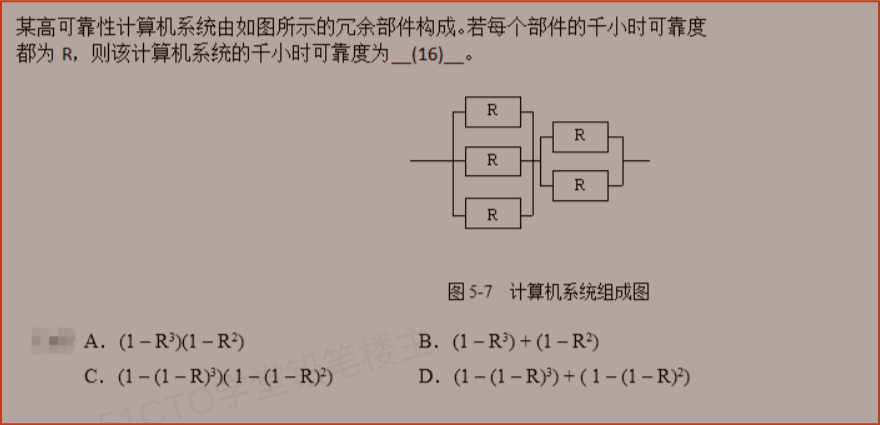

# 备考笔记：系统可靠性-串并联冗余模型

## 一、题目

> 某高可靠性计算机系统由如图所示的冗余部件构成。若每个部件的千小时可靠度都为 $$R$$，则该计算机系统的千小时可靠度为（  ）。
>
> 
>
> A. $$(1 - R^3)(1 - R^2)$$
> B. $$(1 - R^3) + (1 - R^2)$$
> C. $$\left(1 - (1 - R)^3\right)\left(1 - (1 - R)^2\right)$$
> D. $$\left(1 - (1 - R)^3\right) + \left(1 - (1 - R)^2\right)$$

**答案：C. $$\left(1 - (1 - R)^3\right)\left(1 - (1 - R)^2\right)$$**

## 二、知识点：系统可靠性-串并联冗余模型

### 1. 核心原理

系统由若干部件按**串联**或**并联**方式组合，可靠度按结构逐层计算：

- **串联**：所有部件都必须正常工作，系统才可靠。任一部件失效则系统失效，因此可靠度**相乘**，且必然**低于**任一单部件。
- **并联（冗余）**：只要有一个部件正常，系统就正常。全部失效系统才失效，因此**先求全部失效概率再取反**，可靠度**高于**单部件。

本题结构：左侧 **3 个部件并联**成一个支路，右侧 **2 个部件并联**成另一个支路，两支路**串联**。

### 2. 关键公式/规则

| 名称 | 表达式 |
| --- | --- |
| 串联系统可靠度（n 个部件） | $$R_s = R_1 \times R_2 \times \cdots \times R_n$$ |
| 并联系统可靠度（n 个部件） | $$R_p = 1 - (1 - R_1)(1 - R_2)\cdots(1 - R_n)$$ |
| n 个相同部件并联 | $$R_p = 1 - (1 - R)^n$$ |
| 混合结构 | 先算各并联/串联子模块，再按外层结构合成 |

> 记忆口诀：**串联相乘（越串越差），并联取反乘（越并越好）**。

### 3. 解题步骤

1. **识别结构**：三个部件先并联，构成子系统 A；两个部件再并联，构成子系统 B；A 与 B **串联**。
2. **算子模块 A**（3 个并联）：

   $$R_A = 1 - (1 - R)^3$$

3. **算子模块 B**（2 个并联）：

   $$R_B = 1 - (1 - R)^2$$

4. **串联合成**：

   $$R_{sys} = R_A \times R_B = \left(1 - (1 - R)^3\right)\left(1 - (1 - R)^2\right)$$

   故选 **C**。

## 三、易错点

1. **串联是乘、并联也是"乘"容易混**：串联直接乘可靠度 $$R_i$$；并联是乘**失效度** $$1 - R_i$$ 再取反，两者结构完全不同。
2. **选项 A 是典型陷阱**：$$(1 - R^3)(1 - R^2)$$ 相当于把"串联公式"套在并联上——它算的是"三个部件都失效"与"两个部件都失效"同时发生，恰好是**系统全部失效**的概率，正好与正确答案互补，切勿误选。
3. **B、D 用加法是错的**：可靠性是概率，串联不能相加；加法会让结果可能大于 1，明显不合理。
4. **数清并联个数**：左侧 3 个、右侧 2 个，指数不能写反；并联数越多可靠度越高。
5. **先内后外**：混合结构必须先算最内层子模块，再逐层向外合成，顺序颠倒会算错。

## 四、扩展延伸

- **冗余的价值**：单部件 $$R = 0.9$$ 时，2 个并联 $$1 - 0.1^2 = 0.99$$；3 个并联 $$1 - 0.1^3 = 0.999$$，可靠性提升显著但成本也上升。
- **串联的短板效应**：串联系统可靠度由最弱环节主导，部件越多越不可靠，故关键部件常做并联冗余。
- **典型混合模型**：常见的还有"先串联再并联""串并联嵌套"等，解题时都遵循**自内向外分层计算**。
- **现实类比**：串联像"接力赛"，任何一棒掉链子全队失败；并联像"多路供电/双机热备"，只要一路可用就不断电。
- **考点归属**：可靠性、可用性、失效率的计算同属**计算机系统性能与可靠性**，软考常以选择题形式出现，务必记牢串并联两公式。

## 五、错题归档

| 题号 | 题型 | 考点 | 难度 | 掌握度 |
| --- | --- | --- | --- | --- |
| 系统分析师-计算机组成与体系结构 | 单选 | 计算机系统-可靠性计算 串并联冗余模型 | 中 | 待复习 |

## 六、相关图片

原题截图：`./images/06-系统可靠性-串并联冗余模型.png`（由用户上传的原题截图复制改名而来）

