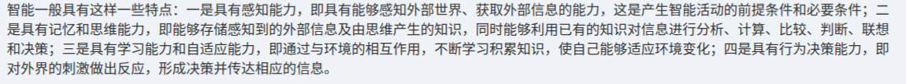

# 备考笔记：人工智能-智能的四大特征

## 一、题目

> 智能一般具有这样一些特点：一是具有感知能力，即具有能够感知外部世界、获取外部信息的能力，这是产生智能活动的前提条件和必要条件；二是具有记忆和思维能力，即能够存储感知到的外部信息及由思维产生的知识，同时能够利用已有的知识对信息进行分析、计算、比较、判断、联想和决策；三是具有学习能力和自适应能力，即通过与环境的相互作用，不断学习积累知识，使自己能够适应环境变化；四是具有行为决策能力，即对外界的刺激做出反应，形成决策并传达相应的信息。

**答案：智能（人工智能）的四大特点——感知能力、记忆和思维能力、学习能力和自适应能力、行为决策能力。**

> 说明：本图为教材原文（知识点陈述），未附选择题题干与选项，故第一节按原文摘录，考点为「智能的四大特征」的记忆与辨析。

## 二、知识点：人工智能-智能的四大特征

### 1. 核心原理

智能并不是单一能力，而是由四类能力递进构成的整体，四者顺序不能乱：

1. **感知能力**：能感知外部世界、获取外部信息。它是**前提条件和必要条件**——没有输入，后续一切智能活动都无从谈起。
2. **记忆和思维能力**：能**存储**感知到的信息与思维产生的知识，并能利用已有知识对信息做**分析、计算、比较、判断、联想和决策**。这是对信息的加工核心。
3. **学习能力和自适应能力**：通过与环境相互作用**不断学习、积累知识**，使自己能适应环境变化。强调的是**随时间演进**的能力。
4. **行为决策能力**：对外界刺激**做出反应**，形成决策并**传达**相应信息。这是把内部加工结果输出为行动的最后环节。

一句话记忆链：**感知（输入）→ 记忆思维（加工）→ 学习适应（演进）→ 行为决策（输出）**。

### 2. 关键公式/规则

| 特征 | 关键含义 | 在体系中的地位 |
| --- | --- | --- |
| 感知能力 | 感知外部世界、获取外部信息 | 前提条件和必要条件（第一位） |
| 记忆和思维能力 | 存储信息与知识；分析、计算、比较、判断、联想和决策 | 信息加工核心 |
| 学习能力和自适应能力 | 与环境相互作用，学习积累知识，适应环境变化 | 动态演进能力 |
| 行为决策能力 | 对外界刺激做出反应，形成决策并传达信息 | 输出与行动环节 |

> 辨析口诀：**感知是前提，记忆思维是核心，学习适应是演进，行为决策是输出**。

### 3. 解题步骤

1. **看题干问什么**：题目若问"智能的特点**不包括**"，就用四特征清单逐一比对，找不属于四类的干扰项。
2. **抓关键词对应**：题干出现"获取信息/感知世界"→ 感知能力；出现"分析、比较、判断、联想"→ 记忆和思维能力；出现"适应环境变化"→ 学习与自适应能力；出现"做出反应/传达信息"→ 行为决策能力。
3. **注意"前提和必要条件"**：这是感知能力的专属定语，常作为判断题的判定点。
4. **排除法收尾**：与四特征无关的表述（如"具有情感""具有道德"）一般不属本组教材表述。

## 三、易错点

1. **"存储"归记忆能力，不归感知能力**：感知只负责"获取（输入）"；"存储感知到的信息与知识"明确属于第二项记忆和思维能力。
2. **"与环境相互作用"归学习自适应能力**：不要因为出现"环境"就误判为感知能力；感知强调的是"感知外部世界、获取外部信息"，不含"相互作用中不断学习"。
3. **"前提条件和必要条件"只修饰感知能力**：该定语是教材原文的固定搭配，混淆到其他三项即为错。
4. **"分析、计算、比较、判断、联想和决策"整体属于思维能力**：注意这里的"决策"是**认知层面**的判断，不等于第四项"行为决策能力（对外反应并传达信息）"。
5. **四项是并列递进，不要漏项或并项**：常考"以下哪项不是智能特点"，四项要记全，缺一即判错。

## 四、扩展延伸

- **与人工智能定义的衔接**：人工智能研究的就是让机器具备上述四类能力，分别对应机器感知（视觉/语音）、知识表示与推理、机器学习、智能决策与控制等分支。
- **与"图灵测试"的关联**：图灵测试本质上检验的是"行为决策能力 + 思维能力"的外在表现，即机器能否在对话中表现得与人无法区分。
- **记忆向学习演进**：记忆与思维解决"当下会做"，学习与自适应解决"越做越好"，后者是当前机器学习/深度学习最活跃的方向。
- **现实类比**：一个人学习开车——先"感知"路况（感知），再"判断"该加速还是刹车（记忆思维），驾龄越久越"适应"各种天气路况（学习自适应），最后踩下油门或刹车并打转向灯（行为决策）。
- **考点归属**：本知识点属于人工智能基础概念的"概念辨析型"考点，多以单选/判断题出现，考查四项特征的辨识与归属。

## 五、错题归档

| 题号 | 题型 | 考点 | 难度 | 掌握度 |
| --- | --- | --- | --- | --- |
| 系统分析师-信息技术基础 | 知识点（原文摘录，暂无选择题题干） | 人工智能-智能的四大特征辨识 | 易 | 待复习 |

## 六、相关图片

原题截图：`./images/07-人工智能-智能的四大特征.png`（由用户上传的原题截图复制改名而来）

