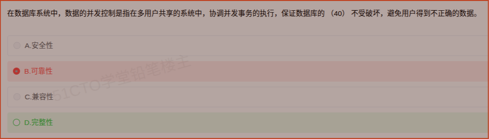

# 备考笔记：数据库-并发控制与数据完整性

## 一、题目

> 在数据库系统中，数据的并发控制是指在多用户共享的系统中，协调并发事务的执行，保证数据库的（40）不受破坏，避免用户得到不正确的数据。
>
> A. 安全性
> B. 可靠性
> C. 兼容性
> D. 完整性

**答案：D. 完整性**

解析：并发控制的作用是协调多个并发事务的执行，防止事务之间互相干扰导致数据不一致，从而**保证数据库的完整性（正确性、一致性）不受破坏**。"避免用户得到不正确的数据"正是不完整（不一致）的表述，故选 D。

## 二、知识点：数据库-并发控制与数据完整性

### 1. 核心原理

- **并发控制**：多用户共享系统中，多个事务可并发执行以提高效率，但并发会带来互相干扰。并发控制就是**协调并发事务的执行**，使并发执行的结果等价于某个串行执行的结果，从而**保证数据的完整性（一致性）**。
- **数据完整性**：指数据的**正确性、相容性和有效性**，反映"数据本身该不该是这样"。DBMS 通过**完整性约束**（实体完整性、参照完整性、用户定义完整性）**加并发控制与恢复机制**共同保障。
- **安全性**：指"**谁有权访问**"，防非法用户与越权操作，靠授权、视图、加密、审计实现。
- **可靠性**：指系统在**故障情况下仍能提供正确服务**的能力，靠冗余、备份、日志与恢复实现。

一句话区分：**完整性管"数据对不对"，安全性管"人能不能看"，可靠性管"坏了还能不能跑"**。

### 2. 关键公式/规则

| 名称 | 关注点 | 典型手段 |
| --- | --- | --- |
| 完整性（Integrity） | 数据的正确性、一致性、有效性 | 完整性约束、并发控制、事务与恢复 |
| 安全性（Security） | 防止非法访问与越权操作 | 用户授权、视图、加密、审计 |
| 可靠性（Reliability） | 故障下仍能正确提供服务 | 冗余、备份、日志、故障恢复 |
| 兼容性（Compatibility） | 非数据库理论术语（干扰项） | — |

并发三大问题与对策：

| 并发问题 | 表现 | 对策 |
| --- | --- | --- |
| 丢失更新 | 后写覆盖前写 | 封锁 / 两段锁协议 |
| 脏读 | 读到未提交数据 | 排他锁、隔离级别 |
| 不可重复读 / 幻读 | 同事务两次读结果不同 | 封锁、可串行化调度 |

### 3. 解题步骤

1. **抓题干动词**："协调并发事务的执行""避免用户得到**不正确**的数据"→ 指向数据本身是否正确 → **完整性**。
2. **排除安全性**：安全性应对的是"非法用户/越权"，题干未涉及权限与访问控制。
3. **排除可靠性**：可靠性应对的是"故障、宕机、数据丢失"，题干未涉及故障场景。
4. **排除兼容性**：兼容性不是数据库并发控制的理论术语，直接排除。
5. **定答案**：选 **D. 完整性**。

## 三、易错点

1. **完整性 ≠ 安全性**：两者最容易混。记牢——**完整性**关注数据**内容是否正确一致**；**安全性**关注**访问权限**是否合法。
2. **别被"不受破坏"骗到可靠性**：可靠性讲的是"系统/设备故障下的持续服务能力（如 MTBF）"，而并发控制处理的是"并发事务干扰带来的数据错误"，属完整性范畴。
3. **并发控制的核心目标是"可串行化"**：保证并发调度结果等价于某一串行调度，本质是维护一致性。
4. **"兼容性"是纯干扰项**：数据库并发控制理论中没有这个概念，出现即可排除。
5. **完整性不只靠约束**：完整性约束（主键、外键等）保证静态约束，并发控制与恢复机制保证动态（运行期）的一致与正确，两者合起来才完整。

## 四、扩展延伸

- **封锁机制**：**排他锁（X 锁）**用于写，**共享锁（S 锁）**用于读；X 锁与任何锁不兼容，S 锁与 S 锁兼容。
- **两段锁协议（2PL）**：事务分"扩展阶段（只加锁）"与"收缩阶段（只解锁）"，是保证可串行化的充分条件（可能死锁）。
- **隔离级别**：读未提交、读已提交、可重复读、可串行化，级别越高一致性越好、并发度越低。
- **与事务 ACID 的联系**：并发控制主要保障 **I（Isolation 隔离性）**，进而保障 **C（Consistency 一致性/完整性）**；**A（原子性）与 D（持久性）**由日志与恢复机制保障。
- **现实类比**：多人同时编辑同一份在线文档（并发事务），版本控制/加锁（并发控制）保证内容最终正确一致（完整性）；而"谁可以编辑这份文档"是权限（安全性）；"服务器崩了文档还在"是可靠性。

## 五、错题归档

| 题号 | 题型 | 考点 | 难度 | 掌握度 |
| --- | --- | --- | --- | --- |
| 系统分析师-数据库系统（题40） | 单选 | 数据库-并发控制 与 完整性/安全性/可靠性辨析 | 易 | 待复习 |

## 六、相关图片

原题截图：`./images/09-数据库-并发控制与数据完整性.png`（由用户上传的原题截图复制改名而来）

