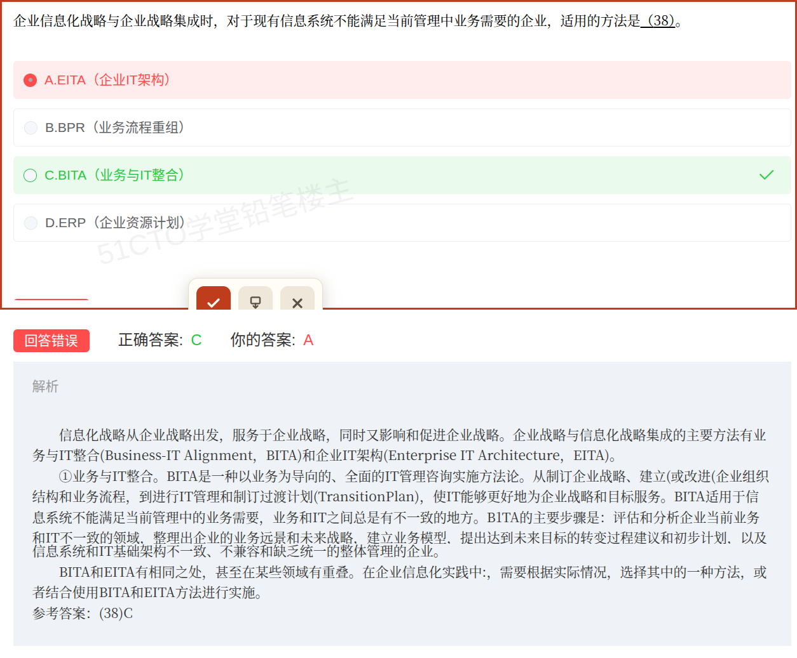

# 备考笔记：企业信息化战略与企业战略的集成方法 BITA 与 EITA

## 一、题目

> 企业信息化战略与企业战略集成时，对于现有信息系统不能满足当前管理中业务需要的企业，适用的方法是（38）。
>
> A. EITA（企业 IT 架构）
>
> B. BPR（业务流程重组）
>
> C. BITA（业务与 IT 整合）
>
> D. ERP（企业资源计划）

**答案：C. BITA（业务与 IT 整合）**

解析：**企业战略与信息化战略集成**的主要方法只有两种——**BITA**（业务与 IT 整合）与**EITA**（企业 IT 架构）。题干的关键词是"**现有信息系统不能满足当前管理中业务需要**"，即"**业务需要没被满足、业务与 IT 不一致**"，这正是 **BITA** 的适用场景（以业务为导向，评估业务与 IT 不一致的领域，整理业务愿景与未来战略，建立业务模型，提出转变过程建议与初步计划）。**EITA** 的适用场景是"信息系统与 IT 基础架构**不一致、不兼容、缺乏统一整体管理**"，与题干不符；BPR 是业务流程重组，属变革手段；ERP 是具体的信息系统产品。故选 C。

## 二、知识点：企业信息化战略与企业战略的集成方法

### 1. 核心原理

**企业战略与信息化战略集成的主要方法有两种**：

| 方法 | 全称 | 定位 | **适用场景（判别关键词）** |
| --- | --- | --- | --- |
| **BITA** | Business-IT Alignment，业务与 IT 整合 | 以**业务为导向**的、全面的 IT 管理咨询实施方法论 | **现有信息系统不能满足当前管理中业务需要的企业**；业务与 IT 之间总有不一致 |
| **EITA** | Enterprise IT Architecture，企业 IT 架构 | 从企业战略出发制订 IT 战略、指导 IT 投资 | **信息系统与 IT 基础架构不一致、不兼容、缺乏统一整体管理的企业** |

**BITA 的主要步骤**（教材顺序）：

1. **评估和分析**企业当前**业务和 IT 不一致**的领域；
2. 整理出企业的**业务愿景和未来战略**；
3. 建立**业务模型**；
4. 提出达到未来目标的**转变过程建议和初步计划**；
5. **执行**计划。

**EITA 的落点**：分析企业战略 → 帮助企业制订 **IT 战略** → 对**投资决策**进行指导 → 在越来越复杂的 IT 系统中实现**最佳投资回报**。

**要点**：

- 两种方法是**并列**的，教材明确二者"有相同之处，甚至在某些领域有重叠"，实践中可**择一或结合**使用；但**单选题要按题干关键词选最贴切的那一个**。
- **BITA 从头到尾"以业务为导向"**：从制订企业战略、建立或改进企业组织结构和业务流程，到 IT 管理和制订**过渡计划（Transition Plan）**，都是"让 IT 服务于业务战略和目标"。
- 因此：**"业务没被满足" → BITA；"IT 架构乱" → EITA**。

### 2. 关键公式/规则

**一句话判别口诀：**

> **业务不满足 → BITA；IT 架构乱 → EITA。**

| 题干预选项 | 归属 | 说明 |
| --- | --- | --- |
| 现有信息系统不能满足业务需要 | **BITA** | 本题答案 C |
| 业务与 IT 不一致 | **BITA** | 同为 BITA 场景 |
| IT 基础架构不一致、不兼容、缺统一整体管理 | **EITA** | 干扰项 A 的真实场景 |
| 业务流程重组、流程再造 | BPR | 变革手段，非战略集成方法 |
| 企业资源计划 | ERP | 具体信息系统产品 |

### 3. 解题步骤

1. **抓题干关键词**："现有信息系统不能满足当前管理中业务需要" → 提炼为"**业务需要未被满足**"。
2. **回忆集成方法**：企业战略与信息化战略集成的主要方法 = **BITA + EITA**（二选一）。
3. **对号入座**：题干落在"业务需要/业务与 IT 不一致" → **BITA**。
4. **排除干扰**：A 的 EITA 适用于"IT 架构不一致/不兼容/缺统一整体管理"；B 的 BPR 是流程重组（手段）；D 的 ERP 是具体系统产品。
5. **定答案**：选 **C. BITA**。

## 三、易错点

1. **误选 EITA（本次错选 A）**：BITA 与 EITA 的分水岭在**题干关键词**——出现"**业务需要/业务与 IT 不一致**"选 BITA；出现"**IT 架构不一致、不兼容、缺乏统一整体管理**"才选 EITA。本题关键词是"业务需要"，故选 BITA。
2. **把 BPR 当成战略集成方法**：BPR（业务流程重组）是**变革手段/管理方法**，不是"企业战略与信息化战略集成"的方法，属于**偷换层级**的干扰项。
3. **把 ERP 当成战略集成方法**：ERP（企业资源计划）是**具体的信息系统/软件产品**，是落地工具，不是战略层的方法论。
4. **对 BITA 望文生义**：BITA 虽名为"业务与 IT 整合"，但它是"**以业务为导向**"的，别因为名字里有"IT"就误判成偏 IT 架构的 EITA。
5. **混淆两法的"步骤"与"适用场景"**：BITA 的五步（评估不一致 → 业务愿景与战略 → 业务模型 → 转变建议与计划 → 执行）常被拿来和 EITA 的"制订 IT 战略、指导投资"混用。
6. **忽略"两法可结合使用"**：教材说二者有重叠、可择一或结合；但作答时仍要挑"最适用"的那一个，不能因为"可结合"就不选。
7. **与"信息化五种方法"混淆**：业务战略转信息战略、信息需求分析、信息资源规划、集成应用开发、综合集成——这是**信息化建设的方法**（见 [44-信息工程方法论-以数据为中心.md](44-信息工程方法论-以数据为中心.md)），与本题"战略集成方法"不是同一层级。

## 四、扩展延伸

- **三层层级对照（把干扰项归位，一眼排除）**：

| 层级 | 内容 | 本题选项 |
| --- | --- | --- |
| **战略集成方法层** | **BITA、EITA** | **C（对）、A（EITA，场景不符）** |
| **变革手段/管理方法层** | BPR、BPM、标杆管理等 | B（层级不符） |
| **系统/产品落地层** | ERP、CRM、SCM、MES | D（层级不符） |

- **现实类比**：把企业当成一个"要换装的人"——**BITA** 是先把"想要什么样、要干什么事"（业务愿景与战略）理清，再让 IT 这个"装备"服务于它（业务导向）；**EITA** 是先盘点"现有装备东拼西凑、型号不统一"（IT 架构不一致），再制订统一装备规划并指导采购投资。本题说"现有装备满足不了当下要做的事"，属前者。
- **关联笔记**：
  - [44-信息工程方法论-以数据为中心.md](44-信息工程方法论-以数据为中心.md)：信息工程"以数据为中心"的方法论，与"以业务为导向"的 BITA 形成对照；
  - [45-信息工程四阶段-信息规划.md](45-信息工程四阶段-信息规划.md)：信息工程四阶段中"信息规划"从企业战略出发，与本篇的"战略集成"处于同一战略起点；
  - [47-决策支持系统DSS-两库结构与知识子系统归属.md](47-决策支持系统DSS-两库结构与知识子系统归属.md)：同属"六、企业信息化与战略"章节的知识点。

## 五、错题归档

| 题号 | 题型 | 考点 | 难度 | 掌握度 |
| --- | --- | --- | --- | --- |
| 软考-企业信息化与战略（38） | 单选 | 企业战略与信息化战略集成方法 BITA/EITA 的适用场景辨析 | 中 | 待复习 |

## 六、相关图片

原题截图：`./images/100-信息化战略集成-BITA与EITA适用场景.png`（由用户上传的原题图复制改名而来）

