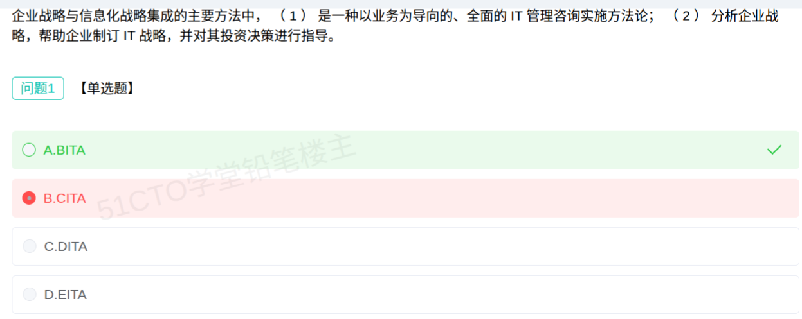

# 备考笔记：信息化战略集成-BITA与EITA定义辨析

## 一、题目
> 企业战略与信息化战略集成的主要方法中，（1）是一种以业务为导向的、全面的 IT 管理咨询实施方法论；（2）分析企业战略，帮助企业制订 IT 战略，并对其投资决策进行指导。
>
> 问题1【单选题】
> A. BITA
> B. CITA
> C. DITA
> D. EITA

**答案：A. BITA**

解析：题干的定义句——"**以业务为导向的、全面的 IT 管理咨询实施方法论**"——正是 **BITA（Business-IT Alignment，业务与 IT 整合）** 的教材原话，故选 A。BITA 从制订企业战略、建立（或改进）企业组织结构和业务流程，到进行 IT 管理和制订过渡计划（Transition Plan），使 IT 更好地服务于企业战略与目标。B/C 的 CITA、DITA 并非教材中的集成方法（杜撰干扰项）；D 的 EITA（企业 IT 架构）对应的是题干（2）那句"分析企业战略，帮助企业制订 IT 战略，并对其投资决策进行指导"。

## 二、知识点：信息化战略集成-BITA与EITA定义辨析

### 1. 核心原理
**企业战略与信息化战略集成的主要方法只有两种**：**BITA（业务与 IT 整合）** 与 **EITA（企业 IT 架构）**。二者的**权威定义**必须逐字对应：

| 方法 | 英文全称 | **教材定义（必背）** | 适用场景 |
| --- | --- | --- | --- |
| **BITA** | Business-IT Alignment（业务与 IT 整合） | 一种**以业务为导向的、全面的 IT 管理咨询实施方法论** | 现有信息系统**不能满足业务需要**、业务与 IT 不一致的企业 |
| **EITA** | Enterprise IT Architecture（企业 IT 架构） | **分析企业战略，帮助企业制订 IT 战略，并对其投资决策进行指导**，在越来越复杂的 IT 系统中实现最佳投资回报 | 现有信息系统与 **IT 基础架构不一致、不兼容、缺乏统一整体管理**的企业 |

**BITA 的展开**：从**制订企业战略**、建立（或改进）**企业组织结构和业务流程**，到进行 **IT 管理和制订过渡计划（Transition Plan）**，使 IT 能够更好地为企业战略和目标服务——全过程"以业务为导向"。

**EITA 的展开**：是一套**完整的、科学的、系统的企业 IT 架构方法论**，落点是**从企业战略出发制订 IT 战略、指导 IT 投资决策、追求最佳投资回报**。

**要点**：

- **"以业务为导向"是 BITA 的专属标签**；**"制订 IT 战略、指导投资"是 EITA 的专属标签**。
- 教材中**只有 BITA、EITA 两种**集成方法——凡出现 CITA、DITA 之类，均为**杜撰的干扰项**。

### 2. 关键公式/规则
**定义配对速查（看到表述答方法）**：

| 题干表述 | 答案 |
| --- | --- |
| 以业务为导向的、全面的 IT 管理咨询实施方法论 | **BITA** |
| 从制订企业战略、改进组织结构和业务流程，到 IT 管理与过渡计划 | **BITA** |
| 分析企业战略，帮助企业制订 IT 战略，并对其投资决策进行指导 | **EITA** |
| 帮助企业建立 IT 的原则、规范、模式和标准 / 追求最佳投资回报 | **EITA** |
| CITA、DITA（题目中出现） | **杜撰干扰项，直接排除** |

口诀：**"业务导向是 BITA，制订 IT 战略、指导投资是 EITA；CITA/DITA 是假的。"**

**适用场景配对（与 100 号笔记互补）**：

| 场景关键词 | 方法 |
| --- | --- |
| 现有信息系统不能满足业务需要 / 业务与 IT 不一致 | **BITA** |
| IT 基础架构不一致、不兼容、缺乏统一整体管理 | **EITA** |

### 3. 解题步骤
1. **抓定义关键词**：空（1）出现"以业务为导向""IT 管理咨询实施方法论" → 直指 **BITA**。
2. **回忆方法集合**：战略集成方法 = BITA + EITA（教材仅此两种）。
3. **排除杜撰项**：CITA、DITA 教材无此方法，排除 B、C。
4. **区分 EITA 的定义**：题干（2）"制订 IT 战略、指导投资决策"是 **EITA**，说明 D 填的是（2）而非（1），故 A 对。
5. **定答案**：选 **A. BITA**。

## 三、易错点
1. **本题误选 B「CITA」**：CITA 是**杜撰的干扰项**，教材中企业战略与信息化战略集成方法**只有 BITA 和 EITA**，看到这三个字母以外的"××ITA"要立刻排除。
2. **把 BITA 与 EITA 的定义对调**：BITA = **以业务为导向**（B 即 Business）；EITA = **制订 IT 战略、指导投资、最佳回报**（E 即 Enterprise，落点在 IT 架构/战略）。名字首字母就是记忆锚点。
3. **被"IT 管理咨询方法论"里的"IT"带偏**：BITA 虽然名字含 IT，但定义强调"**以业务为导向**"，不要因"IT 管理咨询"就误判为 EITA。
4. **忽略题干两空的分工**：题干给了（1）（2）两句定义，恰好一句对应 BITA、一句对应 EITA；做题要把两句分别对号入座，避免张冠李戴。
5. **与 100 号题型的混淆**：100 号问的是"**适用场景**"（业务不满足→BITA；IT 架构乱→EITA），本题问的是"**定义表述**"——同一对方法的两种考法，都要会。

## 四、扩展延伸
- **首字母记忆法**：**B**ITA→**B**usiness-IT（业务与 IT），"以**业务**为导向"；**E**ITA→**E**nterprise IT Architecture（企业 IT 架构），落点在"**IT 战略与投资**"。
- **两法关系**：教材指出二者"有相同之处，甚至在某些领域有重叠"，可**择一或结合**使用；但单选题要按**题干关键词**选最贴切的一个。
- **现实类比**：**BITA** 像"业务部门主导演进"——先想清楚要做什么生意（业务愿景与战略），再让 IT 配合（过渡计划）；**EITA** 像"IT 总架构师主导规划"——先制订 IT 战略与蓝图，再据此决定每笔 IT 投资投向哪里。
- **相关笔记**：
  - [100-信息化战略集成-BITA与EITA适用场景.md](100-信息化战略集成-BITA与EITA适用场景.md)：同一对方法的**适用场景**考法（业务不满足→BITA，IT 架构乱→EITA），与本篇"定义辨析"互补；
  - [44-信息工程方法论-以数据为中心.md](44-信息工程方法论-以数据为中心.md)：信息工程"以数据为中心"，与 BITA"以业务为导向"形成对照；
  - [49-信息资源规划IRP-两条主线与业务模型三层结构.md](49-信息资源规划IRP-两条主线与业务模型三层结构.md)：同属"六、企业信息化与战略"章节。

## 五、错题归档
| 题号 | 题型 | 考点 | 难度 | 掌握度 |
| --- | --- | --- | --- | --- |
| 104 | 单选 | 战略集成方法 BITA/EITA 的**定义表述**辨析；排除杜撰项 CITA/DITA | 易 | 待复习 |

（重做本题时在表尾追加 `重做 N` 行，见「步骤 2.5 重做留痕」）

## 六、相关图片
原题截图：`./images/104-信息化战略集成-BITA与EITA定义辨析.png`（由用户上传的原题图复制改名而来）

