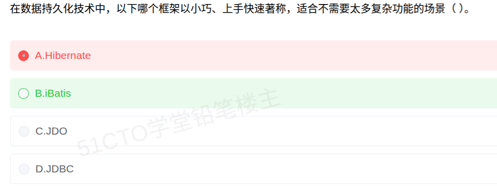

# 备考笔记：数据持久化框架辨析-iBatis与Hibernate

## 一、题目
> 在数据持久化技术中，以下哪个框架以小巧、上手快速著称，适合不需要太多复杂功能的场景（　）。
> A. Hibernate
> B. iBatis
> C. JDO
> D. JDBC

**答案：B. iBatis**

解析：题干关键词是"**小巧、上手快速**"，指向 **iBatis**（后演进为 **MyBatis**）。iBatis 是**半自动的 SQL 映射（ORM）框架**，SQL 由开发者写在映射文件中、框架只负责参数绑定与结果集映射，**轻量、易上手**，正好适合"不需要太多复杂功能"的场景。A 的 Hibernate 是**全自动 ORM**，功能强大但配置重、学习曲线陡，与"小巧、上手快"相反；D 的 JDBC 是**最底层**的数据库访问 API（手写 SQL 与结果集映射，代码繁琐）；C 的 JDO 是 Java 对象持久化**规范/标准**，不属于"小巧快速"的代表框架。

## 二、知识点：数据持久化框架辨析-iBatis与Hibernate

### 1. 核心原理
**数据持久化**指把内存中的对象数据保存到数据库（并可反向读回）的技术。Java 领域的主流方案按"自动化程度 / 轻重"排序：

| 技术 | 定位 | 自动化程度 | 特点 | 适用场景 |
| --- | --- | --- | --- | --- |
| **JDBC** | Java 原生数据库访问 **API** | 无（最底层） | 手写 SQL、手动遍历结果集、手动关闭连接；灵活但**代码繁琐、重复** | 追求极致可控、无框架依赖 |
| **JDO** | Java 数据对象**规范**（JSR 标准） | 全自动（标准接口） | 提供**标准化**的持久化接口，由厂商实现；生态较小、流行度低 | 需要标准接口、厂商实现 |
| **iBatis / MyBatis** | **半自动** SQL 映射框架 | 半自动 | **小巧、上手快**；SQL 由开发者写在映射文件里，框架负责参数映射与结果集映射；SQL 可控性强 | **不需要太多复杂功能**、需精细控制 SQL 的场景 |
| **Hibernate** | **全自动 ORM** 框架 | 全自动 | **功能强大**：自动生成 SQL、HQL、缓存、事务、延迟加载；但配置复杂、**学习曲线陡** | 大型复杂企业应用、对象模型复杂 |

**核心区分**：

- **全自动 ORM（Hibernate）**：开发者只操作对象，SQL 由框架生成——**强大但重**。
- **半自动映射（iBatis）**：SQL 由开发者掌控，框架只做"对象↔结果集"的搬运——**轻巧灵活**。
- 题干的"**小巧、上手快速、不需要太多复杂功能**"是**半自动 iBatis** 的专属标签。

### 2. 关键公式/规则
| 关键词 | 对应技术 |
| --- | --- |
| 小巧、上手快速、适合不复杂场景 | **iBatis** |
| 全自动 ORM、功能强大、学习曲线陡 | **Hibernate** |
| 半自动、SQL 映射、SQL 可控 | **iBatis** |
| 最底层 API、手写 SQL 与结果集映射 | **JDBC** |
| Java 持久化**规范/标准**（JSR） | **JDO** |

口诀：**"小巧快用 iBatis，强大全自动 Hibernate，底层手动 JDBC，规范标准是 JDO。"**

### 3. 解题步骤
1. 圈关键词："**小巧、上手快速**""**不需要太多复杂功能**" → 轻量级持久化框架。
2. 四选项定性：
   - A Hibernate → **全自动 ORM、功能强大、重**，与"小巧"相反，排除；
   - B iBatis → **半自动、轻量、易上手**，**契合**；
   - C JDO → 是**规范/标准**，不是具体"小巧框架"；
   - D JDBC → **最底层 API**，代码繁琐，非框架。
3. 定答案：选 **B. iBatis**。

## 三、易错点
1. **本题误选 A「Hibernate」**：看到"持久化框架"就条件反射选名气最大的 Hibernate——但题干要的是"**小巧、上手快**"，Hibernate 恰恰是**功能强大但笨重**的全自动 ORM，方向相反。**"强大"与"小巧"是 Hibernate 与 iBatis 的核心分野。**
2. **忽视"框架"二字**：JDBC 是**API**、JDO 是**规范**，二者都不是题干所指的"小巧的**框架**"；iBatis/Hibernate 才是框架。
3. **把 iBatis 与 Hibernate 的自动化程度记反**：iBatis **半自动**（SQL 自己写）、Hibernate **全自动**（SQL 框架生成）。
4. **漏记 iBatis 的演进**：iBatis 后更名为 **MyBatis**，二者指同一脉技术；考试可能以 MyBatis 名义考同样特征。
5. **混淆 JDO 与 ORM 框架**：JDO 是**标准的持久化接口规范**（由 JSR 定义、厂商实现），强调"标准"而非"轻巧"。

## 四、扩展延伸
- **全自动 vs 半自动 ORM**：全自动（Hibernate）牺牲"SQL 可控性"换取"开发效率"，适合对象模型复杂、数据库差异屏蔽需求强的场景；半自动（iBatis）保留"SQL 掌控权"，适合 SQL 需优化、报表类或遗留数据库的场景。
- **横向对比记忆**：`JDBC < iBatis < Hibernate` 是**抽象层次/自动化程度由低到高**的一条线；抽象越高＝越强大也越重，抽象越低＝越灵活也越繁琐。
- **现实类比**：**JDBC** 像自己买菜做饭（全程手动）；**iBatis** 像"自选食材 + 帮你配好调料"的半成品（SQL 你写、映射它做）；**Hibernate** 像"点套餐"（只说要什么，做法它全包）；**JDO** 像"行业标准菜谱"（规定接口，各家餐厅照做）。
- **相关笔记**：
  - [17-分布式缓存与文件存储辨析.md](17-分布式缓存与文件存储辨析.md)：同属数据存取技术，可对照"缓存/存储"与"持久化"的分工；
  - [15-数据库-触发器与完整性约束机制.md](15-数据库-触发器与完整性约束机制.md)：数据完整性在数据库侧的实现，与持久化框架的业务侧校验互补。

## 五、错题归档
| 题号 | 题型 | 考点 | 难度 | 掌握度 |
| --- | --- | --- | --- | --- |
| 106 | 单选 | 数据持久化框架辨析（iBatis 轻量半自动 vs Hibernate 全自动） | 易 | 待复习 |

（重做本题时在表尾追加 `重做 N` 行，见「步骤 2.5 重做留痕」）

## 六、相关图片
原题截图：`./images/106-数据持久化框架辨析-iBatis与Hibernate.png`（由用户上传的原题图复制改名而来）

