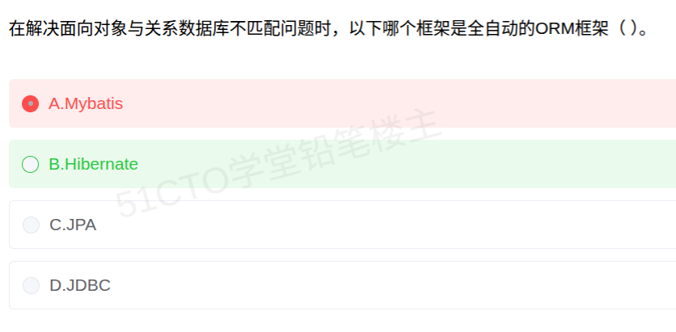

# 备考笔记：全自动ORM框架-Hibernate与MyBatis

## 一、题目
> 在解决面向对象与关系数据库不匹配问题时，以下哪个框架是全自动的 ORM 框架（　）。
> A. Mybatis
> B. Hibernate
> C. JPA
> D. JDBC

**答案：B. Hibernate**

解析：题干问的是"**全自动 ORM 框架**"。**Hibernate** 是典型的**全自动 ORM 框架**——开发者只操作对象，由框架自动生成 SQL、自动完成对象与关系表的映射（含 HQL、缓存、事务、延迟加载等），故选 B。A 的 **MyBatis 是半自动**（SQL 需开发者手写、框架只做映射）；C 的 **JPA 是 ORM 规范/标准接口**，不是"全自动框架"本身；D 的 **JDBC 是最底层 API**，需手写 SQL 与结果集映射，谈不上 ORM 框架。

## 二、知识点：全自动ORM框架-Hibernate与MyBatis

### 1. 核心原理
**对象关系阻抗不匹配（Object-Relational Impedance Mismatch）**：面向对象以"对象 + 继承 + 关联"组织数据，关系数据库以"二维表 + 外键"组织数据，两者范式不同，直接对接麻烦——**ORM（Object-Relational Mapping，对象关系映射）**就是用来填平这道鸿沟的技术。

按自动化程度，主流方案分档：

| 技术 | 属性 | 自动化程度 | 谁写 SQL | 关键特征 |
| --- | --- | --- | --- | --- |
| **JDBC** | 原生 API | 无（最底层） | 开发者手写 | 手写 SQL、手动遍历结果集、手动管连接；灵活但繁琐 |
| **MyBatis**（原 iBatis） | **框架** | **半自动** | **开发者**（写在映射文件） | 小巧、上手快；SQL 可控性强；框架只做参数/结果映射 |
| **Hibernate** | **框架** | **全自动** | **框架自动生成** | 功能强大：自动生成 SQL、HQL、缓存、事务、延迟加载；配置较重 |
| **JPA** | **规范（标准接口）** | 视实现 | 由实现决定 | Java 持久化 **API 标准**（由 Hibernate 等厂商实现）；它是"规范"不是"框架" |

**要点**：

- "**全自动 ORM 框架**"的**唯一正解是 Hibernate**：对象进、记录出，SQL 不用你写。
- **MyBatis 是半自动**：SQL 自己写，框架只管映射——常作为本题的**反向干扰项**（见下"易错点"）。
- **JPA ≠ 框架**：它是**规范**，Hibernate 是其最著名的**实现**；判断题里"规范 vs 实现"是常见陷阱。
- **JDBC 不是 ORM**：它只是最基础的数据库访问 API。

### 2. 关键公式/规则
| 题干关键词 | 对应答案 |
| --- | --- |
| **全自动** ORM 框架 | **Hibernate** |
| **半自动**、SQL 自己写、小巧上手快 | MyBatis（iBatis） |
| Java 持久化**规范/标准接口** | JPA |
| 最**底层** API、手写 SQL 与结果集映射 | JDBC |
| **面向对象与关系数据库不匹配** | 对象关系阻抗不匹配 → 用 ORM（Hibernate）解决 |

口诀：**"全自动找 Hibernate，半自动是 MyBatis，规范标准叫 JPA，底层手动 JDBC。"**

（与 [106-数据持久化框架辨析-iBatis与Hibernate.md](106-数据持久化框架辨析-iBatis与Hibernate.md) 配对记忆：那道题问"**小巧/半自动 → iBatis**"，这道题问"**全自动 → Hibernate**"，两问互为正反面。）

### 3. 解题步骤
1. 圈关键词："**全自动**""**ORM 框架**" → 自动化程度最高的 ORM 实现。
2. 四选项定性：
   - A MyBatis → **半自动**（SQL 手写），排除；
   - B Hibernate → **全自动 ORM 框架**，**契合**；
   - C JPA → 是**规范/标准**，非"框架"；
   - D JDBC → **底层 API**，非 ORM。
3. 定答案：选 **B. Hibernate**。

## 三、易错点
1. **本题误选 A「Mybatis」**：MyBatis 是**半自动**框架——SQL 要开发者自己写，属于"轻量灵活"，**不是全自动**；看到"全自动"一定选 **Hibernate**。
2. **把 JPA 当成框架**：JPA 是**规范/标准接口**（Java Persistence API），Hibernate 是其**实现**；题干若强调"规范/标准"选 JPA，强调"全自动框架"选 Hibernate。
3. **与 106 号题方向记反**：106 问"**小巧、上手快**"→ MyBatis/iBatis；107 问"**全自动**"→ Hibernate。两题关键词**互斥**，切勿按"名气大"来选。
4. **误选 JDBC**：JDBC 只是**接口 API**，既不自动映射，也不是 ORM 框架。
5. **把"对象关系不匹配"当成选型依据**：所有 ORM（Hibernate/MyBatis/JPA 实现）都在解决该问题，**真正区分四选项的是"自动化程度"**。

## 四、扩展延伸
- **自动化程度梯度**：`JDBC（无）< MyBatis（半自动）< Hibernate（全自动）`；JPA 是**跨实现的规范**，位于"Hibernate 之上/之外"的标准化层面。
- **选型直觉**：要"开发快、少写 SQL、屏蔽数据库差异"→ 全自动（Hibernate）；要"SQL 精细可控、便于优化与报表"→ 半自动（MyBatis）；要"标准化、可替换实现"→ 面向 JPA 编程。
- **现实类比**：**Hibernate** 像"全包套餐"（说清要什么，做法与摆盘全由它搞定）；**MyBatis** 像"半成品菜"（菜谱写不写由你，火候它帮你配）；**JPA** 像"行业标准菜谱"（规定菜名与接口，各家照做）；**JDBC** 像"自己下厨"（从买菜到刷锅全手动）。
- **相关笔记**：
  - [106-数据持久化框架辨析-iBatis与Hibernate.md](106-数据持久化框架辨析-iBatis与Hibernate.md)：同一考点的**反向问法**（问"小巧/半自动"），两篇配对复习效果最佳；
  - [15-数据库-触发器与完整性约束机制.md](15-数据库-触发器与完整性约束机制.md)：数据库侧完整性约束，与 ORM 的业务侧校验互补。

## 五、错题归档
| 题号 | 题型 | 考点 | 难度 | 掌握度 |
| --- | --- | --- | --- | --- |
| 107 | 单选 | 全自动 ORM 框架识别（Hibernate vs MyBatis/JPA/JDBC） | 易 | 待复习 |

（重做本题时在表尾追加 `重做 N` 行，见「步骤 2.5 重做留痕」）

## 六、相关图片
原题截图：`./images/107-全自动ORM框架-Hibernate与MyBatis.png`（由用户上传的原题图复制改名而来）

