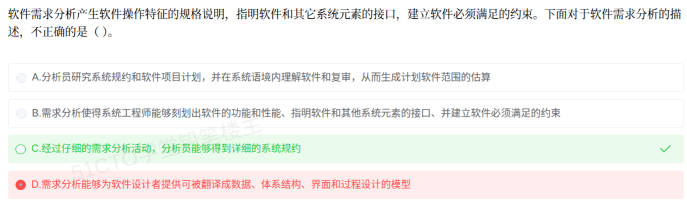

# 备考笔记：软件需求分析-任务描述与产出规格辨析

## 一、题目
> 软件需求分析产生软件操作特征的规格说明，指明软件和其它系统元素的接口，建立软件必须满足的约束。下面对于软件需求分析的描述，不正确的是（）。
> A. 分析员研究系统规约和软件项目计划，并在系统语境内理解软件和复审，从而生成计划软件范围的估算
> B. 需求分析使得系统工程师能够刻画出软件的功能和性能、指明软件和其他系统元素的接口、并建立软件必须满足的约束
> C. 经过仔细的需求分析活动，分析员能够得到详细的系统规约
> D. 需求分析能够为软件设计者提供可被翻译成数据、体系结构、界面和过程设计的模型

**答案：C. 经过仔细的需求分析活动，分析员能够得到详细的系统规约**

## 二、知识点：软件需求分析-任务描述与产出规格辨析

### 1. 核心原理
软件需求分析是**软件定义时期**的最后阶段，任务是明确系统**"做什么"**（必须完成哪些工作），而不涉及**"怎么做"**。据此确定两个锚点：

- **输入**：**系统规约**（系统分析与系统工程阶段的产物）、软件项目计划。分析员在系统语境中理解并复审软件，据此估算软件范围。
- **输出**：**软件需求规格说明（SRS）**，内含数据模型、功能模型、行为模型、性能要求、接口与约束，可为设计者提供可翻译成数据、体系结构、界面、过程设计的模型。

本题四项中，A（输入=系统规约+项目计划）、B（刻画功能性能/接口/约束）、D（为设计者提供模型）均与教材描述一致；**C 项把上游产物"系统规约"错置为需求分析的输出**，故为不正确项，选 C。

### 2. 关键公式/规则

| 名称 | 内容 |
| --- | --- |
| 需求分析输入 | 系统规约、软件项目计划 |
| 需求分析输出 | 软件需求规格说明（SRS）+ 数据/功能/行为模型 |
| 阶段定位 | 定义"做什么"，不定"怎么做" |
| 下游衔接 | 为设计者提供可翻译为数据、体系结构、界面、过程设计的模型 |
| 层级关系 | 系统规约（系统级）→ 需求规格说明（软件级），前者是后者的输入 |

### 3. 解题步骤
1. 抓住"**产出物**"这个锚：需求分析产出 **SRS**，不产出"系统规约"。
2. 用 A 项自证：A 把"系统规约"当作需求分析的**输入**，则 C 把它当作**输出**必然矛盾 → C 错。
3. B、D 为教材原句（功能性能/接口/约束、为设计提供模型），属正确描述，排除。

## 三、易错点
1. **误选 D 的根因**：把"为设计者提供模型"误判为越界（侵入了设计阶段），其实它正是需求分析的正规定义。
2. **混淆产出物层级**：系统规约属系统级、由系统分析产生；需求分析只能得到软件级的 SRS，不会"得到系统规约"。
3. **审题方向**：问"不正确的是"要选**错项**，别惯性选"正确"项。

## 四、扩展延伸
- 软件定义时期三阶段：**问题定义 → 可行性研究 → 需求分析**。
- 需求分析的典型产物：SRS（参照 IEEE 830）、数据流图（DFD）、数据字典（DD）、E-R 图、状态转换图、用例模型等。
- 与设计阶段的边界：需求分析谈"做什么"，概要/详细设计才谈"怎么做"（体系结构、界面、过程设计）。
- 相关既有笔记：88-需求分析方法-三类清单辨析、31-面向对象分析-建模过程、50-面向对象-用例模型与分析模型辨析。

## 五、错题归档
| 题号 | 题型 | 考点 | 难度 | 掌握度 |
| --- | --- | --- | --- | --- |
| — | 单选 | 需求分析的任务/输入输出与"系统规约"归属辨析 | 易 | 薄弱 |

（重做本题时在表尾追加 `重做 N` 行，见「步骤 2.5 重做留痕」）

## 六、相关图片
原题截图：`./images/109-软件需求分析-任务描述与产出规格辨析.png`（由用户上传的原题图复制改名而来）

