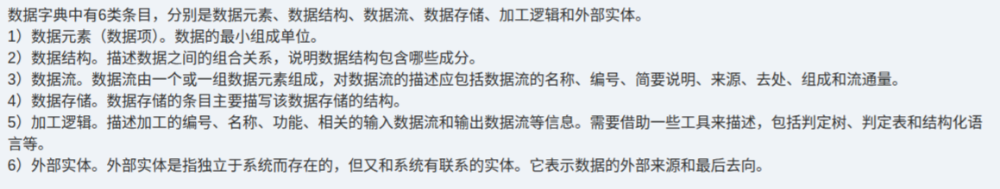

# 备考笔记：数据字典-六类条目构成与辨析

## 一、题目
> 【知识点原文摘录】（本图未含原题题干与选项，为"数据字典 6 类条目"解析原文）
>
> 数据字典中有 6 类条目，分别是**数据元素、数据结构、数据流、数据存储、加工逻辑和外部实体**。
> 1) **数据元素（数据项）**：数据的最小组成单位。
> 2) **数据结构**：描述数据之间的组合关系，说明数据结构包含哪些成分。
> 3) **数据流**：数据流由一个或一组数据元素组成，对数据流的描述应包括数据流的名称、编号、简要说明、来源、去处、组成和流通量。
> 4) **数据存储**：数据存储的条目主要描写数据存储的结构。
> 5) **加工逻辑**：描述加工的编号、名称、功能、相关的输入数据流和输出数据流等信息。需要借助一些工具来描述，包括判定树、判定表和结构化语言等。
> 6) **外部实体**：是指独立于系统而存在的，但又和系统有联系的实体，它表示数据的外部来源和最后去向。

**答案：本图未附题目与选项，属知识点整理**。核心结论：数据字典（DD）由 **数据元素、数据结构、数据流、数据存储、加工逻辑、外部实体** 六类条目构成，六类各司其职、覆盖"最小单位 → 组合关系 → 流动 → 落盘 → 加工 → 系统外来源去向"。

## 二、知识点：数据字典-六类条目构成与辨析

### 1. 核心原理
数据字典（Data Dictionary, DD）是**结构化分析方法（SA）**的核心工具，与数据流图（DFD）配套：**DFD 描述系统"做什么"（数据流动与加工），DD 精确定义 DFD 中每个成分的"是什么"**。DD 有条目式（人工卡片）与自动化（CASE 工具）两种维护方式，其条目固定为以下 **6 类**：

| 条目 | 定义 / 描写内容 | 对应 DFD 元素 |
| --- | --- | --- |
| **数据元素（数据项）** | 数据的**最小组成单位**（不可再分），如"学号""姓名" | 构成数据流 / 数据存储 / 数据结构的最小单元 |
| **数据结构** | 描述数据之间的**组合关系**，说明包含哪些成分（由若干数据元素 / 数据结构组成） | 描述数据流、数据存储的内部结构 |
| **数据流** | 由一个或一组数据元素组成；描写**名称、编号、简要说明、来源、去处、组成、流通量** | DFD 中的**箭头**（数据流动） |
| **数据存储** | 主要描写**数据存储的结构**（数据落盘 / 落库的结构） | DFD 中的**开/双横线**（数据静止存放） |
| **加工逻辑** | 描写加工的**编号、名称、功能、输入数据流、输出数据流**；用**判定树、判定表、结构化语言**描述内部逻辑 | DFD 中的**圆/圆角框**（处理） |
| **外部实体** | **独立于系统而存在、但又与系统有联系**的实体，表示数据的**外部来源和最后去向** | DFD 中的**方框**（系统边界外的输入输出源） |

一句话记忆：**「元素最小、结构组合、数据流流动、数据存储落盘、加工逻辑变换、外部实体出边界」**。

### 2. 关键公式/规则

| 名称 | 内容 |
| --- | --- |
| 六类条目顺序 | 数据元素 → 数据结构 → 数据流 → 数据存储 → 加工逻辑 → 外部实体 |
| 四级数据单位 | 数据项（数据元素）< 数据结构 < 数据流 / 数据存储 |
| 数据流七要素 | 名称、编号、简要说明、来源、去处、组成、流通量 |
| 加工逻辑三工具 | 判定树、判定表、结构化语言 |
| 外部实体本质 | 独立于系统之外、与系统有联系，标志数据**外部来源与最后去向** |
| DD 与 DFD 关系 | DFD 是"骨架/流程"，DD 是"血肉/定义"；DFD 中的每个成分都要在 DD 中有条目 |

### 3. 解题步骤
1. 认准题干问的是"**六类条目**"还是"**某一类条目的描写内容**"。
2. 若问"哪一项**不属于**数据字典条目"：用六类清单排除（常见杜撰项如"处理逻辑说明""模块""程序""数据字典本身"等）。
3. 若问"某条目的描写内容"：按关键词归位——
   - "最小组成单位" → **数据元素**；
   - "组合关系 / 包含哪些成分" → **数据结构**；
   - "名称、编号、来源、去处、流通量" → **数据流**；
   - "描写存储结构" → **数据存储**；
   - "判定树 / 判定表 / 结构化语言" → **加工逻辑**；
   - "独立于系统、外部来源与去向" → **外部实体**。
4. 特别注意"**加工逻辑依赖判定树/判定表/结构化语言**"是高频辨识锚点。

## 三、易错点
1. **六类条目不能增删**：数据字典固定为**数据元素、数据结构、数据流、数据存储、加工逻辑、外部实体**六类；"模块""程序""处理逻辑说明"等都不是 DD 条目。
2. **数据元素是最小单位**：别再往下拆；数据结构的成分由数据元素（或更小的数据结构）组成。
3. **数据流 ≠ 数据存储**：数据流强调"**流动**（来源→去处）"，数据存储强调"**静止存放的结构**"；二者在 DFD 中符号不同（箭头 vs 双横线）。
4. **加工逻辑要写"输入/输出数据流"**：不仅写功能，还要标明相关输入流和输出流，且需借助判定树/判定表/结构化语言描述。
5. **外部实体在系统边界之外**：它表示数据的**外部来源与最终去向**，不是系统内部的处理部件。
6. **DD 与 DFD 配套不可混淆**：DFD 描述数据流动与加工过程，DD 定义各成分的数据属性；DD 常被误当作"DFD 的一部分"或"数据库字典"。

## 四、扩展延伸
- **DD 的两种维护方式**：人工卡片式（条目卡片按字母顺序排列）与自动化（CASE 工具，与 DFD 一致性校验）。
- **一致性检查**：DD 与 DFD 必须成对一致——DFD 上出现的每个数据流 / 数据存储 / 加工 / 外部实体，DD 中都要有对应条目，反之亦不含无源条目。
- **结构化分析方法（SA）三大模型工具**：数据流图（功能）、数据字典（数据定义）、E-R 图（数据模型）；另有状态转换图（行为）。
- **相关既有笔记**：[88-需求分析方法-三类清单辨析.md](88-需求分析方法-三类清单辨析.md)（SA 方法工具清单）、[111-软件需求层次-业务用户系统三层辨析.md](111-软件需求层次-业务用户系统三层辨析.md)（需求分析三模型与数据字典定位）、[109-软件需求分析-任务描述与产出规格辨析.md](109-软件需求分析-任务描述与产出规格辨析.md)（需求分析产物含 DFD / DD）。

## 五、错题归档
| 题号 | 题型 | 考点 | 难度 | 掌握度 |
| --- | --- | --- | --- | --- |
| — | 单选 | 数据字典六类条目构成与各条目描写内容辨析 | 易 | 待复习 |

（重做本题时在表尾追加 `重做 N` 行，见「步骤 2.5 重做留痕」）

## 六、相关图片
原题截图：`./images/113-数据字典-六类条目构成与辨析.png`（由用户上传的原题图复制改名而来）

