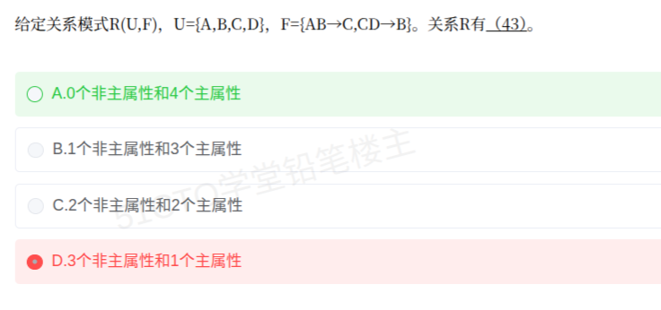

# 备考笔记：数据库-全主属性判定

## 一、题目

> 给定关系模式 R(U,F)，U={A,B,C,D}，F={AB→C, CD→B}。关系 R 有（43）。
>
> A. 0 个非主属性和 4 个主属性
> B. 1 个非主属性和 3 个主属性
> C. 2 个非主属性和 2 个主属性
> D. 3 个非主属性和 1 个主属性

**答案：A. 0 个非主属性和 4 个主属性**

解析：R 有**两个**候选键 ABD 与 ACD。凡出现在任一候选键中的属性都是主属性，二者并集为 {A,B,C,D}，恰好覆盖全部属性，故主属性 4 个、**非主属性 0 个**。D 项只按"一个主键"来数，故错。

## 二、知识点：数据库-全主属性判定

### 1. 核心原理

- **候选键**：能推出全部属性（$X^+ = U$）且不含多余属性（极小性）的属性组；**一个关系可以有多个候选键**。
- **主属性**：出现在**任何一个候选键**中的属性，即所有候选键的**并集**。
- **非主属性**：不在**任何**候选键中的属性。
- **全主属性关系**：当候选键的并集恰好等于 U 时，所有属性都是主属性，非主属性个数为 0。

本题的关键在于：**要穷举出全部候选键**，而不是只找一个主键。很多人只求出 ABD 就结束，于是漏掉 ACD，才会觉得"总有几个属性不是主属性"。

### 2. 关键公式/规则

| 名称 | 表达式/判据 |
| --- | --- |
| 候选键 | $X^+ = U$ 且 X 极小（任一真子集闭包 ≠ U） |
| 主属性 | $X \in \bigcup\{$ 全部候选键 $\}$ |
| 非主属性 | $U - \bigcup\{$ 全部候选键 $\}$ |
| 非主属性个数 | $|U| - |$ 全部候选键的并集 $|$ |

本题属性分类（按在函数依赖中出现的位置）：

| 属性 | 出现位置 | 类别 | 结论 |
| --- | --- | --- | --- |
| A | AB→C（左） | L | **必在**每个候选键中 |
| B | AB→C（左）、CD→B（右） | LR | 可能在内 |
| C | CD→B（左）、AB→C（右） | LR | 可能在内 |
| D | CD→B（左） | L | **必在**每个候选键中 |

### 3. 解题步骤

1. **分类定"必含"**：A、D 都只在左部出现（L 类）→ 每个候选键必含 {A, D}。
2. **求 AD 的闭包**：AD⁺ = {A, D}，两条依赖的左部 AB、CD 都没有被满足 → 闭包推不出新属性，必须再补属性。
3. **在 AD 基础上加入 B**：ABD⁺ → 由 AB→C 得 C → 再由 CD→B（已有 B）→ 得 **{A,B,C,D} = U**，且 A、B、D 任一都不能删（删后闭包 ≠ U）→ **ABD 是候选键**。
4. **在 AD 基础上加入 C**：ACD⁺ → 由 CD→B 得 B → 再由 AB→C（已有 C）→ 得 **{A,B,C,D} = U**，且极小 → **ACD 是候选键**。
5. **排除其它组合**：含 A、D 且同时含 B、C 的（ABCD）含真候选键，不满足极小性；不含 A（BCD⁺ = {B,C,D}）或不含 D（ABC⁺ = {A,B,C}）都推不出 U。
6. **数主属性**：候选键并集 = ABD ∪ ACD = {A,B,C,D} → 主属性 **4 个**，非主属性 **0 个**，选 **A**。

## 三、易错点

1. **只找一个候选键就下结论**：本题有两个候选键 ABD 与 ACD，漏掉任一个都会错算主属性，最终答案就跑到 B、C、D 上去了。
2. **误以为"必有非主属性"**：只要候选键并集覆盖 U，非主属性就可以为 0，不要经验主义。
3. **L 类属性是抓手**：A、D 双 L 类，必须先把它俩放进键里，再从 B、C 中做二选一（本题两个都可行，故得到两个键）。
4. **极小性不可省**：ABCD 虽也能推出全部属性，但它是 ABD/ACD 的超集，**不是**候选键。
5. **主属性 ≠ 主键里的属性**：先求**全部**候选键，再取并集，这是与前一条笔记（候选键与主属性判定）反复考的同一处坑。

## 四、扩展延伸

- **本题是"3NF 但非 BCNF"的经典例子**：对每个非平凡依赖 X→Y，X 不含全部候选键属性时 ——
  - AB→C 中 AB⁺ = {A,B,C} ≠ U，AB **不是超键**，右部 C 却是主属性；
  - CD→B 同理，CD 不是超键，B 是主属性。
  - 3NF 允许"决定因素非超键但被决定属性是主属性"，故 R **满足 3NF**；而 BCNF 要求所有非平凡依赖的决定因素都是超键，故 R **不满足 BCNF**。
  记住这个"全主属性 + 决定因素非超键 = 3NF 而非 BCNF"的判定特征。
- **BCNF 判据**：对每个非平凡函数依赖 X→Y，都要求 X 是**超键**（含候选键）。全主属性关系**天然满足 3NF**（因为不存在非主属性，就不存在非主属性对候选键的部分/传递依赖）。
- **求全部候选键的通用套路**：①按 L/R/N/LR 分类；②L 类与 N 类构成"必含核心"；③对 LR 类属性做**幂集式枚举**，逐个加入后求闭包；④闭包 = U 且极小者即为候选键。
- **现实类比**：候选键像"能唯一锁定一条记录的字段组合"。本题中"编号 A + 时间 D"是必需的，再配上"部门 B"或"工号 C"任一个都能唯一定位，两种组合都合法，于是四个字段一个也没浪费——全员都是主属性。

## 五、错题归档

| 题号 | 题型 | 考点 | 难度 | 掌握度 |
| --- | --- | --- | --- | --- |
| 系统分析师-数据库系统（题43） | 单选 | 数据库-多候选键 全主属性（非主属性个数）判定 | 中 | 待复习 |

## 六、相关图片

原题截图：`./images/13-数据库-全主属性判定.png`（由用户上传的原题截图复制改名而来）

