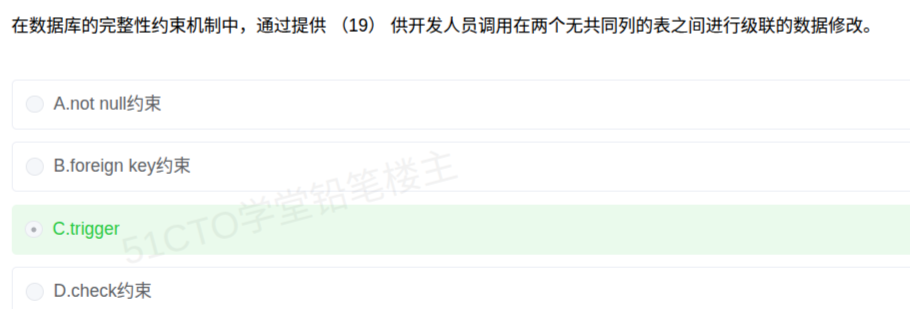

# 备考笔记：数据库-触发器与完整性约束机制

## 一、题目

> 在数据库的完整性约束机制中，通过提供（19）供开发人员调用在两个无共同列的表之间进行级联的数据修改。
>
> A. not null 约束
> B. foreign key 约束
> C. trigger
> D. check 约束

**答案：C. trigger**

解析：外键约束要求两表通过**公共列**建立参照关系（引用对方的主键/唯一键），而题干明确"两个**无共同列**的表"，外键在此无能为力；**触发器（trigger）**是由开发人员编写、挂在表上的一段程序，可在增删改时自动执行，从而跨表完成级联数据修改，故选 C。

## 二、知识点：数据库-触发器与完整性约束机制

### 1. 核心原理

数据库完整性约束机制分为**声明式约束**与**过程式约束**两大类：

- **声明式约束**（not null、check、primary key、unique、foreign key）：只需**声明规则**，由 DBMS 自动检查，作用范围限于**本表（或本表与有公共列的被参照表）**。
  - **not null**：限定该列取值不能为空。
  - **check**：限定该列（或元组）取值满足给定的条件表达式。
  - **primary key / unique**：保证唯一性。
  - **foreign key**：参照完整性，要求本表外键值等于被参照表的主键值或为空；**前提是两表有公共列可建立关联**。
- **过程式约束（触发器 trigger）**：由开发人员用 SQL 过程语言（如 PL/SQL）编写并**绑定到表**的一段程序，在指定事件（INSERT / UPDATE / DELETE）发生时**自动触发执行**，可包含任意复杂逻辑（跨表更新、审计、校验），因此能实现**两表无共同列时的级联修改**。

关键区分：**声明式约束表达"规则"，触发器承载"动作"**；需要跨表自动联动、且缺乏公共列可依托时，只能靠触发器。

### 2. 关键公式/规则

| 机制 | 类别 | 作用范围 | 能否跨无公共列的两表级联 |
| --- | --- | --- | --- |
| not null 约束 | 声明式 | 单列 | 否 |
| check 约束 | 声明式 | 单列 / 单表元组 | 否 |
| primary key / unique | 声明式 | 单表 | 否 |
| foreign key 约束 | 声明式 | 需两表**有公共列** | 否 |
| **trigger 触发器** | 过程式 | 可跨多表 | **能** |

触发器的三个构成要素：

| 要素 | 说明 | 常见取值 |
| --- | --- | --- |
| 触发事件 | 何种操作引发 | INSERT / UPDATE / DELETE |
| 触发时机 | 事件前后执行 | BEFORE / AFTER（或 INSTEAD OF） |
| 触发粒度 | 影响行数维度 | 行级（FOR EACH ROW）/ 语句级 |

### 3. 解题步骤

1. **抓关键词"两个无共同列的表"**：级联修改通常靠外键 + 公共列关联，此处**没有公共列**，可直接排除 **B. foreign key 约束**。
2. **排除 A、D**：not null 只管"不为空"，check 只管"取值满足表达式"，两者都**只作用于本表列**，无法完成跨表级联修改。
3. **锁定 C**：trigger 由开发人员编写、DBMS 在事件发生时自动调用，可跨表执行任意数据修改 → 与"供开发人员调用""级联的数据修改"两项描述完全吻合。
4. **定答案**：选 **C. trigger**。

## 三、易错点

1. **外键不是万能的"级联工具"**：外键实现级联的前提是**两表存在公共列**（外键引用被参照表的主键）。题干特意强调"无共同列"，就是在排除这一选项。
2. **区分触发器与存储过程**：存储过程需**显式调用**，触发器在事件发生时**自动触发**、不能直接调用；题干"供开发人员调用"指的是开发人员**编写**它，而非运行期手动调用。
3. **check 与 trigger 的边界**：check 只能写**单表内可判定的简单条件**，不能查询其他表；跨表逻辑必须用触发器。
4. **触发器是把双刃剑**：它隐式执行、层层嵌套，容易造成**性能开销与调试困难**，这也是约束机制优先用声明式约束、慎用触发器的原因。
5. **完整性约束不等于安全机制**：这些约束保障**数据正确一致（完整性）**，而权限、视图、加密才属**安全性**范畴。

## 四、扩展延伸

- **场景对照**：本类题目常见的触发场景包括——A 表插入后自动向 B 表写入日志、库存表变动后自动更新汇总表、两表字段名不同却需保持同步。凡"自动""联动""跨表"且"无公共列"的关键词，基本都指向触发器。
- **`INSTEAD OF` 触发器**：常用于**视图**上，把对视图的更新改写为对基表的实际操作，是"无公共列/不可直接更新"场景的另一典型用法。
- **级联的其他实现**：
  - 外键 + `ON DELETE CASCADE` / `ON UPDATE CASCADE`（**需公共列**）；
  - 触发器（无需公共列，逻辑自定义）；
  - 应用层事务中显式编码（可控但侵入性强）。
- **三类完整性速记**：实体完整性靠主键、参照完整性靠外键、用户定义完整性靠 not null / check / 触发器；触发器是"用户定义完整性"里能力最强的一种。
- **现实类比**：外键像"两把锁共用一把钥匙"（必须有共同的钥匙孔）；触发器像"请了个秘书，只要这张表有变动，就自动按吩咐去改别的表"——有没有共同字段都不影响他干活。

## 五、错题归档

| 题号 | 题型 | 考点 | 难度 | 掌握度 |
| --- | --- | --- | --- | --- |
| 系统分析师-数据库系统（题19） | 单选 | 数据库-完整性约束机制 触发器与各约束的适用边界 | 易 | 待复习 |

## 六、相关图片

原题截图：`./images/15-数据库-触发器与完整性约束机制.png`（由用户上传的原题截图复制改名而来）

