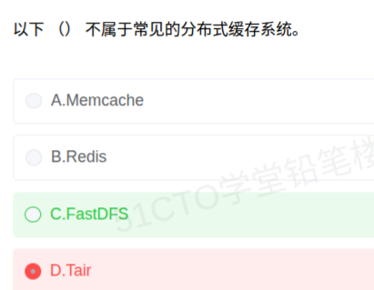

# 备考笔记：分布式缓存与文件存储辨析

## 一、题目

> 以下（  ）不属于常见的分布式缓存系统。
>
> A. Memcache
> B. Redis
> C. FastDFS
> D. Tair

**答案：C. FastDFS**

解析：Memcache、Redis、Tair 都是典型的**分布式缓存系统**（KV 内存存储、以加速读取为目的）；而 **FastDFS 是轻量级开源分布式文件系统**，用于图片、视频等文件的分布式存储与访问，属于"持久化文件存储"而非"缓存"，故选 C。

## 二、知识点：分布式缓存与文件存储辨析

### 1. 核心原理

两者的**设计目标根本不同**，这是判断的根:

- **分布式缓存系统**：把数据放在**内存**中，用多节点分担容量与压力，核心目标是**加速读取、减轻后端数据库压力**。数据通常是**可丢失、可重建**的（从数据库回源即可）。
- **分布式文件系统**：把**文件**分布到多台机器上统一管理，核心目标是**持久、可靠地保存大容量文件**并提供统一访问接口。数据**不可丢失**，必须靠副本/冗余保证可靠性。

一句话：**缓存求"快"，文件系统求"存"**。

### 2. 关键公式/规则

常见系统归类：

| 系统 | 类别 | 数据模型 / 特点 | 持久化 |
| --- | --- | --- | --- |
| **Memcache**（Memcached） | 分布式缓存 | 纯内存 KV，多线程，只支持简单键值 | 不支持 |
| **Redis** | 分布式缓存 | KV + 多数据结构（String/List/Hash/Set/ZSet），支持主从、哨兵、Cluster | 支持（RDB/AOF） |
| **Tair** | 分布式缓存 | 阿里自研 KV 存储，兼容 Redis/Memcached 协议 | 有持久化内存版 / 磁盘版 |
| **FastDFS** | 分布式**文件系统** | Tracker + Storage 两类角色，面向中小文件（图片/视频） | 文件持久存储 |

判定线索速查：

| 线索 | 倾向 |
| --- | --- |
| 名称含 Mem / Cache / Dict 等 | 缓存 |
| 名称含 FS / File / DFS / HDFS | 文件系统 |
| 题干强调"加速读取、减轻 DB 压力" | 缓存 |
| 题干强调"图片/视频/附件存储、不可丢" | 文件系统 |

### 3. 解题步骤

1. **看题干问"不属于"**：先明确这是**反向选择题**，要找的是"混进来的异类"。
2. **逐一归类**：Memcache → 内存 KV 缓存；Redis → 内存 KV + 数据结构缓存；Tair → 阿里分布式 KV 缓存（常作缓存用）；**FastDFS → 分布式文件系统**。
3. **抓名称线索**：FastDFS 中的 **DFS（Distributed File System）** 已直接表明它是文件系统，而非缓存。
4. **定答案**：选 **C. FastDFS**。

## 三、易错点

1. **误选 D（Tair）**是本题最常见的失分点：Tair 虽带"存储"色彩、且有持久化版本，但它本质是**分布式 KV 缓存中间件**，兼容 Redis/Memcached 协议，属缓存阵营。
2. **别被"分布式"三字带偏**：Memcache、Redis、FastDFS 都带"分布式"，但"分布式"只是部署形态，**区分点是"缓存"还是"文件系统"**。
3. **Redis 功能多不等于不是缓存**：它能当数据库、消息队列用，但软考语境下仍归入分布式缓存系统。
4. **缓存数据可丢、文件不可丢**：这是两类系统的本质分野。缓存宕机大不了回源重建；文件系统宕机则意味着用户数据丢失。
5. **注意"不属于"这类反向设问**：正向记忆容易，反向选择易手滑，答题时把问题圈出来再选。

## 四、扩展延伸

- **其他分布式文件系统**：HDFS、Ceph、GlusterFS、MinIO、GFS（Google File System）、MooseFS，均属"分布式存储/文件系统"阵营，与缓存系统不是一回事。
- **缓存的层次划分**：
  - **本地缓存**：Caffeine、Guava Cache（JVM 进程内，速度快但无法跨节点共享）；
  - **分布式缓存**：Redis、Tair、Memcached（跨节点共享，容量可水平扩展）。
  实际系统常"本地 + 分布式"两级缓存并用。
- **缓存四大经典问题**（高频考点联动）：
  - **缓存穿透**：查不存在的数据，请求全打到数据库 → 布隆过滤器 / 空值缓存；
  - **缓存击穿**：热点 key 过期瞬间大量请求涌入 → 互斥锁 / 热点不过期；
  - **缓存雪崩**：大量 key 同时过期或缓存集群宕机 → 过期时间加随机 / 高可用集群；
  - **缓存一致性**：与数据库双写不一致 → Cache Aside（先更新库再删缓存）等策略。
- **现实类比**：缓存像**办公桌上的便签**——写得快、查得快，丢了再抄一份即可；分布式文件系统像**档案室的正式档案**——查起来慢些，但必须长期妥善保存、绝不允许丢失。

## 五、错题归档

| 题号 | 题型 | 考点 | 难度 | 掌握度 |
| --- | --- | --- | --- | --- |
| 系统分析师-系统设计 | 单选 | 分布式系统-分布式缓存与分布式文件系统归类辨析 | 易 | 待复习 |

## 六、相关图片

原题截图：`./images/17-分布式缓存与文件存储辨析.png`（由用户上传的原题截图复制改名而来）

