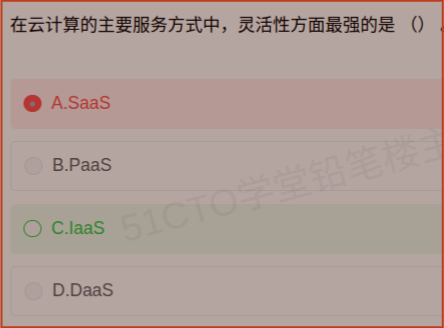

# 备考笔记：云计算服务模式-IaaS/PaaS/SaaS

## 一、题目

> 在云计算的主要服务方式中，灵活性方面最强的是（  ）。
>
> A. SaaS
> B. PaaS
> C. IaaS
> D. DaaS

**答案：C. IaaS**

解析：IaaS 只提供最底层的计算、存储、网络等**基础设施**，操作系统、中间件、运行环境、应用全部由用户自行选择和部署，用户控制粒度最细、可定制程度最高，因此**灵活性最强**。SaaS 恰好相反，开箱即用但可定制余地最小。

## 二、知识点：云计算服务模式-IaaS/PaaS/SaaS

### 1. 核心原理

云计算按"服务商提供到哪一层、用户负责哪一层"划分为三种经典服务模式，**用户管理范围越大，灵活性越强、越省事的程度越低**：

- **IaaS（Infrastructure as a Service，基础设施即服务）**：提供虚拟化的计算（虚拟机）、存储、网络等**基础资源**。用户需自行安装操作系统及以上的所有软件。**控制力最强、灵活性最强**。
- **PaaS（Platform as a Service，平台即服务）**：在基础设施之上再提供**开发与运行平台**（操作系统、中间件、数据库、运行时、开发工具）。用户只需关注**应用和数据**，无需管 OS 与中间件。
- **SaaS（Software as a Service，软件即服务）**：直接提供**可用的应用软件**，用户通过浏览器/客户端使用即可，**什么都不用管**，最省事但灵活性最弱。

一句话对照：**IaaS 给"地"，PaaS 给"地 + 水电"，SaaS 给"装修好可以住的房"**。

### 2. 关键公式/规则

三种模式的职责划分：

| 层次 | IaaS | PaaS | SaaS |
| --- | --- | --- | --- |
| 应用 | 用户 | 用户 | 服务商 |
| 数据 | 用户 | 用户 | 服务商 |
| 运行时 / 中间件 | 用户 | 服务商 | 服务商 |
| 操作系统 | **用户** | 服务商 | 服务商 |
| 虚拟化 / 服务器 / 存储 / 网络 | 服务商 | 服务商 | 服务商 |

结论性排序：

| 维度 | 排序 |
| --- | --- |
| 灵活性 / 可控性 / 可定制性 | **IaaS > PaaS > SaaS** |
| 便捷性 / 开箱即用 / 免运维 | **SaaS > PaaS > IaaS** |
| 用户自行管理的范围 | **IaaS > PaaS > SaaS** |

典型产品：

| 模式 | 典型产品 |
| --- | --- |
| IaaS | AWS EC2、阿里云 ECS、OpenStack、腾讯云 CVM |
| PaaS | Google App Engine、阿里云（部分 PaaS 能力）、Heroku、Cloud Foundry |
| SaaS | Office 365、Salesforce、钉钉、企业微信、金蝶云 |

### 3. 解题步骤

1. **抓关键词"灵活性最强"**：灵活性 = **用户能自己决定的东西有多少** = 控制粒度。
2. **比较控制粒度**：IaaS 用户能自主选操作系统、装中间件、改运行环境；PaaS 只能写应用；SaaS 只能改改配置。→ **IaaS 最强**。
3. **排除 D**：DaaS 不在云计算三大经典服务模式（IaaS/PaaS/SaaS）之列，属衍生概念，可直接排除。
4. **定答案**：选 **C. IaaS**。

## 三、易错点

1. **"灵活性"不等于"好用的程度"**：本题的 A 项 SaaS 是**最省事**的那个，不少考生把"省事"误当成"灵活"而选错。记住：**灵活 = 自己能改的多**。
2. **正反两个排序要一起背**：灵活性 IaaS > PaaS > SaaS，便捷性 SaaS > PaaS > IaaS，二者**方向相反**，考哪个都不会错。
3. **DaaS 不是三大服务模式**：DaaS 通常指 Data as a Service（数据即服务）或 Desktop as a Service，属云计算生态的**衍生概念**，不作为"主要服务方式"，遇到此类选项优先怀疑。
4. **别把 PaaS 当"中间选项"就选它**：PaaS 灵活性居中，只在题目明确问"折中""兼顾"时才考虑。
5. **分界线的记忆抓手**：IaaS 与 PaaS 的分界在**操作系统**（IaaS 用户管 OS，PaaS 不用管）；PaaS 与 SaaS 的分界在**是否需要写代码/开发**（SaaS 用户不开发）。

## 四、扩展延伸

- **生活化类比**（高频记忆法）：
  - **IaaS = 毛坯房**：只给墙和地，水电自己接、装修自己搞，最自由也最费心；
  - **PaaS = 简装房/可以开店的铺面**：水电家具齐全，你只需搬进自己的货物（应用）；
  - **SaaS = 酒店**：拎包入住，什么都有，但格局摆设不能改。
- **云计算的衍生服务模式**：FaaS（函数即服务，Serverless 的核心形态）、BaaS（后端即服务）、CaaS（容器即服务）、DaaS（数据/桌面即服务）、MaaS（模型即服务，大模型时代新形态）。考查"主要服务方式"时，仍以 **IaaS/PaaS/SaaS 三种**为准。
- **云部署模式**（易与"服务模式"混淆，属另一维度）：**公有云**（面向公众开放）、**私有云**（单一组织专用）、**混合云**（公有 + 私有协同）、**社区云**（若干有共同诉求的组织共用）。
- **选择依据**：企业若需深度定制、已有运维团队，倾向 IaaS；若想快速上线业务、不愿管运维，倾向 PaaS；若只需通用办公/业务功能，直接 SaaS 最划算。**灵活性越强，企业自身的运维与集成成本也越高**。
- **考点归属**：云计算服务模式属**企业信息化与新技术**范畴，软考选择题中常以"灵活性/可控性最强的是谁""用户无需管理底层设施的是谁"等形式出现。

## 五、错题归档

| 题号 | 题型 | 考点 | 难度 | 掌握度 |
| --- | --- | --- | --- | --- |
| 系统分析师-企业信息化与新技术 | 单选 | 云计算-IaaS/PaaS/SaaS 服务模式的灵活性对比 | 易 | 待复习 |

## 六、相关图片

原题截图：`./images/18-云计算服务模式-IaaS-PaaS-SaaS.png`（由用户上传的原题截图复制改名而来）

