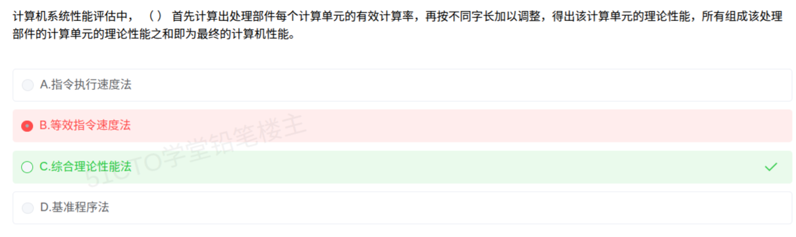

# 备考笔记：计算机系统性能评价方法

## 一、题目

> 计算机系统性能评估中，（  ）首先计算出处理部件每个计算单元的有效计算率，再按不同字长加以调整，得出该计算单元的理论性能，所有组成该处理部件的计算单元的理论性能之和即为最终的计算机性能。
>
> A. 指令执行速度法
> B. 等效指令速度法
> C. 综合理论性能法
> D. 基准程序法

**答案：C. 综合理论性能法**

解析：题干给出的"三步走"正是**综合理论性能法（CTP，Composite Theoretical Performance）**的定义——**先算各计算单元的有效计算率 → 按字长调整得到各单元理论性能 → 全部计算单元理论性能求和**即整机性能。该方法源自美国对高性能计算机的出口管制评估，特点是"自下而上、分层求和"。

## 二、知识点：计算机系统性能评价方法

### 1. 核心原理

衡量计算机性能有四类经典方法，思路由"单指标"逐步走向"综合性/实测性"：

- **指令执行速度法**：用**每秒执行多少条指令**来度量，代表指标为 **MIPS**（百万条整数指令/秒）和 **MFLOPS**（百万次浮点运算/秒）。计算简单，但**不同指令集的"一条指令"含金量不同**，横向比较不可靠。
- **等效指令速度法（吉普森混合法）**：先统计各类指令在典型程序中**出现的比例（权重）**，再对各类指令的执行时间（或速度）做**加权平均**，得到一个"等效"的指令速度。它解决了"程序里指令种类不同"的问题，但仍依赖指令集假设。
- **综合理论性能法（CTP）**：**自下而上**累加。先计算处理部件中**每个计算单元的有效计算率**，按**字长**（定点/浮点、位宽）加以调整，得到该计算单元的理论性能；把所有计算单元的理论性能**求和**，即为处理部件（进而整机）的性能。
- **基准程序法（Benchmark）**：选用一组**有代表性的实际程序**（如 SPEC、TPC-C、Linpack）在机器上实际运行，用运行时间/吞吐量作为性能指标。**最贴近真实应用**，也最费时费力，是公认最可靠的评价方式。

### 2. 关键公式/规则

四种方法的特征对照：

| 方法 | 核心思路 | 关键指标 / 公式 | 关键词信号 |
| --- | --- | --- | --- |
| 指令执行速度法 | 数指令条数 | MIPS、MFLOPS | "每秒百万条""指令数" |
| 等效指令速度法 | **按指令比例加权平均** | T = Σ(pᵢ × Tᵢ)，pᵢ 为第 i 类指令出现比例 | "指令比例""混合""加权""等效" |
| **综合理论性能法** | **分计算单元算 → 按字长调整 → 求和** | 整机性能 = Σ 各计算单元理论性能 | "**计算单元**""**字长**""**理论性能之和**" |
| 基准程序法 | 跑真实程序实测 | SPEC、TPC-C、Linpack 的运行时间/吞吐 | "实际运行""标准测试程序""测试集" |

判定口诀：

| 题干出现 | 选 |
| --- | --- |
| "计算单元""有效计算率""按字长调整""理论性能之和" | **综合理论性能法** |
| "各类指令出现比例""加权平均""吉普森" | 等效指令速度法 |
| "MIPS""MFLOPS""每秒执行指令数" | 指令执行速度法 |
| "标准测试程序""实际运行""SPEC / TPC" | 基准程序法 |

### 3. 解题步骤

1. **圈出题干的动作词**：①"计算出处理部件**每个计算单元**的有效计算率"；②"按**不同字长**加以调整"；③"所有计算单元的理论性能**之和**"。
2. **对照关键词表**："计算单元 + 字长 + 求和"三者同时出现，唯一匹配 **综合理论性能法**。
3. **排除 B**：等效指令速度法的关键词是"**指令出现比例 / 加权平均**"，题干完全没有提到指令比例，也可排除。
4. **排除 A、D**：A 只讲指令执行速度（MIPS 类指标）；D 强调"跑实际程序"，题干未涉及测试程序。
5. **定答案**：选 **C. 综合理论性能法**。

## 三、易错点

1. **B 与 C 是最主要的一对干扰项**：两者的共同点是"都涉及"处理部件/指令"的分项计算"，区别在于 **B 按"指令比例"加权，C 按"计算单元 + 字长"求和**。题干没有"比例"二字，因此不能选 B。
2. **不要被"理论性能"四个字迷惑**：等效指令速度法也谈"等效速度"，但它的落脚点是**加权平均**而非**分层求和**；遇到"求和 / 累加 / 各单元之和"要立刻想到 CTP。
3. **基准程序法虽最可靠，但不是本题答案**：它在题干中一定伴随"实际运行程序""测试集"等描述。**理论 vs 实测**是两条不同的路。
4. **MIPS 不可跨平台横比**：同一程序在不同指令集架构上 MIPS 数值差异很大，业界戏称 MIPS 是 "Meaningless Indicator of Processor Speed"（无意义的处理器速度指标）。
5. **性能评价还要看非性能因素**：可靠性、可用性、兼容性、可维护性、价格等，不能只看速度。

## 四、扩展延伸

- **各方法的适用与局限**：
  - 指令执行速度法：**最快最省事**，适合粗估，不适合精确比较；
  - 等效指令速度法（吉普森混合法）：比单看 MIPS 精确，但仍以"指令比例"为假设前提，程序负载一变结论就变；
  - 综合理论性能法：**客观、可加总**，常用于政府出口管制、机型性能分级；
  - 基准程序法：**最接近真实**，代价是耗时长、受测试程序选择影响大，且难以横向覆盖所有应用类型。
- **常见基准测试套件**：
  - **SPEC**（SPECint / SPECfp / SPECweb / SPECjbb）：通用 CPU 与 Web/Java 场景；
  - **TPC-C / TPC-H / TPC-DS**：联机事务处理与决策支持，衡量数据库事务吞吐与查询性能；
  - **Linpack / HPL**：高性能计算，**全球 TOP500 超算排名**即以此为依据；
  - **AIM、NetBench**：分别面向文件服务器与网络吞吐。
- **单位换算**：1 秒 = 10⁹ 纳秒，若某指令耗时 t ns，则对应速度为 1000 / t MIPS 量级（须结合具体定义理解，考试中多以判断"能否横比"为主）。
- **现实类比**：把这四种方法比作评价一条生产线——
  - 指令执行速度法：**数它每小时拧多少颗螺丝**；
  - 等效指令速度法：**先统计要拧几种螺丝、各占多少比例，再算平均效率**；
  - 综合理论性能法：**把车间拆成若干工位，逐个工位算产能、按规格调整后相加得出整厂产能**；
  - 基准程序法：**干脆接一批真实订单让它试生产**，最真实但最费时间。

## 五、错题归档

| 题号 | 题型 | 考点 | 难度 | 掌握度 |
| --- | --- | --- | --- | --- |
| 系统分析师-计算机系统 | 单选 | 计算机系统性能评价方法（综合理论性能法 CTP 与等效指令速度法辨析） | 中 | 待复习 |

## 六、相关图片

原题截图：`./images/20-计算机系统性能评价方法.png`（由用户上传的原题截图复制改名而来）

