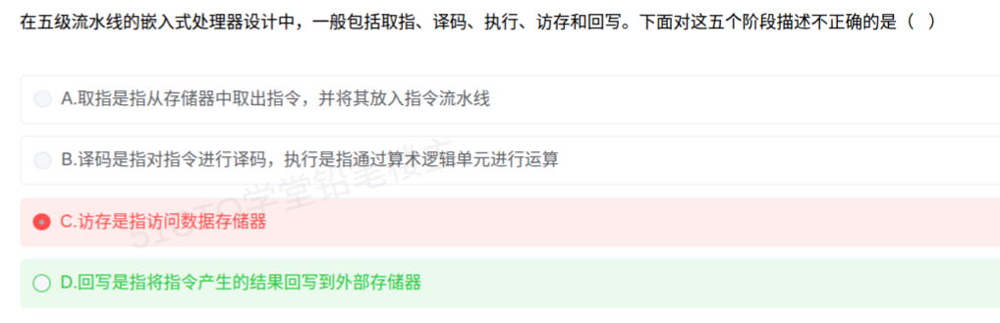

# 备考笔记：五级流水线-阶段功能辨析

## 一、题目

> 在五级流水线的嵌入式处理器设计中，一般包括取指、译码、执行、访存和回写。下面对这五个阶段描述不正确的是（  ）。
>
> A. 取指是指从存储器中取出指令，并将其放入指令流水线
> B. 译码是指对指令进行译码，执行是指通过算术逻辑单元进行运算
> C. 访存是指访问数据存储器
> D. 回写是指将指令产生的结果回写到外部存储器

**答案：D. 回写是指将指令产生的结果回写到外部存储器**

解析：回写（Write Back）是把指令执行结果写回**CPU 内部的通用寄存器**，**不是**写回外部存储器。写外部存储器是 **Store 类指令在"访存"阶段**完成的工作。因此 D 的描述不正确（本题问的是"不正确"）。A、B、C 三项的描述均准确。

## 二、知识点：五级流水线-阶段功能辨析

### 1. 核心原理

经典五级流水线把一条指令的执行拆成五个阶段，各级可**并行处理不同指令**，从而提升吞吐率：

| 阶段 | 英文 | 主要工作 | 关键资源 |
| --- | --- | --- | --- |
| 取指 | IF（Instruction Fetch） | 按 PC 从**指令存储器**（指令 Cache）取出指令，送入流水线，PC 自增 | PC、指令存储器 |
| 译码 | ID（Instruction Decode） | 对指令**译码**，识别操作码与操作数，**读取通用寄存器** | 译码器、寄存器堆 |
| 执行 | EX（Execute） | 由 **ALU** 完成算术/逻辑运算，或计算访存地址 | 算术逻辑单元 |
| 访存 | MEM（Memory Access） | 访问**数据存储器**：Load 读数据、Store 写数据 | 数据 Cache |
| 回写 | WB（Write Back） | 把运算/读取结果**写回通用寄存器** | 寄存器堆 |

**核心记忆点**：五个阶段里唯一"对外"的写动作是**访存阶段的 Store**；**回写的对象永远是 CPU 内部寄存器**，它代表一条指令在流水线中的"收官"。

### 2. 关键公式/规则

流水线时间与性能（K 级流水线、n 条指令、每级耗时一个时钟周期 Δt）：

| 名称 | 公式 | 说明 |
| --- | --- | --- |
| 流水线执行时间 | T = (K + n − 1) × Δt | 第一条指令走满 K 级，其后每周期流出一条 |
| 非流水线执行时间 | T' = n × K × Δt | 每条指令都串行走完 K 级 |
| 加速比 | S = T' / T = nK / (K + n − 1) | 当 n → ∞ 时 S → K，即**理想加速比不超过流水线级数** |
| 吞吐率 | TP = n / [(K + n − 1) × Δt] | 最大吞吐率 = 1 / Δt |

**易混点提示**：流水线的贡献是提高**吞吐率（单位时间完成的指令数）**，**不缩短单条指令的执行时间**（单条指令延迟反而略增）。

三种典型冲突：

| 冲突类型 | 起因 | 常见对策 |
| --- | --- | --- |
| 结构冲突 | 争用同一硬件部件 | 增加部件 / 分设指令与数据 Cache |
| 数据冲突 | 后条指令要用前条的未写回结果 | **数据前推（旁路）**、插入气泡停顿 |
| 控制冲突 | 转移指令改变取指方向 | **分支预测**、延迟槽、预取两条路径 |

### 3. 解题步骤

1. **看设问方向**：题目问"**不正确**"的是，属反向选择，逐个验证即可。
2. **验 A**：取指 = 从存储器取指令并送入流水线 → 正确。
3. **验 B**：译码 = 对指令译码；执行 = 由 ALU 运算 → 正确。
4. **验 C**：访存 = 访问**数据存储器**（区别于取指访问的**指令存储器**）→ 正确。
5. **验 D**：回写 = 结果写回**寄存器**，而非外部存储器 → **错误**，选 **D**。

## 三、易错点

1. **"回写"的落点是寄存器，不是内存**：这是本题唯一错项。写外部存储器只能由 **Store 指令**在**访存阶段**完成，回写阶段不碰外部存储器。
2. **注意区分"指令存储器"与"数据存储器"**：取指访的是**指令存储器**，访存访的是**数据存储器**；两者在哈佛结构中物理分离（也各自有 Cache）。C 项之所以正确，正是因为用词是"数据存储器"。
3. **反向设问要划重点**：题干问"不正确"，与"正确"只差一个字，极易看反导致自信地选错。
4. **不是所有指令都走完五级**：如 `add` 指令无需访存，`nop` 可能全阶段空转；"五级流水线"描述的是**结构**，不是每条指令的必经路径。
5. **流水线不能缩短单条指令时间**：它的收益在**吞吐率**。若题目说"流水线可减少单条指令执行时间"，即为错误表述。

## 四、扩展延伸

- **典型算例**：5 级流水线，执行 100 条指令，每级 1 ns。
  - 流水线耗时 T = (5 + 100 − 1) × 1 ns = **104 ns**；
  - 非流水线耗时 T' = 100 × 5 × 1 ns = **500 ns**；
  - 加速比 S = 500 / 104 ≈ **4.81**（< 5，因首条指令需"填满"流水线，即所谓"流水线填充开销"）。
- **提高并行的进阶技术**：**超标量**（每周期发射多条指令）、**超流水线**（把每级再细分、时钟更快）、**VLIW**（超长指令字，由编译器静态调度）、**乱序执行 + 寄存器重命名**（动态调度）。
- **为什么 RISC 爱用流水线**：指令**定长**（便于统一取指）、**Load/Store 结构**（只有访存指令访问内存）、**寄存器多**（减少访存）、指令格式规整（译码简单）——这些特征天然适合五级流水线。嵌入式处理器多为 RISC 架构，故本考点常与 RISC 一同出现。
- **现实类比**：五级流水线像工厂的**五道装配工位**（取料→看图→加工→取配件→装回成品架）。流水线的意义在于**五个工位同时干活、源源不断出产品**，而不是把某一件产品的生产时间变短。而"回写"这道工位的动作是**把成品放回自己的工具架（寄存器）**，绝非直接发往仓库（外部存储器）——那要等专门的"发货指令"（Store）在"取配件"工位（访存）来办。

## 五、错题归档

| 题号 | 题型 | 考点 | 难度 | 掌握度 |
| --- | --- | --- | --- | --- |
| 系统分析师-计算机系统（嵌入式） | 单选 | 五级流水线各阶段功能，特别是"回写"的对象为寄存器 | 中 | 待复习 |

## 六、相关图片

原题截图：`./images/21-五级流水线-阶段功能辨析.png`（由用户上传的原题截图复制改名而来）

