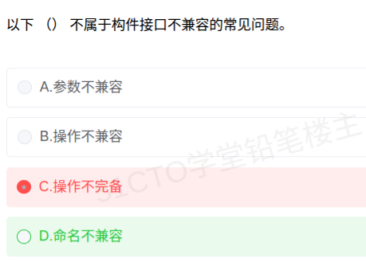

# 备考笔记：构件接口不兼容的常见问题

## 一、题目

> 以下（  ）不属于构件接口不兼容的常见问题。
>
> A. 参数不兼容
> B. 操作不兼容
> C. 操作不完备
> D. 命名不兼容

**答案：D. 命名不兼容**

解析：构件组装时，接口不兼容的常见情况**只有三类**：**参数不兼容**（操作同名，但参数类型或个数不同）、**操作不兼容**（提供接口与请求接口的操作名不同）、**操作不完备**（一方的提供接口是另一方请求接口的子集，或相反）。"命名不兼容"不在教材的这三类之中，故为本应选的答案。值得注意的是，本题设问是"**不属于**"，C（操作不完备）恰恰属于三类常见问题之一，不能选。

## 二、知识点：构件接口不兼容的常见问题

### 1. 核心原理

基于构件的软件复用（CBSD）在把既有构件组装进新系统时，必须处理**接口不匹配**。教材把构件接口不兼容归纳为 **3 种情况**：

| 类型 | 判定要点 | 典型例子 |
| --- | --- | --- |
| 参数不兼容 | 两侧**操作名相同**，但**参数类型**或**参数个数**不同 | 一方 `add(int, int)`，另一方 `add(float, float)`；或一方多一个参数 |
| 操作不兼容 | 两侧**操作名不同**（语义可能对应，但名字对不上） | 一方提供 `getUser()`，另一方请求 `queryUser()` |
| 操作不完备 | 一方的提供接口是另一方请求接口的**子集**，或**反之** | 构件只提供 `read()` 和 `write()`，而需求还要 `delete()`；或构件能力多于所需 |

**处理手段**：对上述不兼容，**必须通过编写适配器构件（Adapter）** 来解决——适配器把请求方的调用"翻译"成提供方能识别的形式，从而屏蔽接口差异。

### 2. 关键公式/规则

接口不兼容三分法及其对策（记忆口诀：**参、操、备**）：

| 不兼容类型 | 差异落在哪一层 | 适配器要做的事 |
| --- | --- | --- |
| 参数不兼容 | 操作名同、**签名**不同 | 做类型转换 / 参数补齐或裁剪 |
| 操作不兼容 | **操作名**不同 | 做名称映射（别名转发） |
| 操作不完备 | 操作**集合**大小不同 | 补齐缺失操作，或屏蔽多余操作 |

判定口诀：

- 名字**一样**、签名**不一样** → **参数不兼容**；
- 名字**不一样**（功能可能一样） → **操作不兼容**；
- 名字和签名都无所谓，是**操作个数（集合范围）**对不上 → **操作不完备**；
- 以上三者之外的说法（如"命名不兼容"）→ **不是**教材口径的常见问题。

### 3. 解题步骤

1. **看设问方向**：题干问"**不属于**"，属反向选择，要挑出"编造项"。
2. **回忆教材三分法**：参数不兼容、操作不兼容、操作不完备——**只有这三类**。
3. **逐项比对**：A 属第 1 类；B 属第 2 类；C 属第 3 类；D "命名不兼容"不在其列。
4. **得出结论**：D 为"不属于"的一项，选 **D**。
5. **反查自己的选择**：若误选 C，是把三类中的真实项当成了"不属于"，属于典型的"反向设问 + 知识边界不清"双重失误。

## 三、易错点

1. **"命名不兼容"是干扰项**：它听起来很像"操作不兼容"，但教材把操作名不同归为**操作不兼容**，并不另设"命名不兼容"这一类。多出一个名词，正是为反向设问准备的陷阱。
2. **反向设问要划重点**：题干问"**不属于**"，一字之差结果全反。做此类题建议先在题干上圈出"不属于/不正确/除外"。
3. **"操作不完备"易被误判为多余说法**：它是**货真价实**的第三类，指接口操作集合的**范围**对不上（子集/超集关系），不要与"操作不兼容"混为一谈。
4. **参数不兼容的前提是"操作名相同"**：若操作名都不同，应判为操作不兼容，而不是参数不兼容——两者的分界就在"名字是否一致"。
5. **"常见问题"是封闭集合**：题目说"常见问题"，应以教材列举的三类为准，不能凭直觉把现实工程中任意接口差异都算进来。

## 四、扩展延伸

- **为什么要有适配器构件**：构件是**独立开发、独立演化**的黑盒，装配时不可能要求提供方改写；于是用适配器在**中间层**完成协议转换，这也是设计模式中 **Adapter（适配器）模式** 在构件组装层面的体现。
- **与之相连的构件组装概念**：构件组装可分为**基于功能**、**基于数据**、**基于层次**等方式；组装能否成功，取决于接口是否"对得上"，这正是本考点的现实背景。
- **同一知识域的常考搭配**：
  - **构件**的三个基本要素：**接口、实现、部署**（构件 = 可独立部署、可替换的软件单元）；
  - **软件复用**层次由低到高：代码复用、设计复用、**构件复用**、框架复用、领域工程；
  - **COTS**（商用现成构件）复用时的**适配与胶合代码**问题；
  - **接口定义语言（IDL）** 用于描述接口，便于跨语言、跨平台组装。
- **现实类比**：把构件组装想成"国标插座与进口插头"。**参数不兼容** = 插头插得进（形状对），但电压/规格不对（类型对不上）；**操作不兼容** = 插孔型号完全不同（名字对不上）；**操作不完备** = 插座只有两个孔，却需要接三根线（集合不齐）。而"**命名不兼容**"这种说法，就像给插座编了本字典却没有实物对应——存在感很强，却不是真正的"对接方式"，因此不是教材承认的常见问题。

## 五、错题归档

| 题号 | 题型 | 考点 | 难度 | 掌握度 |
| --- | --- | --- | --- | --- |
| 系统分析师-软件工程（构件与复用） | 单选 | 构件接口不兼容的三类常见问题（参数/操作/操作不完备），及反向设问 | 中 | 待复习 |

## 六、相关图片

原题截图：`./images/22-构件接口不兼容的常见问题.png`（由用户上传的原题截图复制改名而来）

