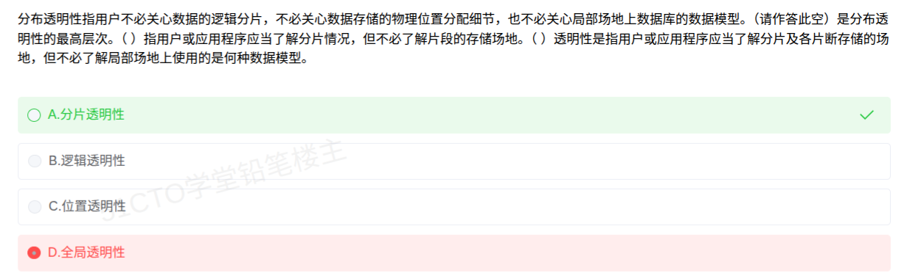

# 备考笔记：分布式数据库-分布透明性层次

## 一、题目

> 分布透明性指用户不必关心数据的逻辑分片，不必关心数据存储的物理位置分配细节，也不必关心局部场地上数据库的数据模型。（请作答此空）是分布透明性的最高层次。（  ）指用户或应用程序应当了解分片情况，但不必了解片段的存储场地。（  ）透明性是指用户或应用程序应当了解分片及各片断存储的场地，但不必了解局部场地上使用的是何种数据模型。
>
> A. 分片透明性
> B. 逻辑透明性
> C. 位置透明性
> D. 全局透明性

**答案：A. 分片透明性**

解析：分布透明性自高到低分为三个层次——**分片透明性、位置透明性、局部数据模型透明性（逻辑透明性）**。其中 **分片透明性层次最高**，用户只对**全局关系**操作，完全不必知道数据如何分片。本题作答空问的是"最高层次"，故选 A。三个空依次应填：**分片透明性（A）、位置透明性（C）、逻辑透明性（B）**。D"全局透明性"并非该分类中的术语，属干扰项。

## 二、知识点：分布式数据库-分布透明性层次

### 1. 核心原理

分布式数据库除具有数据的逻辑独立性与物理独立性外，还多一项**数据分布独立性**，即**分布透明性**：用户不必关心数据的分片、存储场地与局部数据模型。教材把分布透明性分为**三个层次**，层次由高到低如下：

| 层次（高→低） | 名称 | 用户/应用程序需要知道的 | 不需要知道的 | 模式间的映像 |
| --- | --- | --- | --- | --- |
| 最高 | 分片透明性 | 只对**全局关系**操作 | 数据如何**分片** | 全局概念模式 ↔ 分片模式 |
| 中间 | 位置透明性 | 需了解**分片**情况 | 片段存在**哪个场地** | 分片模式 ↔ 分配（分布）模式 |
| 最低 | 局部数据模型透明性（逻辑透明性） | 需了解**分片**及**各片段存储的场地** | 局部场地用的是**何种数据模型** | 分配模式 ↔ 局部概念模式 |

一句话抓要点：**能"少知道一层"就多一层透明**——分片透明连分片都不用管，位置透明要管分片但不管场地，逻辑透明什么都得管、只不用管局部数据模型。

### 2. 关键公式/规则

分布透明性层次速查（记忆口诀：**分片最高、位置居中、逻辑最低**）：

| 说法（题干特征） | 对应透明性 | 口诀对照 |
| --- | --- | --- |
| 只需对全局关系操作，不必知道分片 | 分片透明性 | "连分片都不关心" → 最高 |
| 知道分片，但不知片段存在何处 | 位置透明性 | "知分片、不知场地" |
| 知道分片与场地，但不知局部数据模型/DBMS | 逻辑透明性（局部数据模型透明性） | "只欠最后一层——局部模型" |

补充要点：

- **分片方式**：水平分片、垂直分片、混合分片（分片透明性更高时，用户觉察不到这些划分）。
- **改变不改程序**：分片模式变化时只改"全局概念模式到分片模式的映像"；场地变化时只改"分片模式到分配模式的映像"——**用户程序都不用改写**，这正是"透明"的价值。
- **易混名词**：另有 **复制透明性**（用户不必关心数据副本在网络中的复制与更新同步），它**不属于**本题的三层次序列，但与分布透明性同属分布式数据库的透明性范畴；**"全局透明性"则是编造词**。

### 3. 解题步骤

1. **抓设问**：本题括号里注明"请作答此空"，落在"（　）是分布透明性的最高层次"这一句上——问的是**最高层次**。
2. **回忆三层序列**：分片透明性（最高）→ 位置透明性 → 逻辑透明性（最低）。
3. **对号入座**：最高层次即 **分片透明性**，选项 A。
4. **顺带核验另两空**：第二空"知分片、不知场地" = 位置透明性（C）；第三空"知分片与场地、不知局部数据模型" = 逻辑透明性（B）。三空齐全，进一步佐证 A 正确。
5. **排除干扰项**：D"全局透明性"在教材分类中不存在，直接排除。

## 三、易错点

1. **层次顺序记反**：常见错误是把"逻辑透明"当成最高。实际是**分片透明最高、逻辑透明最低**——因为分片透明对用户"隐瞒"得最多。
2. **"逻辑透明性"的两个叫法**：又叫**局部数据模型透明性**（局部映像透明性）。看到"不必了解局部场地使用的是何种数据模型"，要立刻想到它，而不是"位置"。
3. **位置透明 vs 逻辑透明的分水岭**：一个只管到"场地"（位置透明），一个管到"局部数据模型/DBMS"（逻辑透明）。题干中说"不必了解片段的存储场地"→位置透明；说"不必了解局部数据模型"→逻辑透明。
4. **"全局透明性"是编造项**：教材的三层里没有它，遇到即排除。
5. **别把"复制透明性"塞进这三层**：复制透明是并行的另一个概念，虽同属透明性范畴，但不参与本题的层次排序。

## 四、扩展延伸

- **为什么透明性有层次差别**：分布透明性本质上描述"用户被屏蔽掉多少分布细节"。屏蔽得越多，系统在映像层要做的转换越多，用户编程越简单——因此**分片透明是设计追求的理想目标**，而**逻辑透明对异构型/同构异质的分布式数据库尤为重要**（它能屏蔽各站点 DBMS 与数据模型的差异）。
- **分布式数据库的其他常考特点**（常与本考点同题出现）：
  - **数据独立性**：逻辑独立、物理独立之外，还多"分布独立性"；
  - **集中与自治相结合的控制结构**：各局部 DBMS 自治，同时有全局协调控制；
  - **适当增加数据冗余**：多副本提高可靠性与可用性，也提高局部性/性能，代价是一致性维护；
  - **全局的一致性、可串行性与可恢复性**。
- **几个易混概念一并记住**：
  - **分片模式**定义"数据怎么分"，**分配（分布）模式**定义"片段放在哪个场地"，**全局概念模式**定义"整体逻辑结构"；
  - 分布式数据库的特点常表述为"**物理上分布、逻辑上集中**"。
- **现实类比**：把分布式数据库想成一家"全国连锁书店"。
  - **分片透明**：你只管说"我要《软考教程》这本书"，书是按地区分片摆在哪排哪个店，你完全不用管；
  - **位置透明**：你得知道"这本书被分成若干地区分册"（知道分片），但哪个分册放在北京店还是上海店，不用你操心；
  - **逻辑透明**：你知道分册、也知道各店在哪，只是不用关心"北京店用的自家库、上海店用的外来库"这种局部系统的差异。
  - 而"**全局透明性**"就像有人宣称"你连有没有这家连锁店都不用知道"——听着更高级，其实并不在真实的分级体系里。

## 五、错题归档

| 题号 | 题型 | 考点 | 难度 | 掌握度 |
| --- | --- | --- | --- | --- |
| 系统分析师-数据库（分布式数据库） | 单选 | 分布透明性的三个层次：分片透明性（最高）、位置透明性、逻辑透明性（最低） | 中 | 待复习 |

## 六、相关图片

原题截图：`./images/23-分布式数据库-分布透明性层次.png`（由用户上传的原题截图复制改名而来）

