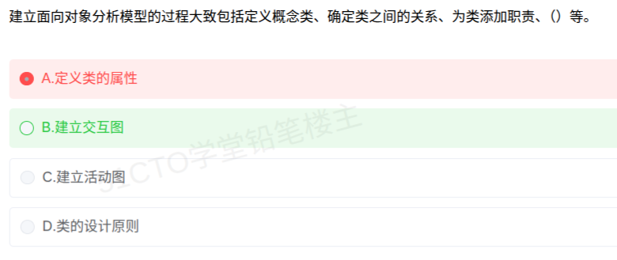

# 备考笔记：面向对象分析-建模过程

## 一、题目

> 建立面向对象分析模型的过程大致包括定义概念类、确定类之间的关系、为类添加职责、（　）等。
> A. 定义类的属性
> B. 建立交互图
> C. 建立活动图
> D. 类的设计原则

**答案：B. 建立交互图**

解析：面向对象分析（OOA）建模的核心步骤可概括为四步——**定义概念类 → 确定类之间的关系 → 为类添加职责 → 建立交互图**。前两步确定"有哪些类、类之间怎么连"（静态结构），第三步给类分配"要做什么"，第四步用**交互图**（顺序图/通信图）刻画对象之间如何**协作**完成用例，从而验证并细化职责分配。其余选项均不属于这四步：A.定义类的属性属于更细的实现内容；D.类的设计原则属**面向对象设计（OOD）**范畴；C.活动图描述业务流程/工作流，而非对象协作（详见第三节）。

## 二、知识点：面向对象分析（OOA）建模过程

### 1. 核心原理

OOA = 用面向对象的思想**建立问题域的分析模型**，回答四个问题："系统里有哪些对象、它们是什么、它们要做什么、它们如何协作"。教材把它收敛成四步：

- **定义概念类**：从需求（用例、领域知识）中识别出问题域里的类/概念，得到概念类图的骨架（"有哪些类"）。
- **确定类之间的关系**：识别类之间的关联、聚合、组合、泛化、依赖等（"类之间怎么连"，即 [30-面向对象-泛化与聚合关系.md](30-面向对象-泛化与聚合关系.md) 中的 is-a / is-part-of 等关系）。
- **为类添加职责**：给每个类分配它应承担的**职责（responsibility）**，即"这个类要做什么"——是高层语义，不是具体方法实现。
- **建立交互图**：用**顺序图/通信图**描述对象之间为完成某个用例而进行的消息交互，检验职责分配是否合理（"对象之间如何协作"）。

一句话记忆：**概念类定骨架 → 关系连结构 → 职责分任务 → 交互图看协作**。

### 2. 关键公式/规则

| 步骤 | 关注点 | 主要产物 | 静态/动态 |
| --- | --- | --- | --- |
| ① 定义概念类 | 有哪些类 | 概念类（类名） | 静态 |
| ② 确定类间关系 | 类之间怎么连 | 类图（关联/聚合/泛化…） | 静态 |
| ③ 为类添加职责 | 每个类要做什么 | 职责清单 | 静态（语义层） |
| ④ 建立交互图 | 对象如何协作 | 顺序图 / 通信图 | 动态 |

UML 图的静态/动态划分（判断选项是否属于"分析建模"的关键）：

| 分类 | 包含的图 |
| --- | --- |
| 静态（结构）图 | 类图、对象图、包图、构件图、部署图 |
| 动态（行为）图 | 用例图、顺序图、通信图、状态图、活动图 |

> 关键区分：**交互图**（顺序图/通信图）专门刻画"对象之间的消息协作"，是 OOA 建模四步之一；**活动图**刻画"业务流程/工作流/控制流"，不是对象协作建模的主角。故 C 不选。

### 3. 解题步骤

1. **读题干抓"步骤序列"**：题干已给出"定义概念类、确定类之间的关系、为类添加职责、____"，缺的必然是四步中的最后一步——**建立交互图**。
2. **逐项排除**：
   - A. 定义类的属性 → 偏实现细节，且在"添加职责"之后才细化，不属于该固定四步；
   - B. 建立交互图 → 与前三步构成完整 OOA 建模过程，**正确**；
   - C. 建立活动图 → 描述业务流程/工作流，非对象协作；
   - D. 类的设计原则 → 属**面向对象设计（OOD）**，不是 OOA。
3. **锁定 B**。

## 三、易错点

1. **OOA 与 OOD 混淆**："类的设计原则"（如单一职责、开闭原则）属**设计**阶段（OOD）；本题问的是**分析**（OOA）建模过程，故 D 不选。
2. **交互图 ≠ 活动图**：两者都是 UML 动态图，但**交互图**（顺序图/通信图）强调**对象之间的消息交互与协作**，**活动图**强调**业务流程/控制流**。此处"为对象分配职责后验证协作"对应交互图，误选 C 会丢分。
3. **"添加职责" ≠ "定义属性/方法"**：职责是**高层语义**（"类要做什么"），属性与操作是**实现层**（"怎么做"）。因此 A.定义类的属性不是紧接着的下一步。
4. **顺序：先静态、后动态**：先把类与关系（静态结构）定下来，再添加职责，最后用交互图（动态）验证；顺序颠倒（如先建交互图）不符合建模过程。
5. **交互图是"一类图"而非"一张图"**：交互图是**总称**，包含**顺序图（时序图）**与**通信图（协作图）**两种，不要只记一种。
6. **题干问"大致包括"**：这是教材式的固定步骤表述，应按标准四步作答，不要自行拿"划分主题""定义属性"等细项去替换选项。

## 四、扩展延伸

- **UML 图全景**：静态图（类图、对象图、包图、构件图、部署图）＋ 动态图（用例图、顺序图、通信图、状态图、活动图）。其中**交互图 = 顺序图 + 通信图**。
- **OOA → OOD → OOP 三阶段**：
  - **OOA（分析）**：面向问题域，建模"是什么"（概念类、关系、职责、交互），与实现无关；
  - **OOD（设计）**：面向解域，确定"怎么做"（类的属性/操作、接口、设计模式、设计原则）；
  - **OOP（编程）**：用具体语言实现。
  分析模型稳定、贴近需求；设计模型贴近实现，二者边界是本题选项 A、D 的分水岭。
- **RUP 的三个特点**：**用例驱动**、**以架构为中心**、**迭代与增量**。OOA 中的"用例"正是驱动"交互图"的源头——每个用例可展开成若干条交互场景。
- **职责分配的落地方法——GRASP 模式**：信息专家、创建者、低耦合、高内聚、控制器等，就是把"为类添加职责"做对的启发式；其中最典型的是"**信息专家**"——把职责分配给拥有完成该职责所需信息的那个类。
- **与已有笔记的联系**：本篇与 [30-面向对象-泛化与聚合关系.md](30-面向对象-泛化与聚合关系.md) 同属面向对象分析/设计主线（前者讲"类间关系"，本篇讲"建模过程"）；与 [22-构件接口不兼容的常见问题.md](22-构件接口不兼容的常见问题.md) 同属软件工程章节。

## 五、错题归档

| 题号 | 题型 | 考点 | 难度 | 掌握度 |
| --- | --- | --- | --- | --- |
| 系统分析师-软件工程（面向对象分析） | 单选 | OOA 建模过程：定义概念类 → 确定关系 → 添加职责 → 建立交互图 | 中 | 待复习 |
| 系统分析师-软件工程（面向对象分析） | 单选 | 交互图（顺序图/通信图）与活动图的区别；OOA 与 OOD 的边界（属性/设计原则） | 中 | 待复习 |

## 六、相关图片

原题截图：`./images/31-面向对象分析-建模过程.png`（由用户上传的原题截图复制改名而来）

