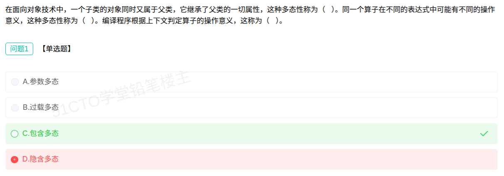

# 备考笔记：面向对象-多态性分类与算子鉴别

## 一、题目

> 在面向对象技术中，一个子类的对象同时又属于父类，它继承了父类的一切属性，这种多态性称为 （1） 。同一个算子在不同的表达式中可能有不同的操作意义，这种多态性称为 （2） 。编译程序根据上下文判定算子的操作意义，这称为 （3） 。
>
> （1）A. 参数多态　B. 过载多态　C. 包含多态　D. 隐含多态
> （2）A. 参数多态　B. 过载多态　C. 包含多态　D. 隐含多态
> （3）A. 算子鉴别　B. 算子操作　C. 算子定义　D. 算子运算

**答案：（1）C. 包含多态　（2）B. 过载多态　（3）A. 算子鉴别**

解析：三空分别对应多态性分类中最容易被混为一谈的三个概念。**（1）** 说的是"子类对象同时属于父类、继承父类一切属性"，本质是**子类型化（继承层次）**，即父类引用可指向子类对象，故为**包含多态**。**（2）** 说的是"同一个算子（运算符/函数名）在不同表达式中有不同操作意义"，如 `+` 既可做整数加法又可做字符串拼接，这是**过载多态**。**（3）** 问的是"编译程序**根据上下文判定算子操作意义**"这一**行为过程**的名称——它不是多态的"类型"，而是编译器实现过载时所做的工作，术语叫**算子鉴别**（在多态四分类里并没有"算子鉴别"这一"多态类型"，它是干扰项设计的重心）。三者关系：**过载多态是"结果"（同名不同义），算子鉴别是编译器得到这一结果的"动作"（按上下文/实参类型判定用哪个含义）。**

## 二、知识点：多态性的四种类型与算子鉴别

### 1. 核心原理

**多态（Polymorphism）** 指"**同一操作（消息）作用于不同对象可以产生不同的结果**"。Cardelli 与 Wegner 按实现机制把多态分为**四类**，并进一步分为两大族：

- **通用多态（Universal）**：对类型不加限制，**同一段代码可适用于多种类型**——含 **参数多态** 与 **包含多态**。
- **特定多态（Ad-hoc）**：只对有限类型有效，**不同类型可能执行不同代码**——含 **过载多态** 与 **隐含（强制）多态**。

四类多态的本质：

| 类型 | 一句话定义 | 典型例子 | 判定/绑定时机 |
| --- | --- | --- | --- |
| **参数多态** | 把**类型当作参数**，同一操作可作用于多种类型，最"纯"的多态 | C++ 模板、Java/C# 泛型、`List<T>` | 编译时（实例化） |
| **包含多态** | **子类型化**：一个类型是另一个类型的子类型，父类引用可指向子类对象 | 继承 + 向上转型、虚函数/重写 | 多为运行时（动态绑定） |
| **过载多态** | **同一个名字（算子/函数名）在不同上下文中代表不同含义** | 运算符重载、函数重载 | 编译时（静态绑定） |
| **隐含（强制）多态** | 通过**隐式类型转换**把一种类型当作另一种使用 | `1 + 2.0` 中 int 自动提升为 double | 编译时（隐式转换） |

**算子鉴别（Operator Identification）**：**编译程序根据上下文（实参的类型、个数、顺序）判定算子的操作意义**的过程。它是编译器为支持**过载**而必须执行的分析动作——即"**在多个同名含义中挑出当前该用的那一个**"。

> 记忆主线：**"子类归父类 → 包含多态；一名多义 → 过载多态；编译期挑含义 → 算子鉴别。"**

### 2. 关键公式/规则

多态性的分类层次：

| 层级 | 类型 | 特征 |
| --- | --- | --- |
| 通用多态 | 参数多态 | 类型作参数，代码通用，最纯的多态 |
| 通用多态 | 包含多态 | 子类型化（继承），父类引用指向子类对象 |
| 特定多态 | 过载多态 | 同名（算子/函数名）在不同上下文有不同含义 |
| 特定多态 | 隐含多态（强制多态） | 隐式类型转换产生多态，实现细节由编译器处理 |

三空关键词对照表（本题解题的钥匙）：

| 题干关键词 | 对应概念 | 所属层面 |
| --- | --- | --- |
| 子类对象又属于父类、继承父类一切属性 | **包含多态** | 多态的一种**类型** |
| 同一算子在**不同表达式**中有不同操作意义 | **过载多态** | 多态的一种**类型** |
| **编译程序根据上下文判定**算子操作意义 | **算子鉴别** | 编译器实现的**过程/动作**（不是多态类型） |

### 3. 解题步骤

1. **先看空（1）**：关键词"**子类对象同时又属于父类**""**继承父类一切属性**"→ 这是**子类型关系**，对应**包含多态**（inclusion）。选 C。
2. **再看空（2）**：关键词"**同一个算子**""**不同表达式中可能有不同操作意义**"→ 一名多义、按上下文取义，正是**过载**的定义。选 B。
3. **最后看空（3）**：注意选项已换成"**算子××**"系列，问的是**编译程序判定算子操作意义**这个**动作**的术语。四个"算子××"里，只有**算子鉴别**表示"辨别/确定是哪一个含义"，选 A。
4. **复核**：（2）与（3）容易混——**（2）问"这种多态性叫什么"→ 答类型（过载多态）；（3）问"这个判定过程叫什么"→ 答动作（算子鉴别）**。题干"这称为"前面的主语不同，是设问角度的分水岭。

## 三、易错点

1. **把"包含多态"误选成"参数多态"**：参数多态强调"**类型作参数**"（模板/泛型），只是让同一份代码适用多种类型；本题说的是"**子类属于父类**"的**子类型关系**，是包含多态，不是参数多态。
2. **把空（2）误选"隐含多态"**：隐含（强制）多态靠的是**隐式类型转换**（如 `1+2.0` 自动提升），题干强调的是"**同名算子在不同表达式有不同操作意义**"，是**过载**，不是类型转换。
3. **空（3）误选"算子操作/算子定义/算子运算"**：这三个词描述的是**算子本身的功能**（做什么、怎么定义、怎么运算），而题干问的是"**编译程序判定其意义**"这个**识别/甄别**过程，只有**算子鉴别**对得上"判定、辨别"。
4. **把"算子鉴别"当成一种多态类型**：多态四分类是**参数、包含、过载、隐含（强制）**，**没有"算子鉴别"**；它是编译器为支持过载所做的**分析过程**，干扰项正是在此设陷。
5. **混淆"过载多态"的绑定时机**：过载是**静态（编译时）多态**；而包含多态若通过虚函数/重写实现则是**动态（运行时）多态**。别把两者都归为运行时。
6. **忽略选项的"换脸"**：空（1）（2）选项是"多态类型"，空（3）选项换成了"算子××"。读题时先看**该空的选项集合**，能提前判断这一空问的是"类型"还是"过程"。

## 四、扩展延伸

- **多态的另一种重要划分（按绑定时机）**：
  - **静态多态（编译时多态）**：函数重载、运算符重载、模板——编译期即可确定调用哪个实现，对应**静态绑定（早绑定）**；
  - **动态多态（运行时多态）**：虚函数重写（override）——运行期根据**对象实际类型**确定调用哪个实现，对应**动态绑定（晚绑定）**。
- **重载（overload）vs 重写/重置（override）**：重载是**同一作用域内同名不同参**（编译时多态）；重写是**子类重新实现父类同名同参方法**（运行时多态）。二者是"过载多态"与"包含多态"在代码层面的落地。
- **包含多态的三大实现条件**：① 类之间有**继承**关系；② 基类中至少定义一个**虚函数**（纯虚函数）；③ 子类中**重新定义**该虚函数。三者齐备才能在运行期发生**动态绑定**。
- **与相关笔记的联系**：
  - [30-面向对象-泛化与聚合关系.md](30-面向对象-泛化与聚合关系.md)：泛化（继承）关系正是**包含多态**赖以存在的结构基础；
  - [31-面向对象分析-建模过程.md](31-面向对象分析-建模过程.md)：多态属于面向对象**基本概念**层，是 OOA/OOD 中"抽象—继承—多态"链条的最后一环；
  - [32-微服务系统特征.md](32-微服务系统特征.md)：微服务的"接口与实现分离、可独立替换"在思想上与**多态/面向接口编程**同源。
- **现实类比**：**"按同一个按钮，不同设备做不同的事"**——按下遥控器上的"播放"（同一消息）：电视机播放节目、音响播放音乐（**包含多态**：对象不同、响应不同）；同一个字"**打**"，既可"打人"也可"打电话"也可"打字"（**过载多态**：同名不同义）；而**翻译官**听到"打"字，要靠**上下文**判断到底是什么意思，这位翻译官干的活就是**算子鉴别**。

## 五、错题归档

| 题号 | 题型 | 考点 | 难度 | 掌握度 |
| --- | --- | --- | --- | --- |
| 2004年下半年系统分析师-面向对象（多态性 3 空） | 单选（多空） | 多态四分类：子类型化→包含多态、同名不同义→过载多态；编译期判定算子意义→算子鉴别 | 中 | 待复习 |

## 六、相关图片

原题截图：`./images/35-面向对象-多态性分类与算子鉴别.png`（由用户上传的原题截图复制改名而来）

