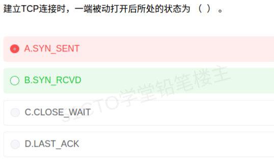

# 备考笔记：TCP 三次握手-状态变迁

## 一、题目

> 建立 TCP 连接时，一端被动打开后所处的状态为 （ ） 。
>
> A. SYN_SENT　B. SYN_RCVD　C. CLOSE_WAIT　D. LAST_ACK

**答案：B. SYN_RCVD**

解析：TCP 建立连接时，"打开"分两种：**主动打开**（客户端调 `connect()`，先发 SYN）与**被动打开**（服务端调 `listen()`，先进入 `LISTEN` 等别人来连）。**被动打开的一方在收到对方的 SYN、并回送 SYN+ACK 之后，进入 `SYN_RCVD`（Synchronize Received，"已收到同步报文"）**，等待对方最后一个 ACK。故答案选 B。

干扰项辨析：A. `SYN_SENT` 是**主动打开**方发出 SYN 后所处的状态；C. `CLOSE_WAIT` 与 D. `LAST_ACK` 都出现在**连接关闭（四次挥手）**阶段，与"建立连接"无关。

## 二、知识点：TCP 状态变迁

### 1. 核心原理

TCP 是面向连接的协议，连接的生命周期由**状态机**刻画。"打开"（建立连接）分两种发起方式：

- **主动打开（active open）**：主动方调用 `connect()`，**主动发 SYN** → 进入 `SYN_SENT`。
- **被动打开（passive open）**：被动方调用 `listen()`，**先进入 `LISTEN`**，安静等待别人的 SYN。

**三次握手的完整状态变迁：**

| 步 | 主动方（客户） | 方向 | 被动方（服务） |
| --- | --- | --- | --- |
| 起点 | `CLOSED` | | `CLOSED` → `LISTEN`（被动打开） |
| ① | 发 SYN | → | 收 SYN |
| | `SYN_SENT` | | **回 SYN+ACK → `SYN_RCVD`** |
| ② | 收 SYN+ACK | ← | |
| | 回 ACK → `ESTABLISHED` | → | |
| ③ | | | 收 ACK → `ESTABLISHED` |

> 一句话主线：**主动打开等回应叫 `SYN_SENT`；被动打开收到 SYN（回了 SYN+ACK）叫 `SYN_RCVD`。**

### 2. 关键公式/规则

**建立连接与关闭连接的状态对照（TCP 全生命周期）：**

| 阶段 | 角色 | 状态序列 |
| --- | --- | --- |
| 建立（主动打开） | 客户端 | `CLOSED` → `SYN_SENT` → `ESTABLISHED` |
| 建立（被动打开） | 服务端 | `CLOSED` → `LISTEN` → **`SYN_RCVD`** → `ESTABLISHED` |
| 关闭（主动关闭） | 先发 FIN 方 | `ESTABLISHED` → `FIN_WAIT_1` → `FIN_WAIT_2` → `TIME_WAIT` → `CLOSED` |
| 关闭（被动关闭） | 后发 FIN 方 | `ESTABLISHED` → **`CLOSE_WAIT`** → `LAST_ACK` → `CLOSED` |

**关键状态的"归属"速查：**

| 状态 | 出现在 | 谁处于该状态 | 在等什么 |
| --- | --- | --- | --- |
| `LISTEN` | 建立（被动打开） | 服务端 | 等连接请求（SYN） |
| `SYN_SENT` | 建立（主动打开） | 客户端 | 等对方的 SYN+ACK |
| `SYN_RCVD` | 建立（被动打开） | 服务端 | 等对方最后一个 ACK |
| `CLOSE_WAIT` | 关闭（被动关闭） | 收到 FIN 的一方 | 等本端应用关闭（发 FIN） |
| `LAST_ACK` | 关闭（被动关闭） | 被动关闭方 | 等对方对 FIN 的 ACK |
| `TIME_WAIT` | 关闭（主动关闭） | 主动关闭方 | 等 2MSL 后彻底关闭 |

### 3. 解题步骤

1. **抓关键词"被动打开"**：被动打开 = 先 `listen()`、等别人来连的一方（服务端），其起始态是 `LISTEN`，不是 `SYN_SENT`。→ 排除 A。
2. **顺着被动方的路径推**：`LISTEN` 收到 SYN → 回 SYN+ACK → 进入 **`SYN_RCVD`**。→ 选 B。
3. **排除关闭阶段状态**：`CLOSE_WAIT`、`LAST_ACK` 是**四次挥手**里的状态，题干问"建立连接"，直接排除 C、D。
4. **复核**：题干问的是"**被动打开后**所处的状态"——即被动方**回应 SYN 之后**所处的中间态，正是 `SYN_RCVD`。

## 三、易错点

1. **把"被动打开"误当"被动接收"**：被动打开是**发起方式的区别**（先 listen 等连），不是指"不先动手"。它同样要有中间等待态 `SYN_RCVD`，不是直接进 `ESTABLISHED`。
2. **混淆 `SYN_SENT` 与 `SYN_RCVD`**：两者都是"发完本轮报文、等对方回应"的中间态，但**主体相反**——`SYN_SENT` 是**主动方**（我发了 SYN，等你的 SYN+ACK）；`SYN_RCVD` 是**被动方**（我收了你 SYN 并回了 SYN+ACK，等你的 ACK）。记住"**RCVD = 收到了对方的 SYN**"。
3. **把关闭阶段状态当建立阶段**：`CLOSE_WAIT`、`LAST_ACK` 属于**四次挥手**；`TIME_WAIT` 也只有主动关闭方才会经历。题干只要出现"建立连接"，这三个可直接判为干扰项。
4. **漏看 `LISTEN` 这一起点**：被动打开方**先处于 `LISTEN`**，收到 SYN 后才是 `SYN_RCVD`。若题目问"被动打开**后**"（即已经开始互动），答 `SYN_RCVD`；若问"被动打开时**最初**的状态"，则是 `LISTEN`——看清"后"字与设问时点。
5. **误以为两次握手就够**：若只有 SYN + SYN+ACK，服务端进 `SYN_RCVD` 便无法确认客户端是否收到，所以必须第三次 ACK，服务端才进 `ESTABLISHED`。`SYN_RCVD` 正是"**三次握手尚未完成**"的标志。

## 四、扩展延伸

- **为什么是三次握手**：要让**双方都确认**"自己的发送能力、对方的接收能力"以及"对方的发送能力、自己的接收能力"都正常。第三次 ACK 让服务端确认"客户端已收到我的 SYN+ACK"，连接才真正建立。
- **`SYN_RCVD` 与 SYN 洪泛攻击（SYN Flood）**：攻击者大量伪造源 IP 发 SYN 却不回最后的 ACK，服务端会在 `SYN_RCVD` 堆积大量**半连接**，**半连接队列（SYN queue）** 被占满，正常用户无法建连。防御手段：SYN Cookie、缩短 `SYN_RCVD` 超时、增大半连接队列。
- **半连接队列 vs 全连接队列**：`SYN_RCVD` 中的连接在**半连接队列**（syn queue）；完成三次握手后移入**全连接队列**（accept queue），等待应用 `accept()` 取走。队列溢出会丢包/超时。
- **关闭连接的镜像对称**：关闭是建立的反过程，四个状态两两对应——主动关闭方走 `FIN_WAIT_1 → FIN_WAIT_2 → TIME_WAIT`；被动关闭方走 `CLOSE_WAIT → LAST_ACK`。**"谁先发 FIN，谁进 TIME_WAIT"**。
- **`TIME_WAIT` 为何要等 2MSL**：确保最后一个 ACK 能到达对方（对方可重发 FIN）、并让本次连接的旧报文段在网络中彻底消失，避免污染下一次同四元组的连接。
- **与相关笔记的联系**：
  - [34-网络安全协议分层辨析.md](34-网络安全协议分层辨析.md)：TCP 是传输层协议，本题的 SYN/ACK 属传输层；TLS/SSL 也在传输层之上保护 TCP 连接；
  - [32-微服务系统特征.md](32-微服务系统特征.md)：微服务间大量短连接调用会把 `TIME_WAIT`/`CLOSE_WAIT` 变成常见线上问题，理解状态机是排查连接数异常的基础。
- **现实类比**：**打电话**——主动打的人是"主动打开"（拨号后听回铃 = `SYN_SENT`）；接电话的一方是"被动打开"（电话响 = `LISTEN`），接起来说"喂"（回 SYN+ACK）、**此时双方还没真正通上话，正处在 `SYN_RCVD`**，直到对方应一声（第三次 ACK）才算接通（`ESTABLISHED`）。

## 五、错题归档

| 题号 | 题型 | 考点 | 难度 | 掌握度 |
| --- | --- | --- | --- | --- |
| TCP 建立连接-被动打开状态 | 单选 | 三次握手状态变迁：被动打开 LISTEN→SYN_RCVD→ESTABLISHED；区分主动方 SYN_SENT 与关闭阶段 CLOSE_WAIT/LAST_ACK | 易 | 待复习 |

## 六、相关图片

原题截图：`./images/36-TCP三次握手-状态变迁.png`（由用户上传的原题图复制改名而来）

