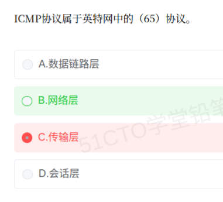

# 备考笔记：ICMP 协议所属层次辨析

## 一、题目

> ICMP 协议属于英特网中的（  ）协议。
>
> A. 数据链路层
> B. 网络层
> C. 传输层
> D. 会话层

**答案：B. 网络层**

解析：**ICMP（Internet Control Message Protocol，网际控制报文协议）** 是 **IP 层的辅助协议**，用于在 IP 网络中传递**差错报告**与**控制/查询信息**（如目的不可达、超时、回送请求/应答）。它的报文被**封装在 IP 数据报中**传输，与 IP 同属**网络层**，是 TCP/IP 体系里网络层的组成部分。数据链路层（A）传递的是帧，传输层（C）是 TCP/UDP，会话层（D）是 OSI 参考模型中的概念（TCP/IP 中无独立会话层），均不符。故选 B。

> 注：在 TCP/IP 四层模型里，ICMP 归入**网际层（网络层）**；在 OSI 七层参考模型中，它对应**网络层**，不单独占一层。

## 二、知识点：ICMP 与网络分层

### 1. 核心原理

ICMP 是 **IP 协议的"配套信使"**，负责**报告 IP 数据报在传输中出的问题**并**支持网络诊断**。它的设计要点有三条：

- **服务于网络层**：它不传输用户数据，只承载**差错与控制信息**，因此与 IP 同属**网络层**。
- **封装在 IP 中**：ICMP 报文本身**没有独立传输层封装**，而是作为 **IP 数据报的数据部分**发送（IP 头中的"协议号 = 1"标识 ICMP）。
- **不保证可靠**：ICMP 报文同样可能丢失，且**不对 ICMP 报文再发 ICMP 差错报文**，避免无限循环。

一句话锚点：**"ICMP 是 IP 的助手，装在 IP 包里，报差错、做探测，属网络层。"**

### 2. 关键公式/规则

**ICMP 报文两大类型：**

| 类型 | 作用 | 常见具体报文 |
| --- | --- | --- |
| **差错报告报文** | 报告 IP 数据报传输故障 | 终点不可达、源点抑制（已废弃）、时间超过、参数问题、改变路由（重定向） |
| **询问/控制报文** | 主动探测网络状态 | 回送请求/回送应答（ping）、时间戳请求/应答、地址掩码请求/应答 |

**网络层协议家族及其定位：**

| 协议 | 全称 | 层次 | 作用 |
| --- | --- | --- | --- |
| **IP** | Internet Protocol | 网络层 | 无连接、尽力而为的分组投递 |
| **ICMP** | Internet Control Message Protocol | **网络层** | 差错报告 + 网络探测，封装在 IP 中（协议号 1） |
| **ARP** | Address Resolution Protocol | 网络层（链路接口） | IP 地址 → MAC 地址 |
| **RARP** | Reverse ARP | 网络层（链路接口） | MAC 地址 → IP 地址 |
| **IGMP** | Internet Group Management Protocol | 网络层 | 组播组成员管理 |

**本题选项定位：**

| 选项 | 层次 | 说明 |
| --- | --- | --- |
| A. 数据链路层 | 二层 | 传"帧"，如 Ethernet、PPP、ARP 的物理承载 |
| **B. 网络层** | **三层** | **IP、ICMP、ARP、IGMP 所在层，传"分组/包"** |
| C. 传输层 | 四层 | TCP、UDP，负责端到端进程通信（传"段"） |
| D. 会话层 | OSI 五层 | OSI 中管理会话，TCP/IP 模型无此独立层 |

### 3. 解题步骤

1. **抓协议名与用途**：ICMP 是"控制报文协议"，服务于 IP 的差错与控制 → 与 **IP 同层**。
2. **用"数据单元判层法"验证**：ICMP 报文被**封装进 IP 数据报**，而 IP 数据报是**网络层**的数据单元，故 ICMP 也归**网络层**。
3. **排除干扰项**：数据链路层传帧（A 错）；传输层是 TCP/UDP（C 错）；会话层是 OSI 概念、TCP/IP 无（D 错）。
4. **锁定 B**，并顺带回忆 ping / traceroute 均基于 ICMP 工作。

## 三、易错点

1. **误把 ICMP 当传输层协议**：**ping 需要"通信"、ICMP 报文又有"请求/应答"**，容易被误认为端到端传输，但其报文封装顺序是 `IP → ICMP`，**报文无端口号**，属网络层，最易错。
2. **误认为 ICMP 属于数据链路层**：ARP/RARP 更贴近链路接口，容易和 ICMP 一起被"下压"到二层；但 **ICMP 封装在 IP 包里，明确在网络层**。
3. **忽略 ICMP 是"IP 的辅助协议"**：它不是独立传输协议，**不携带端口**，只报告 IP 的异常信息，理解这一角色即可正确定层。
4. **混淆 ICMP 与 IGMP**：**ICMP** 管差错/探测，**IGMP** 管**组播组管理**，二者都是网络层，但功能不同，别记串。
5. **记混 OSI 与 TCP/IP 的层次**：TCP/IP 模型把 OSI 的**会话层、表示层、应用层**合并为**应用层**；本题 D"会话层"只在 OSI 里存在，选项中一般是干扰项。
6. **不知道 ICMP 的协议号**：IP 头"协议"字段中 **ICMP = 1、TCP = 6、UDP = 17**，记住 ICMP=1 有助于快速定层。

## 四、扩展延伸

- **ping 与 traceroute 的实现**：
  - **ping** 用 **ICMP 回送请求 / 回送应答（Echo Request / Reply）** 测试连通性与往返时延；
  - **traceroute（Windows 下 tracert）** 通过**逐步增大 IP 头中的 TTL**，利用路由器返回的 **ICMP 时间超过（Time Exceeded）** 报文，逐跳探测路径。
- **ICMP 的"不做"原则**：对**已分片的非首片报文**、**组播/广播地址的报文**、**本身就是 ICMP 差错报文的报文**，**不再发送 ICMP 差错报文**，防止报文风暴。
- **常见 ICMP 差错报文触发场景**：目的主机/端口不可达（如 UDP 无监听端口）、TTL 归零（时间超过）、IP 头参数非法（参数问题）、路由器发现更优路径（重定向）。
- **与相关笔记的联系**：
  - [34-网络安全协议分层辨析.md](34-网络安全协议分层辨析.md)：同属"协议与 OSI/TCP-IP 层次对应"常考簇，都用"数据单元判层法"；
  - [36-TCP三次握手-状态变迁.md](36-TCP三次握手-状态变迁.md)：TCP 属传输层，可与本题的"网络层 ICMP"对照记忆分层。
- **现实类比**：把 IP 网络想成**邮政系统**——**IP** 是负责投递的信使（尽力而为），**ICMP** 是附在退件上的**退单/回执**（报告"地址不详""超时未取"）；而 **TCP/UDP** 是收件人家里负责"确认签收 / 不等确认"的两种管家，**ping** 就是寄一封"你在吗"的测试信。

## 五、错题归档

| 题号 | 题型 | 考点 | 难度 | 掌握度 |
| --- | --- | --- | --- | --- |
| 系统分析师-网络与安全 | 单选 | ICMP 协议所属层次：封装在 IP 数据报中，与 IP 同属网络层（协议号 1） | 易 | 待复习 |

## 六、相关图片

原题截图：`./images/39-ICMP协议所属层次辨析.png`（由用户上传的原题图复制改名而来）

