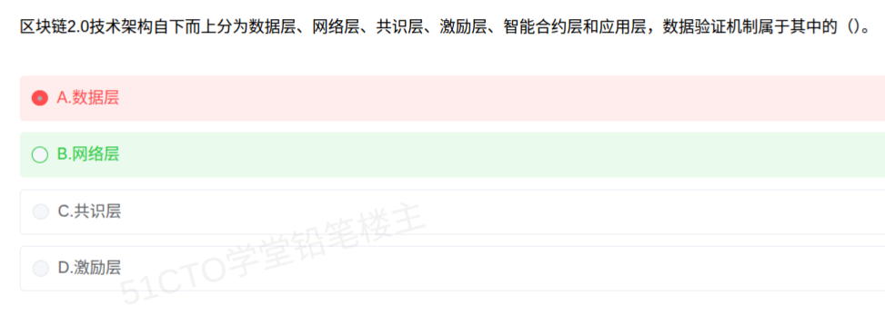

# 备考笔记：区块链 2.0 六层架构与数据验证机制归属

## 一、题目

> 区块链 2.0 技术架构自下而上分为数据层、网络层、共识层、激励层、智能合约层和应用层，数据验证机制属于其中的（  ）。
>
> A. 数据层
> B. 网络层
> C. 共识层
> D. 激励层

**答案：B. 网络层**

解析：区块链 2.0 的**六层架构自下而上**为：**数据层 → 网络层 → 共识层 → 激励层 → 合约层（智能合约层）→ 应用层**。其中**网络层**负责**组网方式与节点间信息交互**，包含三要素：**P2P 网络（组网机制）、传播机制（数据传播方式）、验证机制（数据验证）**。故"数据验证机制"属于**网络层**，选 B。

选项辨析：**数据层（A）** 管"数据怎么存"（区块结构、链式结构、哈希、Merkle 树、非对称加密、时间戳）；**共识层（C）** 管"谁说了算"（PoW/PoS/DPoS 等共识算法）；**激励层（D）** 管"谁来干"（发行机制、分配机制），均不含"验证机制"。若题目改为问"**数据传播机制**"，答案同样是**网络层**。

## 二、知识点：区块链 2.0 六层架构

### 1. 核心原理

区块链 2.0 在 1.0（可编程货币）基础上引入**智能合约**，形成**自下而上的六层技术架构**。分层的意义是**解耦**：下层为上层提供基础能力，上层在下层之上实现业务与逻辑。

- **数据层**：最底层，解决"**数据以什么形式、怎么存**"——区块 + 链式结构 + 哈希 + Merkle 树 + 非对称加密 + 时间戳，保证**数据的不可篡改与可追溯**。
- **网络层**：解决"**节点怎么连、数据怎么传、怎么验**"——**P2P 组网 + 传播机制 + 验证机制**，是节点的"神经系统"。
- **共识层**：解决"**分布式节点如何达成一致**"——PoW、PoS、DPoS、PBFT 等共识算法，防止双花。
- **激励层**：解决"**如何让节点愿意参与**"——发行机制（如出块奖励）与分配机制（如手续费分配）。
- **合约层（智能合约层）**：解决"**业务逻辑如何自动执行**"——脚本代码、智能合约、算法机制，是区块链可编程的关键。
- **应用层**：解决"**面向用户呈现什么**"——可编程货币、可编程金融、可编程社会等各类去中心化应用（DApp）。

一句话锚点：**"数据层管存储，网络层管传输与验证，共识层管一致，激励层管动力，合约层管逻辑，应用层管场景。"**

> 记忆要点：**网络层 = 组网 + 传播 + 验证**，"验证机制"是网络层的招牌要素，最易与"数据层"混淆。

### 2. 关键公式/规则

**六层架构与核心要素对照表（自下而上）：**

| 层次 | 解决的核心问题 | 核心要素 |
| --- | --- | --- |
| **应用层** | 面向用户的应用场景 | 可编程货币、可编程金融、可编程社会、DApp |
| **合约层（智能合约层）** | 业务逻辑如何自动执行 | 脚本代码、智能合约、算法机制 |
| **激励层** | 节点为何愿意参与 | 发行机制、分配机制（出块奖励、手续费） |
| **共识层** | 节点如何达成一致 | PoW、PoS、DPoS、PBFT、Raft 等共识算法 |
| **网络层** | 节点如何组网、传播、验证 | **P2P 网络（组网机制）、传播机制、验证机制** |
| **数据层** | 数据如何组织与存储 | 数据区块、链式结构、哈希函数、Merkle 树、非对称加密、时间戳 |

**本题选项定位：**

| 选项 | 职责 | 典型要素 |
| --- | --- | --- |
| A. 数据层 | 数据存储与防篡改 | 区块结构、Merkle 树、哈希、非对称加密、时间戳 |
| **B. 网络层** | **组网、传播、验证** | **P2P 网络、传播机制、数据验证机制** |
| C. 共识层 | 分布式一致性 | PoW / PoS / DPoS / PBFT |
| D. 激励层 | 参与动力 | 发行机制、分配机制 |

### 3. 解题步骤

1. **默写六层**：数据 → 网络 → 共识 → 激励 → 合约 → 应用（自下而上）。
2. **抓题干关键词**："**数据验证机制**"→ 属于**网络层的三大要素（组网、传播、验证）**之一。
3. **逐项排除**：数据层管"存储结构"（A 错）；共识层管"共识算法"（C 错）；激励层管"奖励分配"（D 错）。
4. **锁定 B**，并顺带区分：**数据传播机制**同样归**网络层**，别与**数据层**混。

## 三、易错点

1. **把"验证机制"错归数据层**（本题最大陷阱）：数据层是**数据的组织与存储**（区块、哈希、Merkle 树），而**验证机制强调节点间的数据校验与传播校验**，属**网络层**。看到"验证"二字别条件反射选数据层。
2. **混淆"数据层"与"网络层"**：记忆口诀——**数据层管"存"（静态结构），网络层管"传与验"（动态交互）**。
3. **把共识算法误认作网络层**：**共识**是独立的**共识层**，PoW/PoS 属共识层而非网络层；网络层只负责"把数据传出去并做基础验证"，不负责"谁说了算"。
4. **漏记"合约层"**：区块链 **2.0** 相比 **1.0 的关键新增就是智能合约层**（可编程），常被漏掉导致层数记成五层。
5. **把激励层的作用记反**：激励层是"**发行机制 + 分配机制**"（如比特币出块奖励、交易手续费），解决**节点积极性**，与"共识"不是一回事（共识解决一致性，激励解决动力）。
6. **层次顺序记混**：务必记牢是**自下而上**——数据层在最底、应用层在最顶；题干若问"从上到下"要反向排序。

## 四、扩展延伸

- **区块链 1.0 / 2.0 / 3.0 演进**：
  - **1.0**：**可编程货币**（比特币），以数字货币与支付为核心；
  - **2.0**：**可编程金融**，引入**智能合约**（以太坊），支持去中心化应用；
  - **3.0**：**可编程社会**，向政务、医疗、供应链、版权等更大范围拓展。
- **P2P 网络的三种组织形式**：**中心化**（有中心服务器，易单点故障）、**完全去中心化**（纯 P2P，如比特币，健壮但效率低）、**混合去中心化**（引入超级节点，兼顾效率与去中心化）。
- **网络层验证机制做什么**：节点收到新区块/新交易后，**校验其合法性**（哈希与签名验证、交易格式、是否双花等）再决定是否继续**传播**——"**先验证、后转发**"是区块链抵御恶意数据的第一道关口。
- **与相关笔记的联系**：
  - [07-人工智能-智能的四大特征.md](07-人工智能-智能的四大特征.md)：同属"新技术概念辨析"常考簇；
  - [33-信息物理系统CPS与物联网辨析.md](33-信息物理系统CPS与物联网辨析.md)：都是"新概念 + 分层/特征"式命题，考法相近；
  - [18-云计算服务模式-IaaS-PaaS-SaaS.md](18-云计算服务模式-IaaS-PaaS-SaaS.md)：云+区块链是"新技术融合"的常见命题背景。
- **现实类比**：把区块链六层想成**一家去中心化公司**——**数据层**是**档案室**（账本怎么存），**网络层**是**快递与门卫**（负责把文件送到各分店并**验真伪**），**共识层**是**董事会表决规则**（谁说了算），**激励层**是**绩效奖金**（谁干活谁拿钱），**合约层**是**自动执行的规章制度**，**应用层**是**公司对外的各项业务**。

## 五、错题归档

| 题号 | 题型 | 考点 | 难度 | 掌握度 |
| --- | --- | --- | --- | --- |
| 系统分析师-新技术 | 单选 | 区块链 2.0 六层架构；网络层 = P2P 组网 + 传播机制 + 验证机制，数据验证机制归网络层 | 易 | 待复习 |

## 六、相关图片

原题截图：`./images/40-区块链2.0六层架构-数据验证机制归属.png`（由用户上传的原题图复制改名而来）

