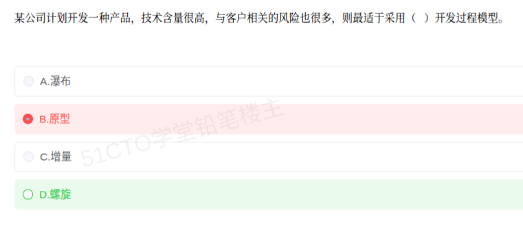

# 备考笔记：开发过程模型选型——高风险项目选螺旋模型

## 一、题目

> 某公司计划开发一种产品，技术含量很高，与客户相关的风险也很多，则最适于采用（  ）开发过程模型。
>
> A. 瀑布
> B. 原型
> C. 增量
> D. 螺旋

**答案：D. 螺旋**

解析：螺旋模型（Spiral Model）的最大特点是把**风险分析**作为每一轮迭代的核心环节，被认为是**"以风险驱动"**的模型，**特别适用于大型、高风险的项目**。本题题干给出强信号——"**技术含量很高**"（技术风险大）、"**与客户相关的风险也很多**"（需求/沟通风险大），恰好对应螺旋模型"**每轮先做风险分析、再决定是否继续**"的机制，故最适于采用**螺旋模型**，选 D。

其余三项：**瀑布模型（A）** 是线性顺序、文档驱动，**需求须稳定明确**，早期不暴露风险，风险越大越不适合；**原型模型（B）** 主要用于**需求不明确**时通过快速原型澄清需求，侧重解决"用户需求模糊"，不专门做全面风险控制；**增量模型（C）** 是把系统拆分、分批交付，侧重**尽早交付、分批上线**，也不以风险分析为核心。

## 二、知识点：常见软件开发过程模型与选型

### 1. 核心原理

开发过程模型（软件生命周期模型）描述了从需求到交付的**活动组织方式**。选型的本质是**看项目的"主要矛盾"落在哪**：

- **需求是否明确** → 需求模糊选**原型**，需求稳定可选**瀑布**。
- **风险大小** → **风险高选螺旋**（把风险分析放进每一轮）。
- **交付节奏** → 想**分批尽早交付**选**增量**（或迭代/敏捷）。
- **规模与规范性** → 大型、需严格文档与评审的传统项目常用**瀑布**。

四种模型的核心特征一句话：

| 模型 | 核心特征 | 驱动力 |
| --- | --- | --- |
| **瀑布模型** | 线性顺序、阶段间严把评审、**文档驱动**，**需求必须稳定** | 文档驱动 |
| **原型模型** | 先做**可运行原型**给用户确认，**澄清模糊需求** | 需求驱动 |
| **增量模型** | 把系统**拆成若干增量**、逐个开发与交付 | 功能分批驱动 |
| **螺旋模型** | **每次迭代都做风险分析**，四象限循环推进 | **风险驱动** |

一句话锚点：**"需求不稳用原型，风险大用螺旋，想早交付用增量，需求稳定用瀑布。"**

> 判定诀窍：题干出现"**风险**"二字（尤其是多项风险），几乎就是在指**螺旋模型**。

### 2. 关键公式/规则

**四类模型对照表（软考高频）：**

| 模型 | 适用场景 | 优点 | 缺点 |
| --- | --- | --- | --- |
| **瀑布** | 需求**明确稳定**、技术成熟、规范性强的大型项目 | 阶段清晰、文档规范、便于管理 | 不适应需求变化，风险后置、返工代价大 |
| **原型** | **需求不明确**、用户说不清想要什么 | 需求澄清快，用户早期可试用反馈 | 原型易被当作成品；反复修改失控 |
| **增量** | 想**尽早交付可用部分**、系统可拆分 | 分批交付、早期见效、降低一次性风险 | 需要良好的总体架构，集成管理复杂 |
| **螺旋** | **大型、高风险**，技术或需求风险突出 | **风险分析前移**、逐步迭代可控 | 风险分析需专门能力，成本高、管理复杂 |

**螺旋模型的"四象限"（每轮迭代都走一遍）：**

| 象限 | 活动 | 说明 |
| --- | --- | --- |
| 左上 | **制定计划** | 确定本轮目标、约束、备选方案 |
| 右上 | **风险分析** | **模型精髓**：评估风险、做原型或仿真验证，决定是否继续 |
| 右下 | **实施工程** | 开发与验证本轮成果 |
| 左下 | **客户评估** | 客户评审反馈，进入下一轮螺旋 |

螺旋模型本质上是**把瀑布与原型结合起来、并在每一圈都加上"风险分析"**，因此又被称为**"瀑布 + 原型 + 风险分析"**的演进模型。

### 3. 解题步骤

1. **抓题干关键词**："**技术含量很高**""**与客户相关的风险很多**"——重复出现两次风险信号。
2. **匹配模型驱动力**：**风险驱动 → 螺旋模型**；这是螺旋模型区别于其他三者的唯一招牌。
3. **逐项排除**：
   - A. 瀑布 → 要求需求稳定、风险低，**排除**；
   - B. 原型 → 解决需求模糊，不是全面风险控制，**排除**；
   - C. 增量 → 解决分批交付，不以风险分析为核心，**排除**；
   - D. **螺旋 → 每次迭代做风险分析，最契合高风险**。
4. **锁定 D**，并回忆螺旋模型常用于**大型复杂、高风险的系统开发**。

## 三、易错点

1. **见"客户风险"就选原型**（本题最大陷阱）：题干同时出现"**与客户相关**"与"**风险**"，容易被"客户"二字带偏到**原型**；但原型解决的是"**需求不明确**"，而本题落点是"**风险多**"，应选**螺旋**。看**关键词的重心**：重心在"需求不清"→原型，重心在"风险大"→螺旋。
2. **误认为"技术含量高"该用瀑布**：技术含量高往往意味着**技术风险大**，瀑布恰恰**缺乏早期风险暴露机制**，反而最不适合。
3. **把增量与迭代、螺旋混淆**：**增量**是把**功能**切成多块分批交付；**螺旋**是把**风险**放在每轮核心，贯穿"计划—风险分析—工程—评估"；二者驱动因素不同。
4. **忘记"螺旋 = 瀑布 + 原型 + 风险分析"**：螺旋模型并非全新模型，而是集成演进的产物，这一点常作为选择题的辨析依据。
5. **混淆螺旋与 RUP/统一过程**：**RUP** 以**用例驱动、架构为中心、迭代增量**为三大特点（四阶段：初始、细化、构造、移交）；**螺旋**的招牌是**风险分析**，二者常被并列作干扰项。
6. **忽略"风险越大越要早分析"这一原则**：无论选哪种模型，软考的一致逻辑是——**风险越大的项目越需要能尽早识别和化解风险的模型**，据此优先锁定**螺旋**。

## 四、扩展延伸

- **模型演进脉络**：**瀑布（线性）→ 原型（澄清需求）→ 增量/迭代（分批交付）→ 螺旋（风险驱动）→ RUP / 敏捷（迭代 + 增量 + 快速反馈）**。理解"每一步解决了前一种的什么痛点"比死记定义更稳。
- **瀑布模型的两个变体**：**V 模型**（把测试与开发阶段一一对应，"左侧开发、右侧测试"）、**喷泉模型**（面向对象开发，阶段间可**无间隙迭代重叠**）。
- **增量 vs 迭代的区别**：**增量**强调"**每次交付一部分完整功能**"（做加法，功能变多）；**迭代**强调"**每次把整体做精一点**"（做精化，逐步完善）。敏捷开发通常是"**迭代 + 增量**"。
- **螺旋模型的风险分析怎么做**：每轮通过**原型验证、仿真、可行性分析、专家评审**等手段降低风险；如果风险过高且无法化解，可**及时终止项目**——这是螺旋模型"止损"能力强的体现。
- **敏捷与螺旋的关系**：二者都主张迭代、都强调**应对变化**；但敏捷更强调**快速小步交付与团队自组织**，螺旋更强调**显式的风险分析与大型项目管控**。
- **与相关笔记的联系**：
  - [31-面向对象分析-建模过程.md](31-面向对象分析-建模过程.md)：同属软件工程/需求域常考簇；
  - [22-构件接口不兼容的常见问题.md](22-构件接口不兼容的常见问题.md)：构件化开发常与增量/迭代模型搭配，可对照理解交付方式。
- **现实类比**：把四种模型想成**四种盖房子的方式**——**瀑布**是"**图纸定死、一次盖完**"（图纸一变全乱）；**原型**是"**先搭个样板间让你看**"（确认你要的户型）；**增量**是"**先盖一层住进去、再盖二层**"（分批交付）；**螺旋**是"**每盖一层都先做风险评估**"（地基行不行、预算够不够，不行就停手）。

## 五、错题归档

| 题号 | 题型 | 考点 | 难度 | 掌握度 |
| --- | --- | --- | --- | --- |
| 系统分析师-软件工程 | 单选 | 开发过程模型选型：高风险（技术风险 + 客户风险）项目最适于螺旋模型（风险驱动） | 易 | 待复习 |

## 六、相关图片

原题截图：`./images/43-开发过程模型选型-高风险项目螺旋模型.png`（由用户上传的原题图复制改名而来）

