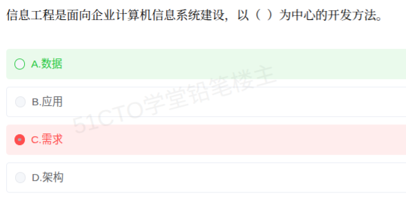

# 备考笔记：信息工程方法论——以数据为中心

## 一、题目

> 信息工程是面向企业计算机信息系统建设，以（  ）为中心的开发方法。
>
> A. 数据
> B. 应用
> C. 需求
> D. 架构

**答案：A. 数据**

解析：**信息工程（Information Engineering，IE）** 是与**结构化方法、面向对象方法**并列的经典系统开发方法论，由 **James Martin** 提出。其最鲜明的标志就是"**以数据为中心**"——主张**先规划数据（建立主题数据库），再围绕数据组织处理**，认为"**数据是企业中相对稳定的资源，而处理/功能是易变的**"，因此系统建设应以**数据**而非功能/处理为核心。故本题选 **A. 数据**。

其余三项：**应用（B）** 与**需求（C）** 是任何开发方法都关注的对象，不构成信息工程的"中心"标签；**架构（D）** 是后续架构设计的关注点，也不是信息工程方法论的定义性特征。区分要点是：**信息工程 = 数据为中心 + 自顶向下规划**。

## 二、知识点：信息工程方法论（IE）

### 1. 核心原理

**信息工程（IE）** 是 20 世纪 80 年代为**企业级信息系统建设**提出的方法论，核心思想可概括为三条：

1. **以数据为中心**：系统建设的出发点是**企业的数据**，而不是某个部门的处理流程或应用功能。先建立**稳定共享的数据基础（主题数据库）**，再在其上开发各类应用。
2. **数据稳定性原理**：**数据比处理更稳定**。企业的业务处理会随组织、流程、技术不断变化，但企业的基础数据（如客户、产品、订单等）变化较慢。因此**以数据为中心设计的系统更易适应变化、更长寿**；若以处理为中心，需求一变系统就大改。
3. **自顶向下规划（战略数据规划，SDP）+ 自底向上实施**：先由企业高层视角做**总体数据规划**，划分**主题数据库**；再分阶段、自底向上地开发具体应用，保证全局一致、避免信息孤岛。

配套要点：

- **主题数据库（Subject Database）**：按**企业主题（业务领域）**组织、面向**全企业共享**的数据库，是 IE 的核心产物与建设目标。
- **数据与处理分离**：数据独立于具体应用存在，同一份数据可被多个应用共享，减少冗余与不一致。
- **强调最终用户参与**，常配合**原型法**辅助需求确认。

一句话锚点：**"信息工程看数据：数据稳定、处理易变；先规划主题库，自顶向下规划、自底向上实现。"**

### 2. 关键公式/规则

**信息工程的三要素与要点：**

| 要素 | 内涵 |
| --- | --- |
| **以数据为中心** | 建设出发点是企业的**数据**，先数据后处理 |
| **自顶向下规划** | **战略数据规划（SDP）**，划分**主题数据库**，保证全局一致 |
| **自底向上实施** | 按规划分阶段开发各应用，逐步落地 |

**主流开发方法论对比（高频辨析）：**

| 方法论 | 关注中心 | 核心思想 | 典型产物 |
| --- | --- | --- | --- |
| **结构化方法（SA/SD）** | **处理/功能** | 自顶向下、逐步求精，功能分解 | 数据流图（DFD）、数据字典 |
| **信息工程（IE）** | **数据** | 数据稳定、处理易变；先规划数据再建应用 | **主题数据库、战略数据规划** |
| **面向对象方法（OO）** | **对象（数据 + 行为）** | 封装、继承、多态，把数据与操作绑定 | 用例图、类图 |
| **原型法** | **需求** | 快速构建可运行原型、用户确认迭代 | 可运行原型 |

**本题选项定位：**

| 选项 | 是否信息工程的"中心" | 说明 |
| --- | --- | --- |
| **A. 数据** | **是** | IE 的标志性主张：以数据为中心 |
| B. 应用 | 否 | 是建设成果，不是方法论中心 |
| C. 需求 | 否 | 原型法等更强调以需求为中心 |
| D. 架构 | 否 | 属后续设计关注点，非 IE 的定义特征 |

### 3. 解题步骤

1. **抓方法论名**："**信息工程**"→ 联想起 **James Martin、战略数据规划、主题数据库**。
2. **回忆其标志性主张**：**以数据为中心**，且"**数据比处理稳定**"。
3. **逐项排除**：
   - B. 应用 → 是最终交付物，非中心；
   - C. 需求 → 是"原型法/需求工程"的关注点；
   - D. 架构 → 属设计层面关注点；
   - A. **数据 → 正是 IE 的定义性特征**。
4. **锁定 A**，并顺带记住对照关系：**结构化以处理为中心、信息工程以数据为中心、面向对象以对象为中心**。

## 三、易错点

1. **误选"需求"（C）**（本题陷阱）：任何开发方法都讲需求，但"**以需求为中心**"是**原型法**的标签，而"**以数据为中心**"才是**信息工程**的专属标志，别被"都要满足需求"这一常识带偏。
2. **把"应用"当作中心**：信息工程的落脚点确实是各类**应用**，但它主张**先有数据规划、再有应用**，应用是**建在数据之上的产物**，而非中心。
3. **混淆"信息工程"与"系统工程 / 软件工程"**：**信息工程**侧重**企业级数据规划**（战略高度），**软件工程**侧重具体软件产品的开发过程，两者层次不同。
4. **记反"自顶向下"与"自底向上"的搭配**：信息工程是"**自顶向下规划、自底向上实施**"，二者**不可颠倒**；规划自顶向下才能保证全局一致，实施自底向上才能分批落地。
5. **把信息工程与结构化方法等同**：结构化方法关注**功能分解（DFD）**，信息工程关注**数据规划（主题数据库）**，中心完全不同；软考常把二者作为对照选项。
6. **忽略"数据稳定性"这一原理的依据地位**：很多辨析题的答案根子都在"**数据比处理更稳定**"这句话上，记住它就能推出"为什么以数据为中心"。

## 四、扩展延伸

- **战略数据规划（SDP）与主题数据库**：IE 的落地路径是"**企业战略 → 战略数据规划 → 划分主题数据库 → 建立数据模型 → 开发应用**"。**主题数据库**不是按部门或应用划分，而是按**企业业务主题**（如"客户""产品""订单""财务"）划分，供全企业共享，从根本上**减少数据冗余、消除信息孤岛**。
- **"数据为中心"的现实印证**：为什么以数据为中心更稳？因为**业务流程和组织架构常变，而企业的基础数据（客户、商品、账户）相对稳定**。以数据为中心建模，业务重组时**只需调整处理逻辑、数据基础可复用**，这正是数据中台、"主数据管理（MDM）"等现代概念的早期思想源头。
- **信息工程的四阶段（James Martin）**：**企业规划 → 业务领域分析 → 系统设计 → 系统构造**，逐层从战略落向实现。
- **与结构化方法的对比记忆**：**结构化 = 面向过程/功能**（先问"系统做什么处理"）；**信息工程 = 面向数据**（先问"企业有哪些数据"）；**面向对象 = 二者结合**（数据与行为封装一体）。软考选择题常以"以什么为中心"直接设问，记住这三条对照即可秒杀。
- **与相关笔记的联系**：
  - [18-云计算服务模式-IaaS-PaaS-SaaS.md](18-云计算服务模式-IaaS-PaaS-SaaS.md)：同属"企业信息化"常考簇，云与企业信息化建设关系密切；
  - [32-微服务系统特征.md](32-微服务系统特征.md)：现代"数据为中心/服务解耦"思想可追溯到 IE 的数据独立性原理，可对照理解；
  - [31-面向对象分析-建模过程.md](31-面向对象分析-建模过程.md)：面向对象方法以"对象"为中心，正好与 IE"以数据为中心"形成对照。
- **现实类比**：把企业想成**一座城市**——**结构化方法**是先定"**各条道路怎么走（业务流程）**"；**信息工程**是先修**自来水厂、电网、燃气管道（主题数据库）**，管道铺好了，路怎么改都不影响供水供电；**面向对象**则是把"**每户人家**"连同其用水用电方式（数据 + 行为）一起封装设计。

## 五、错题归档

| 题号 | 题型 | 考点 | 难度 | 掌握度 |
| --- | --- | --- | --- | --- |
| 系统分析师-企业信息化 | 单选 | 信息工程（IE）方法论核心：以数据为中心，自顶向下规划建设主题数据库（数据比处理更稳定） | 易 | 待复习 |

## 六、相关图片

原题截图：`./images/44-信息工程方法论-以数据为中心.png`（由用户上传的原题图复制改名而来）

