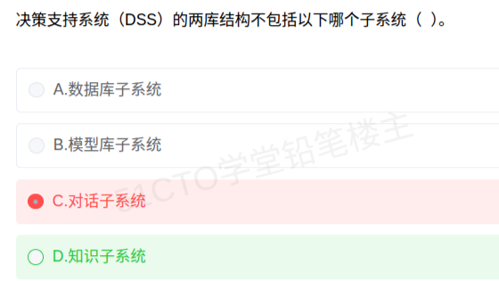

# 备考笔记：决策支持系统DSS-两库结构与知识子系统归属

## 一、题目

> 决策支持系统（DSS）的两库结构不包括以下哪个子系统（  ）。
>
> A. 数据库子系统
>
> B. 模型库子系统
>
> C. 对话子系统
>
> D. 知识子系统

**答案：D. 知识子系统**

解析：经典 DSS 由**数据库子系统、模型库子系统、对话子系统**三部分组成，即"**两库（数据库、模型库）+ 一对话**"的三部件结构。其中数据库与模型库合称"两库"，对话子系统负责人机交互，三者均属 DSS 的组成部分；而**知识子系统（知识库 + 推理机）是智能决策支持系统（IDSS）在传统 DSS 基础上扩展出来的部件**，不属于 DSS 的两库结构，故选 D。

## 二、知识点：决策支持系统DSS-两库结构与知识子系统归属

### 1. 核心原理

**DSS 是面向半结构化/非结构化决策、辅助管理人员决策的人机交互系统**，其经典结构为"**两库三部件**"：

| 部件 | 作用 | 是否属"两库结构" |
| --- | --- | --- |
| 数据库子系统 | 存放与管理决策所需的内外部数据 | 是（库） |
| 模型库子系统 | 存放各类决策模型（预测、优化、评价等） | 是（库） |
| 对话子系统 | 人机接口，负责用户与系统交互、问题描述与结果呈现 | 是（部件，非库） |
| 知识子系统 | 存放决策知识、经验规则并由推理机推理 | **否（属 IDSS 扩展）** |

**要点**：

- "**两库**"特指**数据库 + 模型库**；对话子系统是 DSS 的**第三部件**（接口），不是"库"，但仍是 DSS 的组成部分。
- 题干问的是"**子系统**"而非"库"，因此判断依据是"该子系统是否属于 DSS"，而非"它是不是库"——对话子系统属于 DSS，知识子系统不属于。
- **知识库 + 推理机**是 **IDSS（智能决策支持系统）** 相对传统 DSS 的核心增量。

### 2. 关键公式/规则

| 结构类型 | 组成 |
| --- | --- |
| 两库结构 | 数据库子系统 + 模型库子系统 |
| 两库三部件（DSS 经典结构） | 数据库子系统 + 模型库子系统 + 对话子系统 |
| 三库结构 | 数据库 + 模型库 + 方法库（+ 对话） |
| IDSS（智能 DSS） | DSS 两库三部件 + **知识库子系统 + 推理机** |
| 四库结构 | 数据库 + 模型库 + 方法库 + 知识库（+ 对话） |

记忆口诀：**"数模为两库，对话是接口；加知识变智能（IDSS），加方法成三库。"**

### 3. 解题步骤

1. **抓题干关键词**：DSS、"两库结构"、"不包括"。
2. **回忆 DSS 经典构成**：数据库子系统、模型库子系统、对话子系统 → 两库三部件。
3. **逐项比对**：A（数据库）、B（模型库）是两库本体；C（对话）是 DSS 的第三部件，仍属 DSS。
4. **锁定外来项**：D（知识子系统）是 IDSS 引入的，传统 DSS 中不存在。
5. **定答案**：选 **D**。

## 三、易错点

1. **被"两库"字面误导**：看到"两库"就只想数据库、模型库两项，误认为"对话子系统"也是被排除项。关键是题干问"子系统"而非"库"——对话子系统确是 DSS 的子系统，不能排除。
2. **混淆"不属于两库"与"不属于 DSS"**：对话子系统**不属于两库**，但**属于 DSS**；知识子系统才是**既不属于两库、也不属于 DSS** 的那一项。
3. **把知识库错记为 DSS 固有部件**：知识库 + 推理机是 **IDSS** 的标志性增量，别提前安到 DSS 头上。
4. **混淆 DSS 与 MIS**：MIS 侧重结构化信息处理与例行报表，DSS 侧重辅助半结构化/非结构化决策，模型库是 DSS 区别于 MIS 的关键。
5. **方法库混入**：方法库属"三库/四库结构"的扩展件，同样不是 DSS 两库结构的组成部分。

## 四、扩展延伸

- **信息系统家族辨析**：

| 系统 | 检索 | 处理 | 核心部件特征 |
| --- | --- | --- | --- |
| MIS（管理信息系统） | 结构化 | 例行事务与报表 | 数据库为主 |
| **DSS（决策支持系统）** | **半结构化** | 分析、模拟、评价 | **数据库 + 模型库 + 对话** |
| IDSS（智能 DSS） | 半/非结构化 | 推理与智能辅助 | DSS + **知识库 + 推理机** |
| 群体决策支持系统 GDSS | 半/非结构化 | 支持群体协同决策 | DSS + **通信与协调机制** |

- **结构化程度是分水岭**：结构化问题（如库存记账）交给 MIS；半结构化问题（如投资评估）才是 DSS 的用武之地。
- **现实类比**：把 DSS 想象成一位"决策参谋"——数据库是他的资料柜，模型库是他掌握的各种分析方法，对话子系统是他与你沟通的汇报渠道；而"知识子系统"相当于给他装上"专家大脑"，那是升级成"智能参谋"（IDSS）之后才有的事。

## 五、错题归档

| 题号 | 题型 | 考点 | 难度 | 掌握度 |
| --- | --- | --- | --- | --- |
| 系统分析师-信息系统基础 | 单选 | 决策支持系统 DSS 两库三部件构成与知识子系统归属（IDSS） | 易 | 待复习 |

## 六、相关图片

原题截图：`./images/47-决策支持系统DSS-两库结构与知识子系统归属.png`（由用户上传的原题图复制改名而来）

