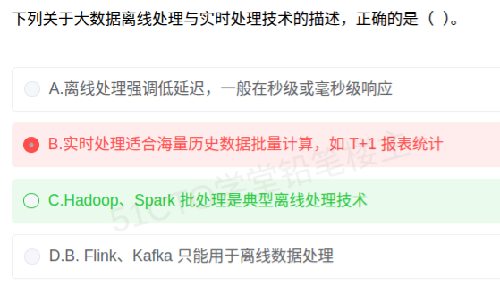

# 备考笔记：大数据-离线处理与实时处理技术辨析

## 一、题目

> 下列关于大数据离线处理与实时处理技术的描述，正确的是（  ）。
>
> A. 离线处理强调低延迟，一般在秒级或毫秒级响应
>
> B. 实时处理适合海量历史数据批量计算，如 T+1 报表统计
>
> C. Hadoop、Spark 批处理是典型离线处理技术
>
> D. Flink、Kafka 只能用于离线数据处理

**答案：C. Hadoop、Spark 批处理是典型离线处理技术**

解析：离线处理（批处理）面向**已落库的海量历史数据**，追求吞吐量，延迟通常为分钟/小时级（如 T+1 报表），Hadoop（MapReduce/HDFS）与 Spark 批处理正是其典型代表，故 **C 正确**。A 把"低延迟"错安到离线处理上（那是实时处理的特征）；B 把"海量历史数据批量计算、T+1 报表"错安到实时处理上（那是离线处理的场景）；D 错在 Flink、Kafka 恰恰是**实时/流处理**的代表（Kafka 是消息队列，Flink 主打流处理），并非只能用离线。

## 二、知识点：大数据-离线处理与实时处理技术辨析

### 1. 核心原理

大数据处理按**时效性**分为两条主线，核心差异在"**先落库再算**"还是"**边到边算**"：

| 维度 | 离线处理（批处理） | 实时处理（流处理） |
| --- | --- | --- |
| 数据特征 | 海量、历史、已落库、有界 | 持续到达、无界的数据流 |
| 时效性 | 分钟/小时/天级（T+1 报表） | 秒级/毫秒级（低延迟） |
| 设计目标 | **高吞吐**、算得全 | **低延迟**、算得快 |
| 典型技术 | **Hadoop（MapReduce）、Spark**、Hive | **Flink、Storm、Spark Streaming、Kafka** |
| 典型场景 | 离线报表、数据仓库、批量 ETL | 实时监控、实时风控、实时推荐 |

**关键结论**：

- **Hadoop、Spark 批处理 = 离线处理的代名词**（本题 C 项）。
- **Flink、Kafka = 实时/流处理的代表**（D 项说"只能离线"必错）。
- Kafka 是**分布式消息队列**，常作实时数据管道；Flink 主打**有状态的流式计算**，二者不是"只能离线"。

### 2. 关键公式/规则

| 名称 | 判据/对照 |
| --- | --- |
| 离线判据 | 数据已落库 + 批量 + 高吞吐 + 高延迟（分钟级起） |
| 实时判据 | 数据流式到达 + 逐条/微批 + 低延迟（秒/毫秒级） |
| 场景关键词 | "T+1 报表/历史数据/批量" → 离线；"秒级/毫秒级/监控告警" → 实时 |
| 技术归类 | Hadoop/Spark 批处理 → 离线；Flink/Storm/Kafka → 实时 |
| Spark 双重身份 | Spark **批处理** → 离线；**Spark Streaming** → 准实时（微批） |

速记口诀：**"历史批量看 Hadoop/Spark，秒级流式看 Flink/Kafka。"**

### 3. 解题步骤

1. **抓题干**：选"正确的"描述，逐项辨真伪。
2. **验证 A**：离线处理的特征是**高延迟、高吞吐**，"低延迟、秒级/毫秒级"是实时处理特征 → **A 错**。
3. **验证 B**："海量历史数据批量计算、T+1 报表"是**离线处理**的典型场景，被安到实时处理上 → **B 错**。
4. **验证 C**：Hadoop、Spark 批处理确为**离线处理**典型技术 → **C 对**。
5. **验证 D**：Flink、Kafka 是**实时/流处理**代表技术，"只能用于离线"是反向错误 → **D 错**。
6. **定答案**：选 **C**。

## 三、易错点

1. **"低延迟"张冠李戴**：低延迟（秒/毫秒级）是**实时处理**的卖点，离线处理恰恰相反——它牺牲延迟换吞吐。A 项就是这一错位。
2. **"T+1 报表"误认实时**：T+1 意味着"第二天才出结果"，本质上就是**离线批处理**的产物，属经典反例。
3. **Kafka 定位不清**：Kafka 是**消息中间件/数据管道**，服务于实时链路，绝非"只能离线"。
4. **忽略 Spark 的双面性**：Spark 核心是批处理（离线），但其 Spark Streaming 支持准实时；答题时若出现"Spark 只用于离线"同样要警惕。
5. **只看技术名不看场景**：判定离/实时，**先看数据形态（有界/无界）与延迟要求**，再对号入座技术栈，别死记名字。

## 四、扩展延伸

- **Lambda 架构与 Kappa 架构**：Lambda 用"批处理层 + 流处理层"双路并行；Kappa 则**只保留流处理一条链路**，用流式重放替代批处理，简化运维。
- **微批 vs 真流**：Spark Streaming 按小批次切分流数据（微批），延迟秒级；Flink 是**逐事件真流式**，延迟可达毫秒级——考试常把二者一并归入"实时/准实时"。
- **典型技术全景**：

| 层 | 代表 |
| --- | --- |
| 分布式存储/批计算 | HDFS、MapReduce、Hive、Spark |
| 流计算 | Flink、Storm、Spark Streaming |
| 消息队列/数据管道 | Kafka、Pulsar |
| 实时存储/查询 | HBase、ClickHouse、Doris |

- **现实类比**：离线处理像"**月底结账**"——数据攒齐后一次性算清，慢但全；实时处理像"**收银台刷卡**"——钱一刷即时扣款，快且准，但只关心当下这笔流水。

## 五、错题归档

| 题号 | 题型 | 考点 | 难度 | 掌握度 |
| --- | --- | --- | --- | --- |
| 系统分析师-新技术-大数据 | 单选 | 大数据离线处理与实时处理技术辨析（Hadoop/Spark 与 Flink/Kafka） | 易 | 待复习 |

## 六、相关图片

原题截图：`./images/48-大数据-离线处理与实时处理技术辨析.png`（由用户上传的原题图复制改名而来）

