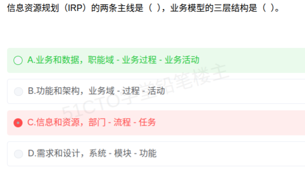

# 备考笔记：信息资源规划IRP-两条主线与业务模型三层结构

## 一、题目

> 信息资源规划（IRP）的两条主线是（ ），业务模型的三层结构是（  ）。
>
> A. 业务和数据，职能域 - 业务过程 - 业务活动
>
> B. 功能和架构，业务域 - 过程 - 活动
>
> C. 信息和资源，部门 - 流程 - 任务
>
> D. 需求和设计，系统 - 模块 - 功能

**答案：A. 业务和数据，职能域 - 业务过程 - 业务活动**

解析：信息资源规划（IRP）的两条主线是**业务主线**与**数据主线**——前者建"业务模型"，后者建"数据模型（主题数据库）"。业务模型自上而下分三层：**职能域 → 业务过程 → 业务活动**（可记为"域—过程—活动"）。B 项架构名称不规范（应为"职能域"而非"业务域"）；C 项的"信息与资源"是同义反复、"部门—流程—任务"非 IRP 术语；D 项是软件工程的概念，与 IRP 无关。

## 二、知识点：信息资源规划IRP-两条主线与业务模型三层结构

### 1. 核心原理

**IRP（Information Resource Planning，信息资源规划）**是对企业**信息的采集、处理、传输和利用**进行全面规划，核心是建立**两类模型、两条主线**：

| 主线 | 产出模型 | 三层结构（自上而下） |
| --- | --- | --- |
| **业务主线** | 业务模型 | **职能域 → 业务过程 → 业务活动** |
| **数据主线** | 数据模型（主题数据库） | **主题数据库（全域数据模型）→ 基本表 → 用户视图** |

**业务模型三层含义**：

- **职能域（Function Area）**：企业（或组织）的主要业务领域，如"生产管理""财务管理""销售管理"——是最高层、最稳定的划分。
- **业务过程（Business Process）**：职能域内的一组相关业务活动的逻辑组合，如"订单处理""库存盘点"。
- **业务活动（Business Activity）**：业务过程中的最小功能单元，不可再分，如"录入订单""审核订单"。

**数据模型三层含义**：

- **主题数据库（全域数据模型）**：面向业务主题、经过规范化设计的共享数据库。
- **基本表**：主题数据库的物理实现单位。
- **用户视图**：最终用户使用的数据表现形式（报表、屏幕界面等）。

### 2. 关键公式/规则

| 名称 | 内容 |
| --- | --- |
| IRP 两条主线 | **业务主线 + 数据主线** |
| 业务模型三层 | **职能域 → 业务过程 → 业务活动** |
| 数据模型三层 | **主题数据库 → 基本表 → 用户视图** |
| 核心思想 | 业务与数据**相互映射**，先梳理业务模型，再导出数据模型 |
| 最终目标 | 建立**主题数据库**，实现数据集成与共享（消除"信息孤岛"） |

速记：**"业务数据两条线，职能过程活动三层建；主题基本用户数据链。"**

### 3. 解题步骤

1. **抓空一**：IRP 的两条主线——业务与数据（业务模型 + 数据模型）→ 只有 A 项符合；B/C/D 的组合均非 IRP 提法。
2. **抓空二**：业务模型三层——顶层是"**职能域**"（不是"业务域""部门""系统"）。
3. **逐项排除**：
   - B "业务域—过程—活动"：层次名称被简化改写，非标准术语 → 错。
   - C "信息与资源""部门—流程—任务"：同义反复 + 术语错 → 错。
   - D "系统—模块—功能"：软件工程概念，与 IRP 无关 → 错。
4. **定答案**：选 **A**。

## 三、易错点

1. **"信息和资源"是文字陷阱**：IRP 全称里含"信息""资源"二字，但两条主线不是"信息和资源"（这是同义反复），而是**业务和数据**——这恰是典型的字面诱导。
2. **顶层名称不能随意替换**：业务模型顶层是**职能域**，不是"业务域""部门""系统"；中间层是**业务过程**（常简写"过程"），底层是**业务活动**。层次名称被改写即判错。
3. **业务模型 ≠ 数据模型**：两者层次名称完全不同，别把"职能域—业务过程—业务活动"与"主题数据库—基本表—用户视图"混用。
4. **与软件工程混淆**：D 项的"系统—模块—功能""需求—设计"是软件工程的分层思路，IRP 不使用这套术语。
5. **忘记对应主线**：答题时要能配成对——业务主线对应业务模型（三层），数据主线对应数据模型（三层），题干常两个空一起考。

## 四、扩展延伸

- **IRP 的由来**：由我国学者**高复先**提出，是信息化规划方法论，强调从**业务与数据**两条线入手，避免只建网络和硬件而忽视信息资源本身。
- **IRP 与"信息孤岛"**：企业各部门各建系统、数据口径不一即形成"信息孤岛"；IRP 通过建立**主题数据库**实现数据的统一与共享来破解。
- **与信息工程方法论的关系**：信息工程（IE）以"**数据为中心**"，IRP 正是其在规划层面的落地方法——先做**业务梳理**（职能域分解），再做**数据梳理**（主题数据库设计）。
- **现实类比**：IRP 好比"**城市规划**"——先划清功能片区（职能域），再定街区与地块（业务过程、业务活动），最后统一铺设水电管网等公共设施（主题数据库），这样后续每栋楼（应用系统）都能接得上、不重复建设。

## 五、错题归档

| 题号 | 题型 | 考点 | 难度 | 掌握度 |
| --- | --- | --- | --- | --- |
| 系统分析师-企业信息化与战略 | 单选 | 信息资源规划 IRP 两条主线与业务模型三层结构 | 易 | 待复习 |

## 六、相关图片

原题截图：`./images/49-信息资源规划IRP-两条主线与业务模型三层结构.png`（由用户上传的原题图复制改名而来）

