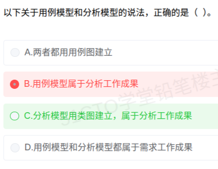

# 备考笔记：面向对象-用例模型与分析模型辨析

## 一、题目

> 以下关于用例模型和分析模型的说法，正确的是（  ）。
>
> A. 两者都用用例图建立
>
> B. 用例模型属于分析工作成果
>
> C. 分析模型用类图建立，属于分析工作成果
>
> D. 用例模型和分析模型都属于需求工作成果

**答案：C. 分析模型用类图建立，属于分析工作成果**

解析：**用例模型用"用例图"建立**，是**需求工作**（需求分析阶段）的成果，从**外部视角**描述系统"做什么"；**分析模型用"类图"建立**，是**分析工作**的成果，从**内部视角**刻画系统"怎么做"（概念类及其关系）。故 C 正确。由上述对应关系可知：A 错在"分析模型不用用例图建"；B 错在"用例模型属需求成果而非分析成果"；D 错在"分析模型不属需求成果"。

## 二、知识点：面向对象-用例模型与分析模型辨析

### 1. 核心原理

面向对象开发中，两种模型分属**不同阶段**、用**不同图**、给**不同视角**：

| 对比项 | 用例模型（Use Case Model） | 分析模型（Analysis Model） |
| --- | --- | --- |
| 所属工作 | **需求工作**成果 | **分析工作**成果 |
| 主要建模图 | **用例图**（辅以用例描述/活动图） | **类图**（辅以交互图、状态图） |
| 建模视角 | **外部视角**：系统与外界（参与者）的交互 | **内部视角**：系统内部的概念类与职责 |
| 回答的问题 | 系统"**做什么**"（功能需求） | 系统"**怎么做**"的初步结构（分析类） |
| 关键元素 | 参与者（Actor）、用例（Use Case） | 边界类、控制类、实体类（概念类） |

**记忆锚点**：

- **"用例图 → 用例模型 → 需求工作"**：需求阶段面向用户，画的是"谁用系统干什么"，天然用**用例图**。
- **"类图 → 分析模型 → 分析工作"**：分析阶段面向实现，把需求转成**类及其关系**，天然用**类图**。

### 2. 关键公式/规则

| 阶段 | 产出模型 | 主要图 | 视角 |
| --- | --- | --- | --- |
| 需求分析 | 用例模型 | 用例图 | 外部（做什么） |
| 分析 | 分析模型 | 类图 | 内部（概念结构） |
| 设计 | 设计模型 | 类图 / 组件图 / 部署图 | 实现（如何实现） |

判据口诀：**"用例图配用例模型（需求），类图配分析模型（分析）"**——看图定模型，看模型定阶段。

### 3. 解题步骤

1. **先定"图—模型"对应**：用例图 → 用例模型；类图 → 分析模型。
2. **再定"模型—阶段"对应**：用例模型 → 需求工作；分析模型 → 分析工作。
3. **逐项判真伪**：
   - A "两者都用用例图" → 分析模型用类图，**错**。
   - B "用例模型属分析工作" → 应为需求工作，**错**。
   - C "分析模型用类图建立，属分析工作成果" → **完全正确**。
   - D "两者都属需求工作" → 分析模型属分析工作，**错**。
4. **定答案**：选 **C**。

## 三、易错点

1. **阶段错位**：最容易把"用例模型"记成分析阶段成果。它属于**需求工作**——因为在需求阶段就要用它和用户确认功能范围。
2. **图形混用**：分析模型的**主要**建模图是**类图**，不是用例图；用例图只服务于需求阶段的用例模型。
3. **"模型"名称相近就混为一谈**：用例模型关注**行为/功能**（外部交互），分析模型关注**结构**（内部概念类），二者视角互补而非同类。
4. **忽略"主要图"的措辞**：分析模型可能辅以交互图、状态图，但**代表性/主要**的建模图是类图，选项若说"分析模型用交互图建立"同样要谨慎。
5. **把分析与设计合并**：分析模型是"问题域"的内部刻画（概念类），**设计模型**才引入具体实现技术；三者依次为需求 → 分析 → 设计。

## 四、扩展延伸

- **UML 图与阶段的对应关系**：

| 阶段 | 常用图 |
| --- | --- |
| 需求 | 用例图、（辅助）活动图 |
| 分析 | 类图、顺序图、通信图、状态图 |
| 设计 | 类图、组件图、部署图、包图 |

- **分析类的三种职责**：**边界类**（系统与外部交互的界面）、**控制类**（业务逻辑协调）、**实体类**（需持久保存的业务数据）——是把需求转成分析模型的核心套路。
- **与结构化方法的类比**：用例模型 ≈ 结构化方法的需求分析（DFD 面向"做什么"）；分析模型 ≈ 面向对象的概念结构设计（把数据与操作封装成类）。
- **现实类比**：用例模型像"**客户点菜单**"——只说要吃什么（需求，外部视角）；分析模型像"**后厨拆解工序**"——把每道菜拆成原料、厨具与步骤（内部结构，分析视角）。

## 五、错题归档

| 题号 | 题型 | 考点 | 难度 | 掌握度 |
| --- | --- | --- | --- | --- |
| 系统分析师-面向对象分析 | 单选 | 用例模型与分析模型的建模图与所属工作阶段辨析 | 易 | 待复习 |

## 六、相关图片

原题截图：`./images/50-面向对象-用例模型与分析模型辨析.png`（由用户上传的原题图复制改名而来）

