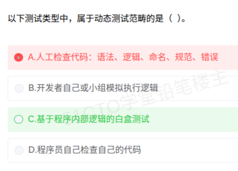

# 备考笔记：软件测试-静态与动态测试辨析

## 一、题目

> 以下测试类型中，属于动态测试范畴的是（ ）。
>
> A. 人工检查代码：语法、逻辑、命名、规范、错误
> B. 开发者自己或小组模拟执行逻辑
> C. 基于程序内部逻辑的白盒测试
> D. 程序员自己检查自己的代码

**答案：C. 基于程序内部逻辑的白盒测试**

解析：**动态测试**的本质是**实际运行**被测试的程序，通过执行来暴露缺陷。**白盒测试**（结构测试）要**运行程序、按内部逻辑设计并执行用例**，属于典型的动态测试。A、B、D 都是**不运行程序**、靠人工阅读/推演代码来检查的**静态测试**（分别对应代码审查、桌面检查/走查、自查），故排除。选 **C**。

本次误选 A：A 描述的是**人工检查代码**，恰恰是**静态测试**的典型代表，与题干"动态"相反。

## 二、知识点：软件测试-静态与动态测试辨析

### 1. 核心原理

测试按"**是否实际运行被测试程序**"这一维度，划分为**静态测试**与**动态测试**——这是与"白盒/黑盒""单元/集成/系统/验收"并列的**另一条正交维度**，不要混为一谈。

| 类别 | 判定标准 | 典型手段 | 目的 |
| --- | --- | --- | --- |
| **静态测试** | **不运行**程序，靠人工或工具审查 | 代码审查、桌面检查、走查、静态分析工具 | 尽早发现代码/文档缺陷 |
| **动态测试** | **实际运行**程序并观察结果 | 各类执行型测试（白盒、黑盒、单元、集成、系统、验收等） | 通过执行暴露缺陷 |

一句话判据：**"跑没跑过程序"**。跑了 → 动态；只"看"不"跑" → 静态。

### 2. 关键公式/规则

**静态测试四大人工手段**（A、B、D 就落在这一栏）：

| 手段 | 形式 | 特点 |
| --- | --- | --- |
| 代码审查（Review） | 多人会议式、对照检查表逐行看 | 最正式，效率高 |
| 桌面检查（Desk Checking） | **由作者自己**通读、模拟推演逻辑 | B、D 属于此类 |
| 代码走查（Walkthrough） | 作者讲解、小组**人工模拟执行** | **只"模拟"，不真运行** |
| 静态分析 | 工具分析代码语法/结构/数据流 | 自动化，仍属静态 |

**易混关键点**：B 的"**模拟**执行逻辑"、D 的"自己检查自己的代码"，都**没有真正运行程序**，是人工推演，**仍属静态测试**——这是本题最主要的陷阱。

**与其它维度的关系**：

| 维度 | 取值 |
| --- | --- |
| 是否运行程序 | **静态** / **动态** |
| 是否看内部代码 | 白盒 / 黑盒 / 灰盒 |
| 测试阶段 | 单元 / 集成 / 系统 / 验收 |
| 用例设计方法 | 等价类、边界值、因果图、判定表、正交、错误推测 |

### 3. 解题步骤

1. **抓维度**：题干问"**动态测试**范畴" → 判据是"**是否实际运行程序**"。
2. **逐个判断是否真运行**：
   - A"人工检查代码" → 只看不跑 → **静态** ✗；
   - B"模拟执行逻辑" → 模拟 ≠ 真运行 → **静态** ✗；
   - C"白盒测试" → 需运行程序、按内部逻辑执行用例 → **动态** ✓；
   - D"自己检查自己的代码" → 只看不跑 → **静态** ✗。
3. **选定 C**。

## 三、易错点

1. **被"模拟执行/执行逻辑"骗到**：B 中的"模拟执行"极易误读成"运行程序"，但人工推演**不加载真实程序、不产生真实运行结果**，仍属静态测试。只有**真正运行**（编译/解释执行、有真实输入输出）才是动态测试。
2. **把"白盒测试"误判为静态**：白盒只是"**是否看内部逻辑**"的维度标签；它是**要运行程序**的测试方法，属**动态测试**。切莫因为"和代码相关"就当成静态。
3. **把"代码审查"当成动态**：A、D 都是人工阅读代码，属静态。**看代码 ≠ 动态测试**。
4. **维度混淆**：静态/动态 **不是**白盒/黑盒的同义词，也不是单元/集成/系统/验收的同义词。题目问哪个维度，就按哪个维度的判据作答。
5. **极端化理解**：不能说"白盒都是动态"、"黑盒就不能静态"——**静态分析工具、文档审查**等方法对黑白盒都可用；动态测试中白盒黑盒也都能用。**唯一硬判据是"跑没跑程序"**。
6. **术语陷阱**：**桌面检查（Desk Checking）**＝自己看；**同行评审/走查**＝小组看；**这两者与"审查"一样都是静态**，只是组织形式不同。

## 四、扩展延伸

- **与前一考点串联**：
  - [52-软件测试-测试阶段目的与接口验证辨析.md](52-软件测试-测试阶段目的与接口验证辨析.md)：讲的是**测试阶段**（单元/集成/系统/验收）这条维度；
  - 本篇讲的是**静态/动态**这条维度。两条维度**相互正交**：例如"单元测试"既可用**静态**方式（桌面检查）也可用**动态**方式（执行用例）来做。
- **静态测试的价值**：缺陷发现越早成本越低，静态测试能在**编码阶段甚至需求/设计阶段**就拦住缺陷，故被 CMMI/近似评审流程中列为**早期质量门**；它**不产生可执行结果**，因此无法发现运行期问题（如性能、并发、内存越界）。
- **动态测试的组成**：等价于"**运行程序 + 观察结果**"，覆盖白盒（语句/判定/条件/路径覆盖）与黑盒（等价类、边界值、因果图、错误推测、正交、场景法）两类用例设计方法，以及单元→集成→系统→验收的各阶段执行。
- **V&V 视角**：
  - **Verification（验证）**：是否**正确地构建**了产品——静态评审与动态测试都服务于它；
  - **Validation（确认）**：是否构建了**正确的产品**——主要靠动态的验收测试。
  静态测试偏 Verification，动态测试两类都含。
- **现实类比**：
  - **静态测试**＝拿到**车/机器不启动**，靠工程师**读图纸、查线路、肉眼检查**（A：查代码；B：脑子里推演；D：自查）；
  - **动态测试**＝**把车真正发动起来上路跑**（C：让程序真正跑起来看逻辑是否按预期执行）；
  - 两者的价值不同：**读图纸**能查出接线错、命名乱、算法逻辑错；**上路跑**才能查出发动机异响、加速慢、跑偏——**很多缺陷只有"跑起来"才会暴露**。

## 五、错题归档

| 题号 | 题型 | 考点 | 难度 | 掌握度 |
| --- | --- | --- | --- | --- |
| 系统分析师-系统测试 | 单选 | 静态/动态测试的判据：是否**实际运行**程序（模拟执行、人工审查均属静态） | 易 | 薄弱（本次错选 A） |
| 系统分析师-系统测试 | 单选 | 测试阶段与目的配对（见第 52 篇） | 易 | 薄弱 |
| 系统分析师-系统测试 | 单选 | 白盒/黑盒与静态/动态维度正交辨析 | 中 | 待复习 |

## 六、相关图片

原题截图：`./images/53-软件测试-静态与动态测试辨析.png`（由用户上传的原题图复制改名而来）

