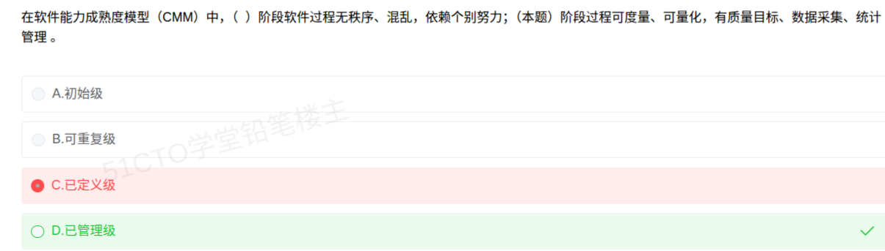
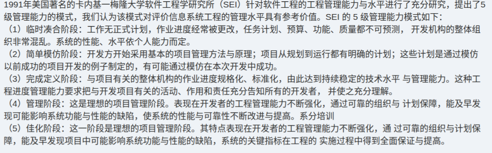

# 备考笔记：CMM能力成熟度模型-五级特征辨析

## 一、题目

> 在软件能力成熟度模型（CMM）中，（ ）阶段软件过程无秩序、混乱，依赖个别努力；（本题）阶段过程可度量、可量化，有质量目标、数据采集、统计管理。
>
> A. 初始级
> B. 可重复级
> C. 已定义级
> D. 已管理级

**答案：D. 已管理级**

解析：
- 第一空"**无秩序、混乱，依赖个别努力**"描述的是 **初始级**（第 1 级）——过程无序，成功靠个人英雄主义；
- 第二空（本题所问）"**过程可度量、可量化，有质量目标、数据采集、统计管理**"是 **已管理级**（第 4 级，Managed）的定义——对过程与产品质量进行**定量度量与统计分析**。

故选 **D**。

本次误选 C："已定义级"（第 3 级）的标志是**过程已文档化、标准化**，强调的是**"定义/规范"**；而**"可量化、统计管理"**是更高一级的**已管理级**，两者层次不同，不能混。

## 二、知识点：CMM能力成熟度模型-五级特征辨析

### 1. 核心原理

**CMM（Capability Maturity Model，能力成熟度模型）** 由 SEI 提出，用于评价**软件组织的开发能力与过程成熟度**，将过程能力划分为 **5 个逐级提升的等级**。级别越高，过程越**规范、可预测、可控制**。

| 级别 | 中文名 | 英文名 | 一句话特征 | 关键词锚点 |
| --- | --- | --- | --- | --- |
| 1 | **初始级** | Initial | 过程**无序、混乱**，成功依赖**个人努力** | 无序、混乱、英雄主义、无章法 |
| 2 | **可重复级** | Repeatable | 建立**项目管理**过程，能**重复**以往成功 | 项目管理、可重复、经验总结 |
| 3 | **已定义级** | Defined | 过程**文档化、标准化**，形成组织级标准过程 | 文档化、标准化、组织级标准过程 |
| 4 | **已管理级** | Managed | 过程与质量**可度量、可量化**，用数据管理 | **可度量、量化、质量目标、数据采集、统计管理** |
| 5 | **优化级** | Optimizing | **持续过程改进**，缺陷预防、技术创新 | 持续改进、缺陷预防、新技术引入 |

**教材口语化别名**（"SEI 5 级管理能力模式"表述，见下方补充知识卡）：**临时凑合**（初始）→ **简单模仿**（可重复）→ **完成定义**（已定义）→ **管理**（已管理）→ **佳化**（优化）。三个新判别点：级 2 是"**模仿以前成功的项目**制定计划"；级 3 是"**整体机构**的作业进度**规格化、标准化**"（组织级，非单个项目）；级 5 的标志是"**关键指标**在实施过程中得到**全面保证与提高**"。

### 2. 关键公式/规则

**"关键词 → 级别"对照表**（本题靠这张表一眼锁定答案）：

| 题干关键词 | 对应级别 |
| --- | --- |
| 无序、混乱、依赖个别努力/英雄主义 | **初始级（1）** |
| 项目管理、可重复成功经验 | 可重复级（2） |
| 文档化、标准化、组织级标准过程 | 已定义级（3） |
| **可度量、可量化、质量目标、数据采集、统计管理** | **已管理级（4）** |
| 持续改进、缺陷预防、过程优化 | 优化级（5） |

**一句话记忆链**：**乱 → 能重复 → 有标准 → 能量化 → 能改进**
（初始 · 可重复 · 已定义 · 已管理 · 优化）

**易混两级的分水岭**：

| 对比 | 已定义级（3） | 已管理级（4） |
| --- | --- | --- |
| 核心动作 | **"定"**：把过程定义清楚 | **"量"**：对过程与质量**度量** |
| 关键证据 | 标准过程文档、过程库 | 度量数据、统计过程控制、质量目标 |
| 口诀 | **有标准** | **有数据** |

### 3. 解题步骤

1. **读两空，分别抓关键词**：第一空"无秩序、混乱、依赖个别努力"；第二空"可度量、可量化、质量目标、数据采集、统计管理"。
2. **先判第一空**：无序混乱 = **初始级（1）**——用来确认对 CMM 的整体理解。
3. **判第二空（本题所问）**：出现"**度量/量化/统计**"→ 锁定 **已管理级（4）**。
4. **排除干扰**：C"已定义级"对应的是"文档化/标准化"（定），不是"度量"（量），故排除。
5. **选定 D**。

## 三、易错点

1. **把"量化/度量"错配给"已定义级"**（本次失分点）：第 3 级只要求过程**被定义、被文档化**；**"可度量、统计管理"是第 4 级已管理级的专属标志**。记住**"三级定、四级量"**。
2. **五级顺序记乱**：正确顺序是 **初始 → 可重复 → 已定义 → 已管理 → 优化**。别把"已管理/已定义"的顺序颠倒，也别把"优化级"插到中间。
3. **CMM 与 CMMI 混用**：**CMM**（SW-CMM）第 2 级叫 **可重复级（Repeatable）**；**CMMI** 第 2 级叫 **已管理级（Managed）**，且第 4 级叫 **定量管理级（Quantitatively Managed）**。两套模型的级别**名称不一致**，题目问 CMM 就按 CMM 的五级名作答。
4. **只记名字不记特征**：软考多考"**特征 → 级别**"的反向判断，务必把每个级别的关键词锚点（混乱/重复/标准/度量/改进）背成对。
5. **"初始级"不是"第一级已实现"**：初始级恰恰表示**基本没有规范化过程**，是成熟度的**最低起点**，不代表"做到了第 1 步就合格"。
6. **级别不可跳跃认定**：CMM 强调**逐级递进**，达到第 4 级意味着前 3 级已满足，答题时不要出现"只满足第 4 级特征却不满足前级"的矛盾表述。

## 四、扩展延伸

- **CMM 的诞生背景**：20 世纪 80 年代美国 SEI 受军方委托研究"如何评价软件承包商能力"，源于**项目延期、超支、质量差**的普遍问题，核心思想是**"软件质量取决于开发过程的质量"**（过程决定质量）。
- **CMM 与 CMMI 的关系**：CMM 家族后来整合为 **CMMI（Capability Maturity Model Integration）**，并派生出：
  - **CMMI-DEV**（开发）、**CMMI-SVC**（服务）、**CMMI-ACQ**（采购）；
  - **阶段式表示**（Staged，5 级）与**连续式表示**（Continuous，按过程域能力等级 0–3 评价）。
- **过程改进的经典模型家族**（常与 CMM 一同考查）：
  - **ISO 9001**：质量管理体系，侧重"符合标准"；
  - **SPICE（ISO 15504）**：软件过程评估，6 级（0–5）；
  - **PDCA 循环**（Plan-Do-Check-Act）：持续改进的通用框架，对应优化级思想。
- **与其他考点的连接**：
  - CMM 属"**软件过程改进**"，与 [43-开发过程模型选型-高风险项目螺旋模型.md](43-开发过程模型选型-高风险项目螺旋模型.md) 同属软件工程章节的"过程"主题；
  - 测试阶段的评审与质量度量（见 [52](52-软件测试-测试阶段目的与接口验证辨析.md)、[53](53-软件测试-静态与动态测试辨析.md)）正是"可度量性"在工程实践中的体现。
- **现实类比**：把 CMM 五级想成一家餐厅的规范程度——
  - **1 初始级**：大厨一个人凭手感做菜，味道全看当天心情（依赖个人努力，无序）；
  - **2 可重复级**：把招牌菜的做法记下来，能稳定复刻（可重复）；
  - **3 已定义级**：所有菜都写成**标准菜谱**，谁来做都按同一份流程（标准化、文档化）；
  - **4 已管理级**：给每道菜**记录出餐时间、温度、投诉率**，用数据卡住质量（可度量、统计管理）；
  - **5 优化级**：根据数据**不断改良菜谱、预防老问题复发**（持续改进）。

## 五、错题归档

| 题号 | 题型 | 考点 | 难度 | 掌握度 |
| --- | --- | --- | --- | --- |
| 系统分析师-软件工程（过程改进） | 单选 | CMM 五级特征辨析："混乱依赖个人"→初始级；"可度量/量化/统计管理"→**已管理级**（三级是标准化，四级才量化） | 易 | 薄弱（本次错选 C） |
| 系统分析师-软件工程（过程改进） | 单选 | CMM 与 CMMI 级别名称差异（可重复级 vs 已管理级） | 中 | 待复习 |
| 系统分析师-软件工程（过程改进） | 单选 | 过程改进模型家族（ISO 9001、SPICE、PDCA 循环） | 中 | 待复习 |

## 六、相关图片

原题截图：`./images/55-CMM能力成熟度模型-五级特征辨析.png`（由用户上传的原题图复制改名而来）

补充知识卡（SEI 5 级管理能力模式原文，系统集成/项目管理师教材表述）：`./images/55-CMM能力成熟度模型-五级特征辨析-知识卡.png`

