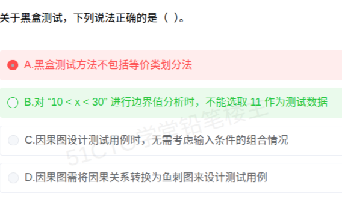

# 备考笔记：黑盒测试方法辨析-等价类划分、边界值、因果图与判定表

## 一、题目

> 关于黑盒测试，下列说法正确的是（ ）。
>
> A. 黑盒测试方法不包括等价类划分法
> B. 对"10 < x < 30"进行边界值分析时，不能选取 11 作为测试数据
> C. 因果图设计测试用例时，无需考虑输入条件的组合情况
> D. 因果图需将因果关系转换为鱼刺图来设计测试用例

**答案：B**

解析：本题是"**选正确项**"型，最稳的解法是**排除法**——先咬死三个错误项：

- **A 错**：等价类划分法**正是**最主要的黑盒测试方法之一（黑盒方法包括等价类划分、边界值分析、错误推测、因果图、判定表驱动、正交实验、场景法等）；
- **C 错**：因果图的价值恰在于**充分考虑输入条件的组合情况**，"无需考虑组合"与之直接相悖；
- **D 错**：因果图设计用例时，是把因果关系转换为 **判定表（决策表）**，**不是鱼刺图**（"鱼刺图"是**因果图本身的别称**，不能自己转换自己，且最终产物是判定表）。

三项排除后，**B 正确**：对"10 < x < 30"做边界值分析时，边界为 **10 和 30**，测试数据取**边界值及其越界邻近值**（9、10、30、31）；**11 位于有效区间（11~29）内部，属于普通有效值，不是边界值分析所要求的边界数据**，因此"不能（不必）选取 11"。

本次误选 A：把"等价类划分 **是**黑盒方法"记成了"不包括"，属于对基本分类的硬伤，需重点加固。

## 二、知识点：黑盒测试方法辨析-等价类划分、边界值、因果图与判定表

### 1. 核心原理

**黑盒测试（功能测试 / 数据驱动测试 / 基于规格说明的测试）**：不关心程序内部结构，只看**输入与输出的对应关系**。常用方法包括：

| 方法 | 核心思想 | 关键词锚点 |
| --- | --- | --- |
| **等价类划分** | 把输入域分成**有效/无效等价类**，每类取一个代表值 | **分类、代表值、有效/无效** |
| **边界值分析** | 错误多发于**边界**，取边界值及其邻近（越界）值 | **边界、越界、±1** |
| **错误推测** | 凭**经验直觉**推测可能出错处 | **经验、直觉** |
| **因果图** | 用图形表示**输入条件与输出的因果关系**，考虑**输入组合** | **因果、输入组合、约束** |
| **判定表（决策表）** | 因果图的**落地产物**，列出条件桩/动作桩与全组合 | **条件桩、动作桩、组合列** |
| **正交实验设计** | 用**正交表**从大量组合中挑少量均衡样本 | **正交表、成对组合** |
| **场景法** | 按**业务流程（基本流/备选流）**设计用例 | **基本流、备选流** |

**关键关系（本题 D 的考点）**：

$$\text{因果图} \xrightarrow{\text{转换}} \text{判定表（决策表）} \xrightarrow{\text{每列}} \text{一个测试用例}$$

- 因果图又叫**因果分析图、石川图、鱼骨图/鱼刺图、特性要因图**（注意：**鱼刺图 = 因果图**，二者是同一个东西）；
- 因果图之所以存在，就是因为**输入条件之间的组合**太多、直接画判定表规模爆炸，先用因果图理清逻辑与约束，**再转成判定表**。
- 判定表列数 = $$2^n$$（$$n$$ 为条件数），因果图中的**约束**会删去不可能出现的组合列。

### 2. 关键公式/规则

**（1）边界值分析的取值规则**

| 输入形式 | 取哪些数据 |
| --- | --- |
| 规定了取值范围 $$[a,b]$$ | 边界 **a、b** 及**越界邻近值** $$a-1$$、$$b+1$$（部分教材亦取内侧邻近值 $$a+1$$、$$b-1$$） |
| 规定了取值范围 $$(a,b)$$（开区间） | 有效区间为 $$a+1 \sim b-1$$；边界为 **a、b**，取 **a、b** 与越界邻近值 $$a-1$$、$$b+1$$ |
| 规定了取值个数 | 取**最小值、最小值+1、最大值、最大值-1** |
| 输入是有序集合 | 取**第一个、第二个、倒数第二个、最后一个** |

> 本题口径：$$10<x<30$$ 的边界是 **10、30**，取 **9、10、30、31**；**11** 处于有效区间内部，不属于边界值分析要求的边界数据，故 B 的表述成立。
>
> ⚠️ 注意：部分教材把"刚进入有效区间的 11"也一并纳入（取 9、10、11、29、30、31）。遇到此类题的**优先解法是排除法**——本题 A/C/D 三项均明确错误，B 必然成立。

**（2）三种方法的分工对照**

| 对比 | 等价类划分 | 边界值分析 | 因果图 / 判定表 |
| --- | --- | --- | --- |
| 关注点 | 类内**代表值** | **边界及越界值** | 输入**组合**与因果逻辑 |
| 是否看组合 | 不看 | 不看 | **看**（核心） |
| 产物 | 代表性用例 | 边界用例 | 判定表 → 用例 |
| 关系 | 基础 | **等价类划分的补充** | 复杂逻辑时使用 |

### 3. 解题步骤

1. **判断题型**：题干问"说法**正确**的是"→ 用**排除法**最稳。
2. **逐项定性**：
   - A：等价类划分是否属黑盒方法？→ **是**（黑盒方法之一）→ A 错；
   - C：因果图是否需要考虑输入组合？→ **需要，且这正是它的强项** → C 错；
   - D：因果图转换的产物是鱼刺图还是判定表？→ **判定表**（鱼刺图本就是因果图的别称）→ D 错；
   - B：$$10<x<30$$ 边界为 10、30，取 9、10、30、31；11 在有效区间内部，不是边界数据 → B 成立。
3. **确定 B**。

## 三、易错点

1. **把等价类划分误当成白盒方法**（本次失分点）：等价类划分**是黑盒方法**。判断"黑盒/白盒"的一条硬标准是——**是否基于内部结构/代码**。等价类划分只看输入域与规格说明，属于黑盒。
2. **把"鱼刺图"和"判定表"张冠李戴**（D 的陷阱）：**因果图的别称**才是鱼刺图/石骨图/石川图；因果图设计用例时**转换的目标是判定表**。记住"**因果图 → 判定表 → 测试用例**"这条链。
3. **误认为因果图"不用管组合"**（C 的陷阱）：因果图的**存在意义**就是处理输入条件的组合与约束，"无需考虑组合"是把它的立身之本说没了。
4. **边界值取证法的混淆**：本题的争议点在于 11，要牢记两种口径——"**边界及其越界值**"（9、10、30、31）与"**边界内外各取一点**"（9、10、11、29、30、31）。考场上遇到此类选项，**优先排除其余三项**，不要纠缠 B。
5. **把"等价类划分"与"边界值分析"当成互斥**：边界值分析是等价类划分的**补充**，二者常配合使用；边界值分析取的是**类的边界**，而非类内任一点。
6. **忘记黑盒测试的适用阶段**：黑盒测试在**单元、集成、系统、验收**各阶段都能用，尤其在**系统测试与确认（验收）测试**中作用不可替代（可与 [52-软件测试-测试阶段目的与接口验证辨析.md](52-软件测试-测试阶段目的与接口验证辨析.md) 对照）。
7. **静态/动态混淆**：黑盒测试**大多属于动态测试**（要运行程序）；但**需求评审**等静态活动也常借助黑盒视角的分析（详见 [53-软件测试-静态与动态测试辨析.md](53-软件测试-静态与动态测试辨析.md)）。

## 四、扩展延伸

- **黑盒 vs 白盒一句话区分**：黑盒看**"做什么"**（输入→输出），白盒看**"怎么做"**（语句/分支/路径覆盖）。
- **白盒覆盖强度（由弱到强）**：语句覆盖 < 判定（分支）覆盖 < 条件覆盖 < 判定/条件覆盖 < 条件组合覆盖 < 路径覆盖。这是配套高频考点。
- **测试用例的最小化思想**：等价类划分"每类取一代表值"、正交实验设计"用正交表压缩组合"，本质都是**用最少用例覆盖最大风险**，与"完全穷举测试是不可能的"这一测试原则呼应。
- **判定表的规模问题**：$$n$$ 个条件 → $$2^n$$ 列，条件一多就爆炸；这正是因果图"先理逻辑、再去掉不可能组合"的价值所在，也是**正交实验设计**被引入的原因。
- **现实类比**：
  - **等价类划分**＝体检时按"年龄段"抽人，18–30 岁抽一个代表即可；
  - **边界值分析**＝专挑"刚满 18 岁""刚超 60 岁"的人查，因为边界最容易出问题；
  - **因果图**＝画一张"是否打折 = 会员？ + 满 200？"的因果推理图，再把所有组合情况列成一张**判定表**逐行核对；
  - **鱼刺图/石川图**＝质量管理里的"人机料法环"鱼骨图——**它就是因果图本尊**，别再让它"转换成自己"。

## 五、错题归档

| 题号 | 题型 | 考点 | 难度 | 掌握度 |
| --- | --- | --- | --- | --- |
| 系统分析师-系统测试 | 单选 | 黑盒测试方法辨析：等价类划分属黑盒（A 错）；因果图考虑输入组合（C 错）；因果图→**判定表**而非鱼刺图（D 错）；边界值分析取值 | 中 | 薄弱（本次错选 A） |
| 系统分析师-系统测试 | 单选 | 边界值分析取值规则（取值范围 / 开区间 / 个数 / 有序集合） | 中 | 待复习 |
| 系统分析师-系统测试 | 单选 | 白盒覆盖强度排序（语句<判定<条件<判定条件<条件组合<路径） | 中 | 待复习 |

## 六、相关图片

原题截图：`./images/57-黑盒测试方法辨析-等价类划分边界值因果图与判定表.png`（由用户上传的原题图复制改名而来）

