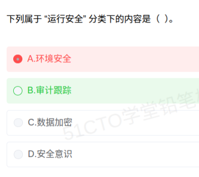

# 备考笔记：信息系统安全分类-运行安全与审计跟踪

## 一、题目

> 下列属于"运行安全"分类下的内容是（ ）。
>
> A. 环境安全
> B. 审计跟踪
> C. 数据加密
> D. 安全意识

**答案：B. 审计跟踪**

解析：信息系统安全按保护对象与手段划分为**物理安全、运行安全、数据安全、管理安全**四个层次，各选项分属不同层次——**环境安全**属**物理安全**；**审计跟踪**属**运行安全**；**数据加密**属**数据安全**；**安全意识**属**管理安全**（人员安全）。题干问"运行安全"，故选 **B**。

## 二、知识点：信息系统安全分类-运行安全与审计跟踪

### 1. 核心原理

软考把**信息系统安全**按"保护什么、用什么手段保护"划分为**四层**，各层职责边界清晰：

- **物理安全**：保护**硬件实体与运行环境**——环境安全（机房温湿度、防雷防火防水、门禁）、设备安全、媒体（介质）安全。
- **运行安全**：保护**系统运行过程本身**——**审计跟踪（日志审计）**、备份与恢复、防病毒、应急预案、电磁泄露防护、网络运行监控。核心是"**系统在跑的时候不出事、出事能查能恢复**"。
- **数据安全**：保护**数据本身**——数据加密、数据完整性校验、访问控制、防篡改、数据备份。
- **管理安全**：靠**制度与人员**保障——安全管理制度、组织保障、**安全意识教育**、人员权限与操作规程、法律法规合规。

一句话记忆：**物理管"房子"，运行管"跑"，数据管"料"，管理管"人"**。

### 2. 关键公式/规则

| 层次 | 保护对象 | 典型内容 |
| --- | --- | --- |
| **物理安全** | 硬件实体与机房环境 | **环境安全**、设备安全、媒体安全、门禁/消防/防雷 |
| **运行安全** | 系统运行过程 | **审计跟踪**、备份与恢复、防病毒、应急响应、电磁防护、网络运行监控 |
| **数据安全** | 数据（存储与传输） | **数据加密**、完整性校验、访问控制、防篡改 |
| **管理安全** | 制度与人员 | **安全意识**教育、安全管理制度、人员权限、合规审计 |

> 关键区分：**"审计跟踪"是运行安全的标志性内容**——它是系统运行过程中的**行为记录与追溯**机制，属于"运行"层面；而"**数据备份**"虽与运行安全相邻，但通常归**数据安全**（若表述为"**备份与恢复机制**"则归运行安全，需按教材口径判断）。

### 3. 解题步骤

1. **抓考点**：题干问"属于**运行安全**分类下的内容"。
2. **回放四层分类**：物理安全 / 运行安全 / 数据安全 / 管理安全。
3. **逐项归层**：
   - A 环境安全 → **物理安全** ✗；
   - B 审计跟踪 → **运行安全** ✓；
   - C 数据加密 → **数据安全** ✗；
   - D 安全意识 → **管理安全**（人员安全）✗。
4. **选定 B**。

## 三、易错点

1. **"审计"与"安全审计/合规"混淆**：**审计跟踪**是**运行安全**；而**安全审计制度、合规检查**属于**管理安全**。看题干限定词——落在"跟踪/日志/记录"上属运行。
2. **"数据备份"归属摇摆**：作为**数据保护手段**归**数据安全**；作为**系统运行保障机制（备份与恢复）**归**运行安全**。做题时以教材选项体系为准，题干若并列"备份与恢复"通常算运行安全。
3. **"环境安全"误判为运行安全**：环境安全（机房环境）明确属**物理安全**，是最常被误选的干扰项。
4. **"安全意识"错当技术措施**：安全意识/培训/制度都是**管理安全**，不是技术层面的运行安全。
5. **只记"加密=安全"**：数据加密只覆盖**数据安全**一层，不能包打四层；物理、运行、管理各有其专属内容。
6. **四层与"网络安全"混淆**：网络安全协议、防火墙属**网络运行安全**层面，可与运行安全交叉考，注意题干措辞。

## 四、扩展延伸

- **与信息系统安全体系（SSE-CMM / ISO 27001）对照**：教材四层是入门分类；工程实践中 ISO/IEC 27001 把控制措施分为**组织控制、人员控制、物理控制、技术控制**，与"管理/物理/运行/数据"大体对应，只是技术控制内部再细分为运行与数据两类。
- **审计跟踪（Audit Trail）机制要点**（可作深度考点）：
  1. **完整性**：日志不可被删除、篡改，需**只追加（append-only）**或**哈希链**保护；
  2. **可追溯**：记录**谁、何时、对什么、做了什么、结果如何**（Who/When/What/How/Result）；
  3. **留存期**：按合规要求保留（如等保要求日志留存不少于 6 个月）；
  4. **联动**：日志 + **入侵检测** + **应急响应**构成运行安全闭环。
- **等保 2.0 的启示**：等级保护要求从**物理、网络、主机、应用、数据、管理**多维落实，其中"**安全运维管理**"正对应运行安全层，强调**审计、监控、备份、应急**四件事。
- **现实类比**：
  - **物理安全**＝锁好大楼门禁与消防；
  - **运行安全**＝大楼里的**监控摄像头与值班日志**，正跑着的东西要**看得见、查得到**；
  - **数据安全**＝把**金库里的钱加密上锁**；
  - **管理安全**＝**员工守则与安全培训**，机器再好，人乱来一样出事。
  一句话：**物理防"砸门"，运行防"内乱"，数据防"泄密"，管理防"人祸"**。

## 五、错题归档

| 题号 | 题型 | 考点 | 难度 | 掌握度 |
| --- | --- | --- | --- | --- |
| 系统分析师-网络与信息安全 | 单选 | 信息系统安全四层分类：**运行安全含审计跟踪**；环境安全属物理、数据加密属数据、安全意识属管理 | 易 | 薄弱 |
| 系统分析师-网络与信息安全 | 单选 | 审计跟踪机制要点（完整性、可追溯、留存期、与应急响应联动） | 中 | 待复习 |
| 系统分析师-网络与信息安全 | 单选 | "数据备份"归属辨析（数据安全 vs 运行安全） | 中 | 待复习 |

## 六、相关图片

原题截图：`./images/58-信息系统安全分类-运行安全与审计跟踪.png`（由用户上传的原题图复制改名而来）

