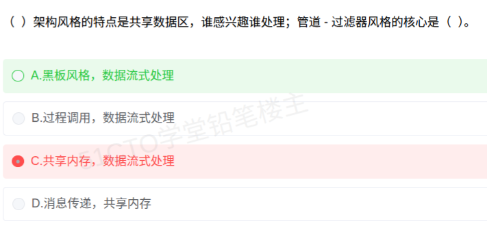

# 备考笔记：架构风格-五大类变式命题推演

> 本笔记是 [59-架构风格-黑板风格与管道过滤器.md](59-架构风格-黑板风格与管道过滤器.md) 的**举一反三**专题：母题只问"黑板 + 管道-过滤器"两个点，但同一个考点在试卷上会换多种问法。下面把**五大类架构风格**各角度的变式题型一次性推演完，并横向贯通全科目相关笔记。

## 一、题目

**母题**（[59](59-架构风格-黑板风格与管道过滤器.md)）：

> （ ）架构风格的特点是共享数据区，谁感兴趣谁处理；管道-过滤器风格的核心是（ ）。
>
> A. 黑板风格，数据流式处理　B. 过程调用，数据流式处理
> C. 共享内存，数据流式处理　D. 消息传递，共享内存

**答案：A**

**命题规律**：架构风格题**几乎只考三件事**——
1. **风格名 ↔ 特征描述**的互认（"共享数据区"＝黑板、"数据流式处理"＝管道-过滤器）；
2. **风格归类**（某具体风格属于五大类中的哪一类）；
3. **风格与质量属性的对应**（哪个风格可复用性好、哪个性能差）。

## 二、知识点：架构风格-五大类变式命题推演

### 1. 核心原理

**架构风格（Architectural Style）= 构件 + 连接件 + 约束**。做题先问自己：**构件之间靠什么连接、数据怎么流、控制权归谁**。据此划分五大类：

| 大类 | 典型风格 | 连接件 | 数据/控制流向 |
| --- | --- | --- | --- |
| **数据流** | 批处理序列、**管道-过滤器** | 数据流（管道） | 单向流动、顺序加工 |
| **调用/返回** | 主程序-子程序、**面向对象**、**层次结构** | 调用/返回 | 自上而下，控制权随调用转移 |
| **独立构件** | **进程通信**、**事件驱动（隐式调用）** | 消息/事件 | 无固定调用，**发布者不知订阅者** |
| **虚拟机** | **解释器**、**基于规则的系统** | 状态机/解释引擎 | 由引擎解释"程序/规则" |
| **仓库** | **数据库、黑板、超文本** | 中心数据结构 | 围绕**共享数据区**读写 |

**易混风格的精确区分**：

| 风格对 | 区分点 |
| --- | --- |
| 黑板 vs 数据库 | 同属**仓库**；数据库**被动**等查询，黑板由**知识源主动触发**、无预定解法 |
| 黑板 vs 事件驱动 | 前者有**中心数据区**；后者靠**事件/消息**广播，无中心数据 |
| 管道-过滤器 vs 批处理序列 | 同属**数据流**；前者数据**流式**传递、过滤器可并发，后者整批传递、不并行 |
| 层次结构 vs 分层网络设计 | 前者是**软件架构风格**（层间只相邻调用）；后者是**网络拓扑**（[41](41-园区网络层次化设计-接入层功能辨析.md) 接入/汇聚/核心），**不同领域** |
| 解释器 vs 编译器 | 前者**边解释边执行**、灵活但慢（虚拟机风格）；编译器各阶段是**管道-过滤器**（数据流风格） |

### 2. 关键公式/规则

**（1）关键词 → 风格 速判表**（背熟这张表，选择题秒杀）：

| 题干关键词 | 对应风格 | 所属大类 |
| --- | --- | --- |
| 共享数据区、谁感兴趣谁处理、知识源、无确定解法 | **黑板** | 仓库 |
| 数据流式处理、逐步加工、可复用过滤器、Unix 管道 | **管道-过滤器** | 数据流 |
| 整体批量、前后步传完整数据集 | **批处理序列** | 数据流 |
| 自顶向下、过程调用、模块化 | **主程序-子程序** | 调用/返回 |
| 封装、继承、多态、对象 | **面向对象** | 调用/返回 |
| 每层只与相邻层交互、抽象级别递增、下层服务上层 | **层次结构** | 调用/返回 |
| 发布-订阅、不直接调用、松耦合、可插拔、不知道谁会响应 | **事件驱动（隐式调用）** | 独立构件 |
| 消息传递、进程间通信、端口 | **进程通信** | 独立构件 |
| 边解释边执行、脚本/规则、易定制 | **解释器、基于规则的系统** | 虚拟机 |
| 中心数据库、超文本链接 | **数据库、超文本** | 仓库 |

**（2）缺点是高频考点**：

| 风格 | 优点 | 缺点 |
| --- | --- | --- |
| 管道-过滤器 | 可复用、可并发、可测试、易于理解 | **不适合交互式应用**；过滤器间无共享状态；复杂决策难表达 |
| 事件驱动（隐式调用） | 松耦合、**可扩展/可插拔** | **控制流不可预测**、难调试、构件放弃对计算的控制权 |
| 层次结构 | 支持抽象、**可替换可复用**、便于标准化 | **性能开销大**（层层穿越）；难划定正确层次 |
| 解释器 | **灵活性高**、易定制 | **效率低** |
| 仓库/黑板 | 数据集中、便于一致性与共享 | 中心结构是**性能瓶颈与单点** |
| 批处理序列 | 简单、吞吐高 | 不适合交互、**无并发** |

**（3）风格 ↔ 质量属性**（架构评估题常考）：

| 质量属性 | 受益的风格 |
| --- | --- |
| **可修改性 / 可复用性** | 管道-过滤器、层次结构、事件驱动 |
| **可扩展性** | 事件驱动（隐式调用）、微服务、微内核 |
| **性能** | 层次结构差；管道-过滤器较好 |
| **可测试性** | 管道-过滤器（过滤器可独立测试） |
| **处理无确定解法的复杂问题** | **黑板** |

### 3. 解题步骤

**三步判定法**：
1. **找连接件**：看构件是靠**数据流**、**调用**、**消息/事件**，还是**中心数据区**连接——一句话定大类；
2. **找控制权**：控制权**随调用转移**＝调用/返回；**发布者不知订阅者**＝事件驱动；**谁感兴趣谁处理**＝黑板；
3. **比对选项**：注意选项里常塞"非风格名词"（如"共享内存""协议分层"）与"跨领域名词"来设陷。

**变式推演（8 题自测，答案见括号）**：

1. 编译器设计通常采用（　）风格 —— **管道-过滤器（数据流）**。
2. 语音识别、信号处理等**无确定解法**问题宜用（　）—— **黑板**。
3. "构件发布事件、订阅者自行响应，双方互不知晓"属于（　）—— **事件驱动（隐式调用）**，属**独立构件**大类。
4. 以下**不属于**数据流风格的是：A 批处理序列　B 管道-过滤器　C 面向对象　D 数据流处理 —— **C**（属调用/返回）。
5. "每层只能与相邻层交互，下层向上层提供服务"描述的是（　）—— **层次结构**。
6. 某风格优点为"高灵活性、易定制"，缺点为"效率低"，是（　）—— **解释器**（虚拟机风格）。
7. 提高系统**可扩展性**、支持**可插拔**构件，宜选（　）—— **事件驱动（隐式调用）**。
8. 架构风格的三要素是（　）—— **构件、连接件、约束（配置）**。

## 三、易错点

1. **"共享内存"当风格名**：它是**实现技术**（进程通信手段之一），**不是架构风格**；仓库/黑板才是风格名。
2. **五大类记成四类**：常漏**虚拟机风格**（解释器、基于规则的系统）——它和"仓库风格"一样是必考项。
3. **面向对象归错类**：OO 属**调用/返回**，不是"独立构件"；有"对象间消息传递"字样时易被误猜成独立构件，**关键看是不是方法调用**（OO 是调用/返回）。
4. **把"消息传递"与"事件驱动"混为一谈**：两者同属独立构件，但**进程通信**是**点对点明确收发**（知道对方），**隐式调用**是**发布-订阅**（不知道订阅者）。
5. **管道-过滤器的"流式 vs 批处理"**：题意强调"数据流/逐步加工"选管道-过滤器；强调"整体数据集传递、不可并行"选批处理序列。
6. **优缺点记反**：**事件驱动＝可扩展但难预测控制流**；**层次结构＝易抽象但性能差**；**管道-过滤器＝可复用但不宜交互**。这三组最常考。
7. **层次结构 ≠ 网络分层**：一个是**软件架构风格**，一个是**网络设计层次**（[41](41-园区网络层次化设计-接入层功能辨析.md)），题干若提"接入层/汇聚层/核心层"那是网络题。
8. **架构风格 ≠ 开发过程模型**：螺旋/瀑布/敏捷属**开发过程模型**（[43](43-开发过程模型选型-高风险项目螺旋模型.md)），不要与架构风格同框记忆。

## 四、扩展延伸

**贯穿全科目的横向关联**（融汇贯通的落点）：

| 关联笔记 | 关联逻辑 |
| --- | --- |
| [59-架构风格-黑板风格与管道过滤器](59-架构风格-黑板风格与管道过滤器.md) | 本题**母题**，风格名 ↔ 特征互认 |
| [32-微服务系统特征](32-微服务系统特征.md) | 微服务是一种**以业务能力划分的架构风格**，其"松耦合、独立部署、技术异构"正是**事件驱动/独立构件**思想的工程化；可扩展性受益 |
| [22-构件接口不兼容的常见问题](22-构件接口不兼容的常见问题.md) | 架构风格的**可复用性**要落地，必须解决构件接口不兼容（参数/操作/操作不完备），靠**适配器**；管道-过滤器之所以可复用，正因过滤器接口简单统一 |
| [38-软件设计-内聚类型辨析](38-软件设计-内聚类型辨析.md) | 高内聚低耦合是**架构风格的共同目标**；微服务"单一职责"对应**功能内聚** |
| [30-面向对象-泛化与聚合关系](30-面向对象-泛化与聚合关系.md)、[37-面向对象-类关系耦合强度排序](37-面向对象-类关系耦合强度排序.md) | 面向对象风格内部的构件关系强度判断，与架构层"松耦合"一脉相承 |
| [50-面向对象-用例模型与分析模型辨析](50-面向对象-用例模型与分析模型辨析.md) | 面向对象**风格**在分析设计阶段的建模落地 |
| [43-开发过程模型选型-高风险项目螺旋模型](43-开发过程模型选型-高风险项目螺旋模型.md) | **开发过程模型**（瀑布/螺旋/敏捷）≠ **架构风格**，两套术语勿混 |
| [41-园区网络层次化设计-接入层功能辨析](41-园区网络层次化设计-接入层功能辨析.md) | 网络层次化设计的"分层"与软件"层次结构风格"是**不同领域的分层** |
| [34-网络安全协议分层辨析](34-网络安全协议分层辨析.md) | 协议分层（OSI/TCP-IP）是**通信架构**上的分层，可视为层次结构思想在协议栈的体现 |

**一句话贯通**：**架构风格回答"构件怎么连"，微服务/构件复用回答"系统怎么拆、怎么组"，内聚耦合回答"拆得好不好"，三者是同一件事的三个视角。**

**现实类比**：
- **数据流（管道-过滤器）**＝**流水线**，每人只管一道工序，做完整批货往下传；
- **调用/返回**＝**上下级汇报**，逐层请示、逐层回令；
- **独立构件（事件驱动）**＝**微信群公告**，发的人不管谁看，谁关心谁响应；
- **虚拟机（解释器）**＝**翻译官现场同传**，规则随时可改但速度慢；
- **仓库（黑板）**＝**作战室白板**，各路人马围着同一块板子补充情报。

## 五、错题归档

| 题号 | 题型 | 考点 | 难度 | 掌握度 |
| --- | --- | --- | --- | --- |
| 系统分析师-系统架构设计 | 单选 | 风格名 ↔ 特征互认（黑板＝共享数据区；管道-过滤器＝数据流） | 易 | 薄弱 |
| 系统分析师-系统架构设计 | 单选 | 五大类风格归类（数据流/调用返回/独立构件/虚拟机/仓库） | 中 | 待复习 |
| 系统分析师-系统架构设计 | 单选 | 风格优缺点（事件驱动难预测、层次结构性能差、管道不宜交互） | 中 | 待复习 |
| 系统分析师-系统架构设计 | 单选 | 架构风格与质量属性对应（可扩展→事件驱动；可复用→管道-过滤器） | 中 | 待复习 |
| 系统分析师-系统架构设计 | 单选 | 架构风格三要素：构件、连接件、约束 | 易 | 待复习 |

## 六、相关图片

本专题为母题 [59](59-架构风格-黑板风格与管道过滤器.md) 的变式推演，**无独立原题截图**，沿用母题原图：

