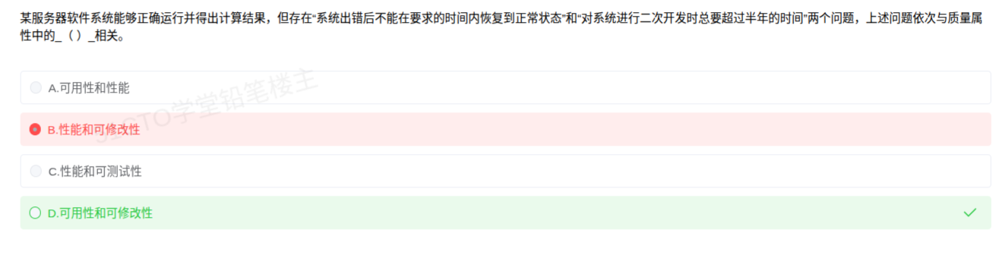

# 备考笔记：软件质量属性——可用性与可修改性辨析

## 一、题目

> 某服务器软件系统能够正确运行并得出计算结果，但存在"系统出错后不能在要求的时间内恢复到正常状态"和"对系统进行二次开发时总要超过半年的时间"两个问题，上述问题依次与质量属性中的（ ）相关。
> A. 可用性和性能
> B. 性能和可修改性
> C. 性能和可测试性
> D. 可用性和可修改性

**答案：D. 可用性和可修改性**

## 二、知识点：软件质量属性——可用性与可修改性辨析

### 1. 核心原理

软件质量属性（又称"非功能特性"）刻画系统在功能之外所表现出的能力，是架构评估的核心对象。常见六大类：

- **性能（Performance）**：系统的响应时间、吞吐量、资源利用率。
- **可用性（Availability）**：系统在需要时可用的比例，重点是故障检测、恢复与修复能力（MTTR、MTBF）。
- **可修改性（Modifiability）**：对系统进行修改、扩展、二次开发的**代价与难易程度**。
- **可测试性（Testability）**：通过测试发现缺陷、验证需求的难易程度。
- **易用性（Usability）**、**安全性（Security）**、**可伸缩性（Scalability）**、**互操作性（Interoperability）** 等。

本题两处描述的共同点是"**能力欠缺导致代价高**"，而非"快慢"：

1. "系统出错后不能在要求的时间内恢复到正常状态"——描述的是**故障后的恢复能力**，归入**可用性**。
2. "对系统进行二次开发时总要超过半年"——描述的是**变更（修改/扩展）的代价**，归入**可修改性**。

### 2. 关键公式/规则

| 属性 | 关注点 | 题干关键词 | 典型战术/度量 |
| --- | --- | --- | --- |
| 性能 | 时间与吞吐 | 响应时间、吞吐量、并发数、延迟 | 资源调度、并发、缓存；RT、QPS |
| 可用性 | 故障恢复与持续服务 | 出错后恢复、不能长时间停工、容灾 | 心跳、Ping/Echo、冗余、检查点回滚；MTTR、MTBF |
| 可修改性 | 变更代价 | 二次开发、修改/扩展、耦合高、改动大 | 限制依赖、抽象、信息隐藏、发布-订阅；变更成本 |
| 可测试性 | 测试难易 | 测试用例、可观测、可断言 | 记录/回放、接口分离、内置监控 |
| 安全性 | 抗攻击与保密 | 越权、加密、审计、防篡改 | 认证、授权、加密、审计追踪 |
| 易用性 | 用户使用效率 | 学习成本、操作步骤 | 帮助、引导、界面一致性 |

### 3. 解题步骤

1. 找第一处描述的关键词："出错后不能在要求时间内恢复正常" → **恢复能力** → 锁定**可用性**。
2. 找第二处描述的关键词："二次开发超过半年" → **变更代价大** → 锁定**可修改性**。
3. 排除法：选项含"性能""可测试性"的直接剔除（性能讲响应/吞吐，可测试性讲测试难易，题干均未涉及）→ 选 **D**。

## 三、易错点

1. **"恢复正常"不等于性能**：性能关注响应时间、吞吐量；"恢复"是可用性范畴。选 A、C 的根因就是把"恢复慢"错当成"性能差"。
2. **"开发耗时长"不是性能**：开发/改造的耗时反映的是**变更代价**，属于可修改性，而非系统运行速度。
3. **可修改性 vs 可维护性**：软考语境中，可修改性（Modifiability）强调"变更、扩展的代价"；可维护性（Maintainability）更宽，含纠错、适应、完善、预防性维护。本题问"二次开发"更贴合可修改性。
4. **一次题干对应多个属性**：本题是"依次对应"型，必须严格按描述顺序匹配，顺序错则选项错。

## 四、扩展延伸

- **质量属性与架构评估**：ATAM、SAAM 等方法的核心即围绕这些质量属性做场景化权衡（如可用性↑往往带来性能↓）。
- **可用性战术**：错误检测（Ping/Echo、心跳、异常监控）、错误恢复（冗余、检查点/回滚、投票）、错误预防（进程监控、服务下线）。
- **可修改性战术**：限制模块依赖、引入抽象、信息隐藏、使用中间件/发布-订阅降低耦合。
- **现实类比**：可用性 ≈ "停电后备用电源多快恢复供电"；可修改性 ≈ "改一处功能要动多少代码、返工多少天"。

## 五、错题归档

| 题号 | 题型 | 考点 | 难度 | 掌握度 |
| --- | --- | --- | --- | --- |
| 69 | 单选题 | 软件质量属性（可用性 / 可修改性）辨析 | 易 | 待复习 |

## 六、相关图片

原题截图：`./images/69-质量属性-可用性与可修改性辨析.png`（由用户上传的原题图复制改名而来）

