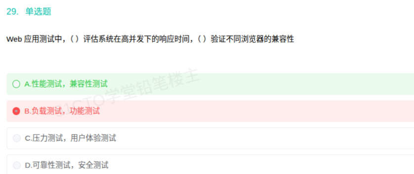

# 备考笔记：Web 应用测试类型——性能测试与兼容性测试辨析

## 一、题目

> Web 应用测试中，（ ）评估系统在高并发下的响应时间，（ ）验证不同浏览器的兼容性。
> A. 性能测试，兼容性测试
> B. 负载测试，功能测试
> C. 压力测试，用户体验测试
> D. 可靠性测试，安全测试

**答案：A. 性能测试，兼容性测试**

## 二、知识点：Web 应用测试类型辨析

### 1. 核心原理

Web 应用测试按关注点可分为多个类型，本题考察"从描述反推测试类型"：

- **性能测试（Performance Testing）**：评估系统在特定条件下的**响应时间、吞吐量、资源占用**等性能指标，是包含负载测试、压力测试在内的一类测试的统称。"高并发下的响应时间"正是性能测试的典型目标。
- **负载测试（Load Testing）**：在**预期负载**下运行，验证系统是否满足性能指标（性能测试的子类）。
- **压力测试（Stress Testing）**：施加**超过正常范围的负载**，寻找系统瓶颈与崩溃点（性能测试的子类）。
- **兼容性测试（Compatibility Testing）**：验证软件在**不同运行环境**（浏览器、操作系统、分辨率、数据库等）下能否正常工作。"不同浏览器的兼容性"直接对应此项。
- 对照项：功能测试验证功能是否正确；可靠性测试关注长期稳定运行；安全测试关注抗攻击与权限。

### 2. 关键公式/规则

| 测试类型 | 关注点 | 题干关键词 |
| --- | --- | --- |
| 性能测试 | 响应时间、吞吐量、资源占用（统称） | 高并发下的响应时间、QPS、并发数 |
| 负载测试 | 预期负载下是否达标（性能子类） | 一定并发量、预期负载、性能指标 |
| 压力测试 | 超负荷找瓶颈与崩溃点（性能子类） | 极限、超负荷、崩溃点、瓶颈 |
| 兼容性测试 | 不同环境下可否正常运行 | 不同浏览器、不同操作系统、跨平台 |
| 功能测试 | 功能是否正确 | 功能点、业务流程、输入输出 |
| 可靠性测试 | 长期稳定运行 | 长时间运行、故障率、MTBF |
| 安全测试 | 抗攻击与权限控制 | 漏洞、越权、加密、注入 |

### 3. 解题步骤

1. 抓第一空关键词"**高并发下的响应时间**" → 关注的是性能指标（响应时间）→ 归入**性能测试**。
2. 抓第二空关键词"**不同浏览器的兼容性**" → 关注的是运行环境差异 → 归入**兼容性测试**。
3. 直接选 **A**；B 的"功能测试"、C 的"用户体验测试"、D 的"可靠性/安全测试"均与"浏览器兼容"无关。

## 三、易错点

1. **误选负载测试/压力测试**：负载测试、压力测试都是性能测试的**子类**；题干只说"高并发下响应时间"，未限定"预期负载"或"超负荷崩溃点"，因此最贴切的是上位概念**性能测试**（本题官方答案为 A）。
2. **误把"兼容性"当功能测试**：功能测试只验证功能对错，不区分运行在哪个浏览器。
3. **混淆兼容性测试与用户体验测试**：用户体验测试关注易用性、交互感受，与"能否在浏览器中运行"不是一回事。
4. **可靠性测试≠性能测试**：可靠性强调长期运行的稳定与低故障率，不针对响应时间。

## 四、扩展延伸

- **性能测试体系**：性能测试（统称）⊃ 负载测试（验证能力是否达标）+ 压力测试（找极限与崩溃点），另外还有并发测试、吞吐量测试、稳定性/疲劳测试。
- **兼容性测试维度**：浏览器兼容（Chrome/Edge/Firefox/Safari）、操作系统兼容、分辨率/设备兼容、数据兼容、向前向后兼容。
- **常用工具**：性能——JMeter、LoadRunner；浏览器兼容——Selenium Grid、BrowserStack、多浏览器真机/虚拟机。
- **现实类比**：性能测试 ≈ 体检测"跑得多快、能扛多少"；兼容性测试 ≈ 同一双鞋在不同地形上是否合脚。

## 五、错题归档

| 题号 | 题型 | 考点 | 难度 | 掌握度 |
| --- | --- | --- | --- | --- |
| 70 | 单选题 | Web 应用测试类型（性能测试 / 兼容性测试）辨析 | 易 | 待复习 |

## 六、相关图片

原题截图：`./images/70-Web应用测试类型-性能测试与兼容性测试辨析.png`（由用户上传的原题图复制改名而来）

