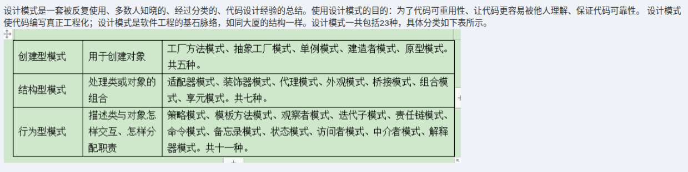

# 备考笔记：设计模式-23种模式三分类清单

## 一、题目

> 设计模式是一套被反复使用、多数人知晓的、经过分类的、代码设计经验的总结。使用设计模式的目的：为了代码可重用性、让代码更容易被他人理解、保证代码可靠性。设计模式使代码编写真正工程化；设计模式是软件工程的基石脉络，如同大厦的结构一样。设计模式一共包括 23 种，具体分类如下表所示。
>
> | 分类 | 用途 | 具体模式 |
> | --- | --- | --- |
> | **创建型模式** | 用于创建对象 | 工厂方法模式、抽象工厂模式、单例模式、建造者模式、原型模式。**共五种**。 |
> | **结构型模式** | 处理类或对象的组合 | 适配器模式、装饰器模式、代理模式、外观模式、桥接模式、组合模式、享元模式。**共七种**。 |
> | **行为型模式** | 描述类与对象怎样交互、怎样分配职责 | 策略模式、模板方法模式、观察者模式、迭代子模式、责任链模式、命令模式、备忘录模式、状态模式、访问者模式、中介者模式、解释器模式。**共十一种**。 |

**答案：正确（√）**

解析：教材按**用途**把 GoF 的 **23 种设计模式**划分为**三大类**——**创建型 5 种、结构型 7 种、行为型 11 种**（5 + 7 + 11 = 23）。题干对分类名称、用途与模式清单的表述与教材口径一致，故该说法**正确**。

- 判据只有一条：**"创建 / 结构 / 行为"看的是"解决什么问题"**——创建对象、组合结构、还是对象间交互与职责分配。
- 常见误读：把三类模式数量记混（如以为结构型也是 5 种），或把**桥接、组合、享元**误归到创建型。

## 二、知识点：设计模式-23种模式三分类清单

### 1. 核心原理

**设计模式**是对**反复出现的设计问题**的**可复用解决方案总结**，目的是**代码可重用、易理解、保证可靠性**，让代码编写**工程化**。

GoF 按**模式解决的问题（用途）**把 23 种模式分为**三大类**：

| 分类 | 解决的问题 | 数量 |
| --- | --- | --- |
| **创建型（Creational）** | **怎样创建对象**：把对象的创建与使用解耦 | 5 |
| **结构型（Structural）** | **类/对象怎样组合**成更大的结构 | 7 |
| **行为型（Behavioral）** | **类/对象怎样交互、怎样分配职责** | 11 |

合计 **23** 种。

### 2. 关键公式/规则

**（1）三分类完整清单（本题核心，需背全）**

| 分类 | 数量 | 模式清单 |
| --- | --- | --- |
| **创建型** | **5** | 工厂方法、抽象工厂、单例、建造者、原型 |
| **结构型** | **7** | 适配器、装饰器、代理、外观、桥接、组合、享元 |
| **行为型** | **11** | 策略、模板方法、观察者、迭代子、责任链、命令、备忘录、状态、访问者、中介者、解释器 |

**（2）各模式一句话用途（速查）**

创建型（5 种）——"怎么把对象**造**出来"：

| 模式 | 一句话用途 |
| --- | --- |
| 工厂方法 | 定义创建对象的接口，**让子类决定实例化哪个类**，把对象的创建延迟到子类。 |
| 抽象工厂 | 提供**创建一系列相关或相互依赖对象**的接口，无需指定具体类。 |
| 单例 | 保证一个类**仅有一个实例**，并提供一个全局访问点。 |
| 建造者 | 把复杂对象的**构建与表示分离**，用同样的构建过程分步装配出不同表示。 |
| 原型 | 用原型实例指定要创建对象的种类，通过**拷贝（克隆）原型**来创建新对象。 |

结构型（7 种）——"怎么把类和对象**拼**成更大的结构"：

| 模式 | 一句话用途 |
| --- | --- |
| 适配器 | 把一个类的接口**转换**成客户希望的另一个接口，让接口不兼容的类能一起工作。 |
| 桥接 | 把**抽象部分与实现部分分离**，使二者可以独立变化。 |
| 组合 | 把对象组合成**树形结构**表示"部分—整体"层次，客户使用单个对象与组合对象的方式一致。 |
| 装饰器 | **动态地给对象添加额外职责**，是比继承更灵活的功能扩展方式。 |
| 外观 | 为子系统中的一组接口提供**统一的高层接口**，简化子系统的使用。 |
| 享元 | **共享大量细粒度对象**，减少对象数量以节省内存开销。 |
| 代理 | 为其他对象提供**代理以控制对原对象的访问**（如延迟加载、权限控制）。 |

行为型（11 种）——"对象之间怎么**打交道、谁负责**"：

| 模式 | 一句话用途 |
| --- | --- |
| 策略 | 定义一系列**可相互替换的算法**并各自封装，使算法独立于使用它的客户而变化。 |
| 模板方法（类行为） | 定义算法的**骨架**，把某些步骤**延迟到子类**实现，子类可重定义部分步骤。 |
| 观察者 | 建立**一对多依赖**，目标状态变化时自动**通知并更新**所有观察者。 |
| 迭代子（迭代器） | **顺序访问**聚合对象中的元素，**不暴露其内部表示**。 |
| 责任链（职责链） | 让多个对象都有机会处理请求，请求**沿链传递**直到被处理，避免发送者与接收者耦合。 |
| 命令 | 把**请求封装成对象**，从而可用不同的请求参数化客户，并支持撤销、排队与日志。 |
| 备忘录 | 在**不破坏封装**的前提下捕获并保存对象内部状态，以便之后**恢复**。 |
| 状态 | 对象在**内部状态改变时改变其行为**，看起来像换了一个类。 |
| 访问者 | 封装作用于对象结构中**各元素的操作**，可在不改变元素类的前提下**新增操作**。 |
| 中介者 | 用**中介对象封装同事对象间的交互**，使对象间不必显式相互引用而松散耦合。 |
| 解释器（类行为） | 给定一种**语言，定义其文法的表示**，并定义解释器来解释该语言中的句子。 |

**（3）数量速记**

$$5（创建） + 7（结构） + 11（行为） = 23$$

助记口令：**"创建五、结构七、行为十一"**；也可记 **"5-7-11 公差 2"** 的递增（5、7、11，实为 5→7→11，末项跳 4）。

**（4）分类判据（归属口诀）**

| 若模式在解决…… | 归入 |
| --- | --- |
| "对象怎么**生**出来" | 创建型 |
| "对象/类怎么**拼**起来" | 结构型 |
| "对象之间怎么**打交道、谁负责**" | 行为型 |

### 3. 解题步骤

1. **判断题型**：本题为**教材原文陈述/清单核对**（判断正误或默写型）。
2. **抓口径**：GoF 23 种，按用途分**三类**，数量 **5 / 7 / 11**。
3. **逐项核对**：分类名（创建/结构/行为）、用途描述、模式清单**逐条对得上、无缺漏、无杜撰**。
4. **下结论**：题干表述**正确（√）**。

## 三、易错点

1. **三类数量记混**（最常错）：正确为**创建 5、结构 7、行为 11**，合计 23。易误记成"7-5-11"或"结构 5 种"。
2. **把"桥接、组合、享元"误归创建型**：三者都是**结构型**（处理类/对象组合），与"创建对象"无关。
3. **把"原型、单例"误当结构型**：二者是**创建型**——原型靠**克隆**创建、单例靠**控制实例化次数**创建。
4. **漏记"抽象工厂"或把"工厂方法/抽象工厂"当成一个**：二者是**并列的两个创建型模式**，需分别记住。
5. **行为型多记/少记**：行为型**11 种**最多，易漏掉**迭代子、解释器、中介者、备忘录**等；"迭代子模式"即**迭代器模式**的另一种写法。
6. **把设计模式与"架构风格"混为一谈**：设计模式是**类/对象级**的复用方案（23 种），架构风格是**系统级**的结构组织方式（如管道-过滤器、黑板等，可对照 [59-架构风格-黑板风格与管道过滤器.md](59-架构风格-黑板风格与管道过滤器.md)）。

## 四、扩展延伸

- **分类与"目的"的对应**：创建型→**解耦对象的创建与使用**；结构型→**通过继承/组合扩展结构**；行为型→**解耦对象间的交互与职责**。
- **易混对照**：**工厂方法**（一个产品族下延迟到子类创建）vs **抽象工厂**（创建**一族**相关产品）；**适配器**（转接口，事后补救）vs **桥接**（抽象与实现分离，事前设计）。
- **五类创建型的创建方式**：工厂方法/抽象工厂=**多态式创建**；单例=**唯一实例**；建造者=**分步装配复杂对象**；原型=**克隆**。
- **与其它维度串联**：
  - 架构风格（系统级结构）见 [59-架构风格-黑板风格与管道过滤器.md](59-架构风格-黑板风格与管道过滤器.md)、[60-架构风格-五大类变式命题推演.md](60-架构风格-五大类变式命题推演.md)；
  - 面向对象类关系（泛化/聚合、耦合强度）见 [30-面向对象-泛化与聚合关系.md](30-面向对象-泛化与聚合关系.md)、[37-面向对象-类关系耦合强度排序.md](37-面向对象-类关系耦合强度排序.md)；
  - 设计内聚见 [38-软件设计-内聚类型辨析.md](38-软件设计-内聚类型辨析.md)。
- **现实类比**：把 23 种模式当成**装修工具的三层抽屉**——
  - **创建型抽屉（5 件）**：怎么"造"家具（工厂批量造、单例只造一件、原型照着样子克隆）；
  - **结构型抽屉（7 件）**：怎么"拼装"房间（适配器转接头、装饰器加装饰、代理当门卫、外观当前台）；
  - **行为型抽屉（11 件）**：房间"住起来"怎么协作（策略换方案、观察者通知、责任链逐级审批）。
  先看**要解决"造/拼/互动"哪类问题**，再去对应抽屉里找工具，这就是三分类的本质。

## 五、错题归档

| 题号 | 题型 | 考点 | 难度 | 掌握度 |
| --- | --- | --- | --- | --- |
| 系统分析师-软件工程 | 判断/默写 | 设计模式按用途三分类：**创建型 5 / 结构型 7 / 行为型 11，共 23 种**及完整清单 | 易 | 待复习 |
| 系统分析师-软件工程 | 单选 | 具体模式归属辨析（桥接/组合/享元属结构型；原型/单例属创建型） | 中 | 待复习 |

## 六、相关图片

原题截图：`./images/72-设计模式-23种模式三分类清单.png`（由用户上传的原题图复制改名而来）

