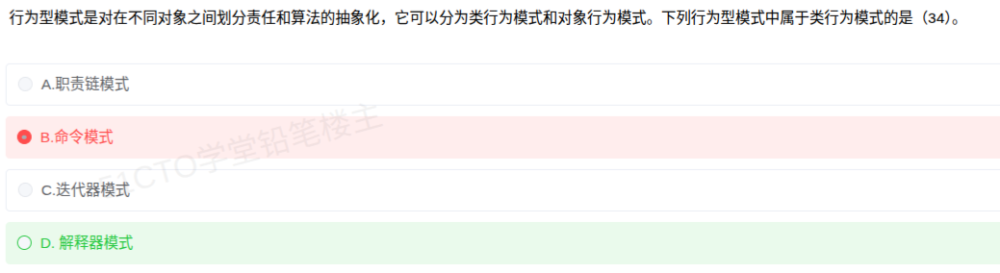

# 备考笔记：设计模式-类行为模式辨析

## 一、题目
> 行为型模式是对在不同对象之间划分责任和算法的抽象化，它可以分为类行为模式和对象行为模式。下列行为型模式中属于类行为模式的是 (34)。
> A. 职责链模式
> B. 命令模式
> C. 迭代器模式
> D. 解释器模式

**答案：D. 解释器模式**

## 二、知识点：设计模式-类行为模式辨析

### 1. 核心原理
行为型模式共 11 种，按"行为在类之间还是在对象之间分派"分为两类：

- **类行为模式（2 种）**：使用**继承**关系在**类**间分派行为，编译期即确定。仅 **解释器（Interpreter）、模板方法（Template Method）** 两种。
- **对象行为模式（9 种）**：使用**组合/聚合**关系在**对象**间分派行为，运行期可变。其余 9 种全部属于此类：职责链、命令、迭代器、中介者、备忘录、观察者、状态、策略、访问者。

记忆锚点：类行为模式只有"两个"
——**"解释模板"**（解释器 + 模板方法），其余都是对象行为。

### 2. 关键公式/规则
| 分类 | 机制 | 模式 |
| --- | --- | --- |
| 类行为模式（2） | 继承（类间） | 解释器、模板方法 |
| 对象行为模式（9） | 组合/聚合（对象间） | 职责链、命令、迭代器、中介者、备忘录、观察者、状态、策略、访问者 |

### 3. 解题步骤
1. 审题：问的是"类行为模式"还是"对象行为模式"。
2. 回忆口诀：类行为 = 解释器 + 模板方法，仅此两种。
3. 逐项比对：职责链、命令、迭代器均不在类行为清单中，只有"解释器"命中。

## 三、易错点
1. **职责链、命令、迭代器**等高频模式默认都往"对象行为"里放，见到它们出现在"类行为"题干中直接排除。
2. 混淆"结构型模式"的 Adapter（类结构型用继承）与行为模式的分类依据——行为型看**行为分派机制**。
3. 访问者模式容易误判为类行为（涉及类层次结构），实际是对象行为模式。
4. 类结构型模式（Adapter）与类行为模式（解释器、模板方法）分属结构型/行为型两个维度，不要混为一谈。

## 四、扩展延伸
- 类结构型模式同样只有 1 种：适配器（类形式）；其余 6 种结构型（代理、外观、组合、装饰、桥接、享元）为对象结构型。
- 三大类型数量：创建型 5 种（单例、原型、工厂方法、抽象工厂、建造者）、结构型 7 种、行为型 11 种。
- 记忆总口诀："**5-7-11，类行为只有解释模板，类结构只有适配器**"。
- 与本笔记关联：[72-设计模式-23种模式三分类清单](72-设计模式-23种模式三分类清单.md)。

## 五、错题归档
| 题号 | 题型 | 考点 | 难度 | 掌握度 |
| --- | --- | --- | --- | --- |
| 34 | 单选 | 行为型模式中类行为模式的辨析 | 易 | 待复习 |

## 六、相关图片
原题截图：`./images/73-设计模式-类行为模式辨析.png`（由用户上传的原题图复制改名而来）

