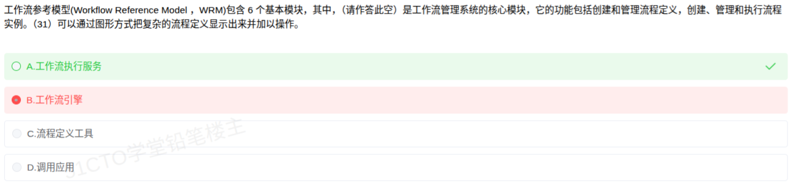

# 备考笔记：工作流参考模型 WRM 六大基本模块辨析

## 一、题目

> 工作流参考模型（Workflow Reference Model, WRM）包含 6 个基本模块，其中，（请作答此空）是工作流管理系统的核心模块，它的功能包括创建和管理流程定义，创建、管理和执行流程实例。（31）可以通过图形方式把复杂的流程定义显示出来并加以操作。
> A. 工作流执行服务
> B. 工作流引擎
> C. 流程定义工具
> D. 调用应用

**答案：A. 工作流执行服务**（第（31）空对应 C. 流程定义工具）

## 二、知识点：WRM 六大基本模块与功能辨析

### 1. 核心原理

WRM（工作流参考模型）由工作流管理联盟（WfMC）提出，用来描述工作流管理系统（WFMS）的通用体系结构，共含 6 个基本模块与 5 个接口。

6 个基本模块及其职责：

| 模块 | 职责 |
| --- | --- |
| **工作流执行服务（核心）** | WFMS 的**核心模块**。创建和管理流程定义，创建、管理和执行流程实例；为每个用户维护活动列表，并做任务提醒 |
| 工作流引擎 | 为流程实例提供**运行环境**，解释执行流程实例，即负责流程处理的软件模块（是执行服务的内部组件，可多个并存） |
| 流程定义工具 | 管理流程定义的工具，**通过图形方式**把复杂的流程定义显示出来并加以操作 |
| 客户端应用 | 以**请求方式**与工作流执行服务交互，是面向最终用户的界面（B/S 或 C/S 架构） |
| 调用应用 | 被工作流执行服务调用的应用（如电子文档处理），由工作流在执行中调用 |
| 管理监控工具 | 管理组织与参与者数据，监控流程实例状态（挂起、恢复、销毁），统计系统运行情况 |

关键结论：**核心是"工作流执行服务"而不是"工作流引擎"**。执行服务是面向外部的整体能力入口；引擎是执行服务内部真正"跑流程"的部件。

### 2. 关键公式/规则

| 名称 | 对应描述（题干关键词） |
| --- | --- |
| 工作流执行服务 | 核心模块、创建和管理流程定义、创建/管理/执行流程实例、活动列表与任务提醒 |
| 工作流引擎 | 运行环境、解释执行流程实例、负责流程处理 |
| 流程定义工具 | 图形方式显示与操作流程定义 |
| 客户端应用 | 以请求方式交互、面向最终用户的界面（B/S、C/S） |
| 调用应用 | 被工作流执行服务调用、完成流程实例中的具体任务 |
| 管理监控工具 | 组织和参与者数据管理、实例监控、统计分析 |

记忆口诀：**执行服务是枢纽，引擎跑流程，定义工具画流程，客户端给用户看，调用应用被调用，监控工具管全局。**

### 3. 解题步骤

1. 找关键词"**核心模块**"+"创建和管理流程定义，创建、管理和执行流程实例" → 对应**工作流执行服务**。
2. 排除干扰项"工作流引擎"：它的定义是"为流程实例提供运行环境、解释执行流程实例"，不含"创建和管理流程定义"。
3. 第（31）空关键词"**通过图形方式把复杂的流程定义显示出来并加以操作**" → 唯一对应**流程定义工具**。

## 三、易错点

1. **把"工作流引擎"误当核心模块**：这是本题最大陷阱。WRM 明确把"工作流执行服务"列为核心；引擎是执行服务的内部分解，只负责运行流程实例。
2. **混淆执行服务与引擎的职责边界**：执行服务面向外部（管理定义 + 管理/执行实例）；引擎面向内部（提供运行环境、解释执行实例）。
3. **把"图形化操作流程定义"误选为执行服务或引擎**：图形化建模是**流程定义工具**的专属能力。
4. **把"调用应用"当成客户端应用**：客户端应用由人来发起请求；调用应用是被执行服务调用的、完成具体任务的程序（如文档处理程序）。

## 四、扩展延伸

- **WfMC 五接口**：接口 1（流程定义交换，与流程定义工具对接）、接口 2/3（客户端应用接口）、接口 4（与其他 WFMS 互操作）、接口 5（管理监控接口）。
- **中间件视角**：WFMS 属于企业级中间件，常用于 OA 审批、BPM、EAI 等场景，与"企业应用集成"同属一类问题。
- **易混概念**：工作流（Workflow，强调流程自动化）vs 工作流管理系统（WFMS，实现工作流的软件系统）vs WRM（描述 WFMS 的参考架构，不是具体产品）。
- **现实类比**：WFMS 像一家餐厅——"执行服务"是大堂经理（接单、派单、管全流程），"引擎"是后厨流水线，"流程定义工具"是菜谱编辑器，"客户端应用"是点餐界面。

## 五、错题归档

| 题号 | 题型 | 考点 | 难度 | 掌握度 |
| --- | --- | --- | --- | --- |
| 71 | 单选题 | 工作流参考模型 WRM 六大基本模块与核心模块辨析 | 中 | 待复习 |

## 六、相关图片

原题截图：`./images/76-工作流参考模型-六大基本模块辨析.png`（由用户上传的原题图复制改名而来）

