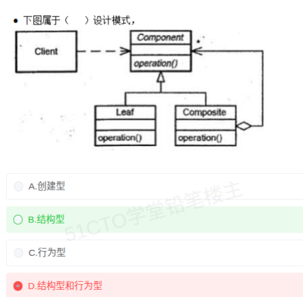

# 备考笔记：组合模式-类图识别与结构型分类

## 一、题目
> 下图属于（ ）设计模式。
> （类图：Client 虚线关联 Component（含 operation()）；Leaf、Composite 继承 Component；Composite 一端带菱形的聚合线指向 Component，形成递归包含）
> A. 创建型
> B. 结构型
> C. 行为型
> D. 结构型和行为型

**答案：B. 结构型**

解析：类图三大特征直接锁定**组合模式（Composite）**——①抽象构件 Component 统一定义 `operation()`；②叶子 Leaf 与容器 Composite 均继承 Component；③Composite 通过聚合（菱形端）持有 Component 集合，形成"**部分—整体**"的递归树形结构。组合模式在 GoF 23 种模式中属于**结构型**（处理类/对象的组合方式），不是创建型，也不因"容器要递归执行操作"而被归入行为型或"双重"类别。GoF 三分类是**互斥单选**，不存在"既 X 又 Y"的模式。

## 二、知识点：组合模式-类图识别与结构型分类

### 1. 核心原理
组合模式（Composite）将对象组织成树形结构，使**客户端以一致的方式处理单个对象（Leaf）和组合对象（Composite）**，即"整体—部分"的层次结构统一操作。结构型模式的共同使命是关注**类和对象如何组合成更大的结构**（继承 + 组合），而非对象间职责分配（行为型）或对象创建机制（创建型）。

类图角色对应：
| 类图元素 | 模式角色 |
| --- | --- |
| Component | 抽象构件：统一接口 `operation()` |
| Leaf | 叶子构件：无子节点，实现 operation() |
| Composite | 容器构件：聚合 Component 集合，operation() 中通常递归调用子构件 |
| Client ——▷ Component | 客户端面向抽象编程（依赖倒置） |

识别锚点：**"父类—两个子类 + 容器子类聚合父类自身（自包含/递归聚合）"** 是组合模式的标志性画法。

### 2. 关键公式/规则
| 名称 | 表达式 |
| --- | --- |
| GoF 三分类（互斥） | 创建型 5：Abstract Factory、Builder、Factory Method、Prototype、Singleton |
| 结构型 7 | Adapter 适配器、Bridge 桥接、**Composite 组合**、Decorator 装饰器、Facade 外观、Flyweight 享元、Proxy 代理 |
| 行为型 11 | Chain of Responsibility、Command、Interpreter、Iterator、Mediator、Memento、Observer、State、Strategy、Template Method、Visitor |
| 组合模式意图 | 树形"部分—整体"层次；客户端统一对待 Leaf 与 Composite |
| 判定口诀 | 见"递归聚合自身 + 叶子/容器并列" → Composite → 结构型 |

### 3. 解题步骤
1. 读类图找锚点：继承体系 + **Composite 聚合 Component 自身** → 判定组合模式。
2. 回归分类定义：组合解决"对象如何组成树形结构" → 结构型。
3. 排除干扰项：创建型管 new（本图无工厂/原型痕迹）；行为型管交互与职责分配；GoF 分类互斥，"结构型和行为型"这种叠加选项本身即错。

## 三、易错点
1. 误选 D"结构型和行为型"：认为 Composite 容器要"递归执行行为"就兼具行为型——错。GoF 23 种模式每一种只属一个类别，考试中"既…又…"选项通常为陷阱。
2. 只看名字"Composite=组合"就联想"组合关系"，与结构型中"组合（复用）优先于继承"的设计原则混淆——模式名对应的是树形组合结构。
3. 与装饰器（Decorator）类图混淆：两者都有"抽象父类 + 包装类聚合父类"，区别是装饰器每个装饰类**各自**聚合 Component（层层包裹、同层不并列），组合模式是 Leaf 与 Composite **并列继承**、仅 Composite 聚合 Component。
4. 与享元/代理等结构型混淆：看到聚合线就套结构型时，仍需先确认具体模式名，题目可能追问模式识别而非分类。

## 四、扩展延伸
- 组合模式典型应用：文件系统（文件=Leaf，文件夹=Composite）、GUI 容器（控件树）、组织机构树；与迭代器模式配合遍历树。
- 对比记忆结构型"三兄弟"类图：**Composite**（容器聚合父类，树形）、**Decorator**（包装类聚合父类，链形）、**Proxy**（代理与实体同实现接口，一对一直接引用）。
- 分类总表见 [72-设计模式-23种模式三分类清单.md](72-设计模式-23种模式三分类清单.md)；类行为模式辨析见 [73-设计模式-类行为模式辨析.md](73-设计模式-类行为模式辨析.md)。
- 现实类比：公司组织架构——员工（Leaf）与部门（Composite）都是"组织单元"（Component），部门里可再塞部门，汇报流程对老板（Client）完全透明。

## 五、错题归档
| 题号 | 题型 | 考点 | 难度 | 掌握度 |
| --- | --- | --- | --- | --- |
| 待补 | 单选 | 组合模式类图识别 + GoF 三分类归属（结构型） | 中 | 薄弱 |

## 六、相关图片
原题截图：`./images/77-组合模式-类图识别与结构型分类.png`（由用户上传的原题图复制改名而来）

