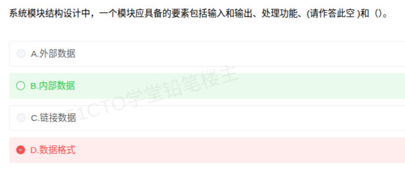

# 备考笔记：模块四要素辨析

## 一、题目
> 系统模块结构设计中，一个模块应具备的要素包括输入和输出、处理功能、（请作答此空）和（）。
> A. 外部数据
> B. 内部数据
> C. 链接数据
> D. 数据格式

**答案：B. 内部数据**

解析：软件工程经典结论——**模块四要素**：①输入和输出；②处理功能；③**内部数据**；④程序代码。本题两个空依次填"内部数据"和"程序代码"。前两者是模块的**外部特性**（对外可见的接口与功能），后两者是模块的**内部特性**（内部持有与实现）。"外部数据""链接数据""数据格式"都不是模块要素的标准提法，其中"数据格式"最像正确答案（描述数据的东西），但它是接口消息的属性，不是模块本身的构成要素。

## 二、知识点：模块四要素辨析

### 1. 核心原理
模块（Module）是"具有输入和输出、处理功能、内部数据、程序代码四要素的程序单位"，是模块化设计与结构化设计（SD）的基本构件：

| 要素 | 类别 | 含义 |
| --- | --- | --- |
| 输入和输出 | 外部特性 | 模块与调用者/被调用者之间的信息传递（接口） |
| 处理功能 | 外部特性 | 模块"做什么"，完成的功能逻辑 |
| 内部数据 | 内部特性 | 模块内部使用并保存的属于它自己的数据（局部变量等） |
| 程序代码 | 内部特性 | 实现该模块功能的程序体 |

四要素两两分组记忆：**对外的"接口 + 功能"，对内的"数据 + 代码"**——这正是"信息隐蔽"原则的雏形：外部特性稳定，内部特性可自由替换。

### 2. 关键公式/规则
| 名称 | 表达式 |
| --- | --- |
| 模块四要素 | 输入输出 + 处理功能 + 内部数据 + 程序代码 |
| 外部/内部二分 | 外部特性 = {输入输出, 处理功能}；内部特性 = {内部数据, 程序代码} |
| 判定口诀 | 四要素口诀："进出功能、内部数据、代码" |
| 模块独立性度量 | 内聚（模块内部联系强度）+ 耦合（模块之间联系强度），高内聚低耦合 |

### 3. 解题步骤
1. 识别考点：题干出现"一个模块应具备的要素" → 直接回忆模块四要素。
2. 两空连填：四要素中已给出"输入和输出、处理功能"，剩余两个是"内部数据、程序代码"，本空选内部数据。
3. 排除干扰：数据格式、外部数据、链接数据均不在四要素清单内 → 选 B。

## 三、易错点
1. 误选 D"数据格式"：数据格式属于接口中传递消息的规约（协议层面），描述的是"输入输出"的样子，不是模块的构成要素——审题要问"模块由什么构成"，而不是"接口里有什么"。
2. 误选 A"外部数据"：模块对外只交换"输入和输出"，"内部数据"才属于模块自身；"外部数据"是干扰性的对偶词。
3. 第二空误填：另一空是"程序代码"，不是"算法""处理过程"等自造词。
4. 与构件（Component）混淆：构件是比模块更高层的部署/复用单元（接口 + 实现 + 部署），四要素是传统结构化设计中"模块"的定义，别用构件术语作答。

## 四、扩展延伸
- 四要素与"信息隐蔽"（Parnas）：调用方只依赖外部特性（接口+功能），内部数据与代码被封装——由此发展出抽象数据类型、面向对象封装。
- 相关考点的连续链：模块四要素（是什么）→ 耦合/内聚（好不好，见 [38-软件设计-内聚类型辨析.md](38-软件设计-内聚类型辨析.md)）→ 模块结构图/HIPO 图（怎么画）→ 构件与接口（现代形态，见 [22-构件接口不兼容的常见问题.md](22-构件接口不兼容的常见问题.md)）。
- 结构化设计（SD）口诀回顾：高内聚、低耦合、控制范围 ≤ 判断范围、扇入扇出适度。
- 现实类比：一个"模块"像一家门店——门口的接待与业务（输入输出 + 处理功能）是顾客看得到的；店内账本（内部数据）和操作手册（程序代码）是店内的，外人不必知道。

## 五、错题归档
| 题号 | 题型 | 考点 | 难度 | 掌握度 |
| --- | --- | --- | --- | --- |
| 待补 | 单选 | 模块四要素（内部数据 / 程序代码）辨析 | 易 | 薄弱 |

## 六、相关图片
原题截图：`./images/78-模块四要素辨析.png`（由用户上传的原题图复制改名而来）

