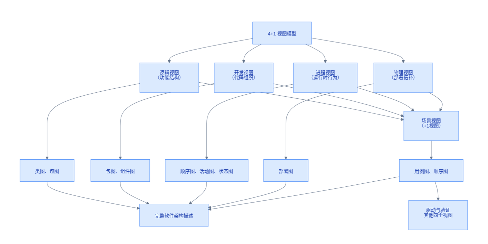

# 备考笔记：4+1视图模型-五视图职责辨析

## 一、题目
> 本条来自**知识点图**（无原题选项）。图为 4+1 视图模型结构：顶层"4+1 视图模型"分为逻辑视图（功能结构）、开发视图（代码组织）、进程视图（运行时行为）、物理视图（部署拓扑）四个视图，外加场景视图（+1 视图）；四个视图分别映射到类图/包图、包图/组件图、顺序图/活动图/状态图、部署图，场景视图对应用例图/顺序图并驱动与验证其他四个视图，最终汇聚成完整软件架构描述。

**核心结论：4+1 = 逻辑视图 + 开发视图 + 进程视图 + 物理视图 + 场景视图（+1）**。常考问法速答：
| 题干关键词 | 答案视图 |
| --- | --- |
| 功能需求、面向最终用户/分析人员 | 逻辑视图 |
| 代码组织、软件配置管理、面向程序员 | 开发视图 |
| 运行时行为、并发/同步/性能、面向系统集成人员 | 进程视图 |
| 部署拓扑、软硬件映射、面向系统工程师 | 物理视图 |
| 用例驱动、验证其他视图（"+1"） | 场景视图 |

## 二、知识点：4+1视图模型-五视图职责辨析

### 1. 核心原理
4+1 视图模型由 Kruchten（克鲁希滕）提出，是 RUP（统一过程）描述软件架构的标准方法：从**四个不同角度**（逻辑、开发、进程、物理）分别刻画架构，再用**场景视图（用例）作为"+1"**把四者串联——用例既驱动四个视图的设计，又验证四者之间的一致性，最终形成完整的软件架构描述。

| 视图 | 关注点 | 面向人员 | 主要 UML 图 |
| --- | --- | --- | --- |
| 逻辑视图 | 功能结构（系统"做什么"） | 最终用户、分析人员 | 类图、包图、对象图 |
| 开发视图 | 代码组织（模块/包的静态划分） | 程序员、配置管理 | 包图、组件图 |
| 进程视图 | 运行时行为（并发、同步、性能） | 系统集成人员 | 顺序图、活动图、状态图 |
| 物理视图 | 部署拓扑（软硬件映射） | 系统工程师 | 部署图 |
| 场景视图(+1) | 用例串联、驱动与验证 | 所有人员 | 用例图、顺序图 |

### 2. 关键公式/规则
| 名称 | 要点 |
| --- | --- |
| 4+1 构成 | 逻辑 + 开发 + 进程 + 物理 + 场景（+1） |
| "+1" 的地位 | 不是第五个平行视图，而是**核心**：用例驱动其余四视图并验证一致性 |
| 视图与角色配对 | 逻辑→用户；开发→程序员；进程→集成人员；物理→系统工程师 |
| 视图与 UML 配对 | 类/包图→逻辑；组件图→开发；顺序/活动/状态图→进程；部署图→物理；用例图→场景 |
| 记忆口诀 | 功能逻辑、代码开发、跑起来进程、放上去物理、用例串全场 |

### 3. 解题步骤
1. 圈题干关键词：功能/最终用户 → 逻辑；代码组织/程序员 → 开发；并发/性能/运行时 → 进程；部署/拓扑/节点 → 物理；驱动/验证/用例 → 场景(+1)。
2. 若给 UML 图反推视图：先按上表"视图与 UML 配对"落位（部署图→物理，组件图→开发，类图→逻辑）。
3. 辨析易混对：静态结构类（逻辑 vs 开发）看"功能结构"还是"代码组织"；动态行为类（进程 vs 物理）看"运行时行为"还是"部署映射"。

## 三、易错点
1. 混淆**逻辑视图 vs 进程视图**：逻辑是功能的静态划分（类/包）；进程是运行时的并发行为（线程/同步/性能）。见"并发、性能、同步"选进程。
2. 混淆**开发视图 vs 物理视图**：开发管"代码怎么分组件/包"，物理管"软件放到哪些节点（拓扑）"。见"部署图、网络节点"选物理。
3. 轻视"+1"：场景视图不是可选项或附属品，考试常问"哪个视图是核心/起驱动作用" → 场景视图（用例）。
4. UML 图配对张冠李戴：组件图属于**开发**视图（不是逻辑）；部署图属于**物理**视图；用例图属于**场景**视图。
5. 别与 ISO/IEEE 42010（原 IEEE 1471）架构描述标准、C4 模型等其他架构描述框架混淆——题干提 Kruchten/RUP/"4+1"时按本表作答。

## 四、扩展延伸
- 4+1 与 RUP 的关系：RUP 的架构文档（SAD）按 4+1 组织；用例驱动贯穿"需求→分析→设计"，可对照 [31-面向对象分析-建模过程.md](31-面向对象分析-建模过程.md) 和 [50-面向对象-用例模型与分析模型辨析.md](50-面向对象-用例模型与分析模型辨析.md)。
- 视图与质量属性关注点的映射：逻辑→功能正确性；开发→可维护性/可构建性；进程→性能与可伸缩性；物理→可用性/部署灵活性，呼应 [69-质量属性-可用性与可修改性辨析.md](69-质量属性-可用性与可修改性辨析.md)。
- 架构风格（风格层）与视图（描述层）互补：风格回答"用什么结构模式"，4+1 回答"如何多角度呈现"，参考 [59-架构风格-黑板风格与管道过滤器.md](59-架构风格-黑板风格与管道过滤器.md)。
- 现实类比：交付一栋大楼——户型功能图（逻辑）、施工组织图（开发）、水电与管线运行图（进程）、总平面选址图（物理），而"业主使用场景剧本"（场景）把四张图串起来验收。

## 五、错题归档
| 题号 | 题型 | 考点 | 难度 | 掌握度 |
| --- | --- | --- | --- | --- |
| 待补（知识点图） | 知识整理 | 4+1 视图模型：五视图职责、面向角色与 UML 图配对 | 中 | 待复习 |

## 六、相关图片
原图截图：`./images/79-4+1视图模型-五视图职责辨析.png`（由用户上传的知识图复制改名而来）

