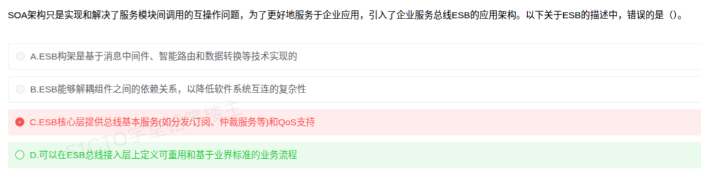

# 备考笔记：SOA-ESB总线分层与职责

## 一、题目
> SOA架构只是实现和解决了服务模块间调用的互操作问题，为了更好地服务于企业应用，引入了企业服务总线ESB的应用架构。以下关于ESB的描述中，错误的是 ( )。
> A. ESB架构是基于消息中间件、智能路由和数据转换等技术实现的
> B. ESB能够解耦组件之间的依赖关系，以降低软件系统互连的复杂性
> C. ESB核心层提供总线基本服务(如分发/订阅、仲裁服务等)和QoS支持
> D. 可以在ESB总线接入层定义可重用和基于业界标准的业务流程

**答案：D. 可以在ESB总线接入层定义可重用和基于业界标准的业务流程**

解析：ESB 逻辑上分为接入层、核心层与业务流程层。定义可重用、基于业界标准（如 BPEL）的业务流程属于**业务流程层**的职责；**接入层**只负责多种协议/应用的接入与适配，不负责流程编排，故 D 错误。A、B、C 均为 ESB 的标准表述。

## 二、知识点：SOA-ESB总线分层与职责

### 1. 核心原理
SOA 解决了服务模块间调用的互操作问题；ESB 在此基础上充当企业应用的"总线"，负责服务接入、消息路由、协议/数据转换与流程编排。ESB 逻辑上自下而上分为三层，每层职责固定，命题点就是"某个功能属于哪一层"。

### 2. 关键公式/规则
| 层次 | 核心职责 |
| --- | --- |
| 接入层 | 多协议接入与适配（HTTP/SOAP、JMS、FTP 等），把各类应用/组件接入总线 |
| 核心层 | 总线基本服务：消息分发/订阅、智能路由、消息转换与仲裁（中介）、安全等，并提供 QoS 支持 |
| 业务流程层 | 服务编排：定义可重用、基于业界标准（BPEL）的业务流程 |

### 3. 解题步骤
1. 记三层职责口诀：接入管"进"（协议适配），核心管"跑"（路由/转换/仲裁/QoS），流程层管"编排"（BPEL 业务流程）。
2. 题干问某层做什么，逐项对号入座。
3. 看到"业务流程定义"→ 只能是业务流程层；看到"协议/应用接入"→ 接入层；看到"分发/订阅、路由、仲裁、QoS"→ 核心层。

## 三、易错点
1. 误以为"业务流程"也是接入总线时顺便定义的 → 错，流程编排是独立的业务流程层职责（D 项陷阱就在"接入层"三字）。
2. 被"仲裁服务"这个陌生词吓住而误选 C → 仲裁即消息中介/路由决策，属核心层基本服务，表述正确。
3. 与网络的接入层/核心层（层次化网络设计）混淆 → ESB 分层是逻辑功能分层，与网络设备分层职责不同。

## 四、扩展延伸
- ESB 的技术支撑：消息中间件、智能路由、数据转换（对应选项 A）；其价值在于解耦组件依赖、降低互连复杂性（对应选项 B）。
- 微服务时代的对比常考：ESB 集中式总线（重、单点）→ 微服务去中心化治理（轻量网关 + 服务自治）。
- 相关笔记：[74-SOA服务建模-三阶段](74-SOA服务建模-三阶段.md)、[75-异构系统集成-总线架构选型](75-异构系统集成-总线架构选型.md)。

## 五、错题归档
| 题号 | 题型 | 考点 | 难度 | 掌握度 |
| --- | --- | --- | --- | --- |
| — | 单选-选错误项 | ESB 三层职责划分（业务流程编排属于业务流程层） | 中 | 薄弱 |

## 六、相关图片
原题截图：`./images/80-SOA-ESB总线分层与职责.png`（由用户上传的原题图复制改名而来）

