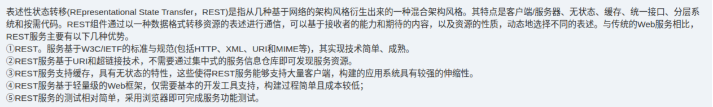

# 备考笔记：REST-优点与服务代理陷阱

## 一、题目
> 表述性状态转移（Representational State Transfer, REST）是指从几种基于网络的架构风格中衍生出来的一种混合架构风格。其特点是客户/服务器、无状态、缓存、统一接口、分层系统。REST 服务通过统一的资源格式来描述和表达，可以根据接收者的能力和期待的内容，以及资源的性质，动态地选择不同的表示。与传统 Web 服务相比，REST 服务主要具备以下几条优点：
> ① REST 服务基于 W3C/IETF 的标准与规范（包括 HTTP、XML、URI 和 MIME 等），其实现技术简单、成熟。
> ② REST 服务基于 URI 和超链接技术，不需要通过中间的服务器代理即可发现服务资源。
> ③ REST 服务支持缓存，无状态性使得 REST 服务能够支持大量客户端，构建的应用系统具有较强的伸缩性。
> ④ REST 服务是轻量级的 Web 框架，仅需要基本的开发工具支持，构建过程简单且成本较低。
> ⑤ REST 服务的测试相对简单，采用浏览器即可完成服务功能测试。

**答案：①~⑤ 均为 REST 的正确优点**（原题选项未截入；此类"选错误项"变式的坑几乎都出在②——翻转成"需要通过服务器代理/注册中心才能发现服务资源"即为错误项，那是传统 Web 服务 UDDI/WSDL 的发现机制）

## 二、知识点：REST-优点与服务代理陷阱

### 1. 核心原理
REST 由 Roy Fielding 提出，是一种**混合架构风格**，由客户/服务器、无状态、缓存、统一接口、分层系统等风格组合而成。资源用 URI 标识，客户端经统一接口（GET/POST/PUT/DELETE）直接访问，通过内容协商按"接收者能力和期待、资源性质"动态选择表述。软考命题点集中在：①REST 由哪些风格混合而成；②REST 与传统 Web 服务（SOAP/WSDL/UDDI）的优点对比。

### 2. 关键规则（五条优点 + 新旧对比）
| 记忆关键词 | REST 优点内容 |
| --- | --- |
| 标准成熟 | 基于 W3C/IETF 标准（HTTP、XML、URI、MIME），实现技术简单、成熟 |
| URI 直达 | 基于 URI 和超链接，**无需服务器代理**即可发现服务资源 |
| 伸缩性强 | 支持缓存；无状态性使服务能支持大量客户端，系统伸缩性强 |
| 轻量低成本 | 轻量级 Web 框架，仅需基本开发工具，构建过程简单、成本低 |
| 浏览器可测 | 测试相对简单，采用浏览器即可完成服务功能测试 |

| 对比项 | 传统 Web 服务（SOAP/WSDL/UDDI） | REST |
| --- | --- | --- |
| 服务发现 | 需 UDDI 注册中心（服务代理） | URI 直接寻址 + 超链接，无需代理 |
| 协议栈 | SOAP 重型协议栈 | 复用 HTTP 等成熟标准 |
| 状态 | 可维护会话状态 | 无状态 + 缓存，伸缩性强 |
| 重量/成本 | 重量级、开发部署复杂 | 轻量级、构建成本低 |

### 3. 解题步骤
1. 先判风格组成题：REST 混合了"客户/服务器、无状态、缓存、统一接口、分层系统"——选项里冒出别的风格（如事件订阅、管道-过滤器）即为干扰。
2. 再判优点题：对照五条关键词（标准成熟、URI 直达、缓存无状态伸缩、轻量低成本、浏览器可测）。
3. 见到"服务代理 / UDDI / 注册中心 / 需要先到注册中心查找"出现在 **REST** 语境 → 直接判错；出现在**传统 Web 服务**语境 → 正确。

## 三、易错点
1. 把②反向记忆成"REST 需要通过服务器代理发现资源" → 错，REST 基于 URI 直接寻址；"需要代理"是传统 Web 服务 UDDI 的方式。
2. 混淆"无状态"与"有状态"：REST 服务端不保存客户端会话状态，正是无状态 + 缓存才带来强伸缩性。
3. 把"动态选择不同的表示"当缺点或忽略 → 这是 REST 统一接口下的**内容协商**机制，属优点。
4. 误以为 REST 全面取代 SOAP 服务 → 传统 Web 服务在安全、事务（WS-Security、WS-Transaction）等企业级场景仍有优势，REST 胜在简单轻量。

## 四、扩展延伸
- 出处：Roy Fielding 2000 年博士论文《Architectural Styles and the Design of Network-based Software Architectures》。
- 统一接口四动作：GET（查）、POST（增）、PUT（改）、DELETE（删），配合 HTTP 状态码表达结果。
- HATEOAS（超媒体即应用状态引擎）：客户端通过响应中的超链接发现后续可执行操作，即②中"超链接技术"的延伸。
- 与本库相关笔记串联：REST 的轻量去中心化 ↔ [80-SOA-ESB总线分层与职责](80-SOA-ESB总线分层与职责.md) 的总线式集中编排；服务发现方式对照 [75-异构系统集成-总线架构选型](75-异构系统集成-总线架构选型.md)。

## 五、错题归档
| 题号 | 题型 | 考点 | 难度 | 掌握度 |
| --- | --- | --- | --- | --- |
| — | 单选-选错误项 | REST 混合架构风格组成 + 五条优点 + "无需服务代理"的服务发现方式 | 中 | 薄弱 |

## 六、相关图片
原题截图：`./images/82-REST-优点与服务代理陷阱.png`（由用户上传的原题图复制改名而来）

