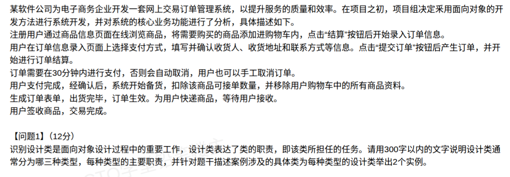
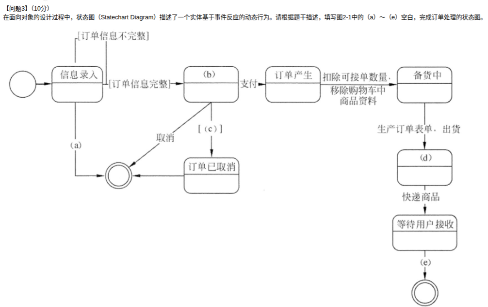

# 备考笔记：面向对象-设计类三类型与订单状态图

## 一、题目

> 某软件公司为电子商务企业开发一套网上交易订单管理系统，采用面向对象的开发方法。业务流程：注册用户通过**商品信息页面**在线浏览商品，加入**购物车**，点击"结算"按钮后开始录入订单信息；在**订单信息录入页面**选择支付方式，填写并确认收货人、收货地址和联系方式，点击"提交订单"按钮后产生订单，并开始进行订单结算；订单需要在 **30 分钟内进行支付**，否则会**自动取消**，用户也可以**手工取消**订单；用户**支付完成**，经确认后，系统开始**备货**，扣除该商品可接单数量，并移除用户购物车中的所有商品资料；生成订单表单，**出货完毕，订单生效**；为用户快递商品，等待用户接收；用户**签收商品**，交易完成。
>
> 【问题1】（12分）设计类通常分为哪三种类型？说明每种类型的主要职责，并针对题干案例为每种类型举出 2 个实例。
> 【问题2】（3分）给出活动图（Activity Diagram）与流程图（Flow Chart）的三个主要区别。
> 【问题3】（10分）根据题干描述，填写订单处理状态图中的 (a)~(e) 空白。

**答案：**

- **问题1**：**实体类、边界类、控制类**（职责与实例见下表）。
- **问题2**：① 活动图面向对象、流程图面向过程；② 活动图支持**并发**、流程图只能串行；③ 活动图活动间可传递**对象（对象流/泳道分工）**、流程图只有控制流。
- **问题3**：(a) **取消**；(b) **待结算（待支付）**；(c) **[超过30分钟未支付]**；(d) **订单生效**；(e) **签收商品**。

## 二、知识点：面向对象-设计类三类型与订单状态图

### 1. 核心原理

**设计类三类型**（面向对象设计 OOD 的核心产出，源自用例分析）：

| 类型 | 职责 | 识别方法（关键词） | 案例实例（任举2个） |
| --- | --- | --- | --- |
| **实体类**（Entity） | **保存和管理系统需要持久存储的信息**（"数据仓库"） | 抓**业务名词** | 注册用户、商品、订单、购物车 |
| **边界类**（Boundary） | **封装系统与外部参与者（人/外部系统）之间的交互**（"接待窗口"） | 抓**页面、界面、表单、接口** | 商品信息页面、订单信息录入页面、订单表单 |
| **控制类**（Control） | **封装业务逻辑与流程控制**，协调边界类与实体类（"业务经理"） | 抓**动词短语**（结算、处理、备货） | 订单结算、备货/出货处理、扣除商品可接单数量、订单取消处理 |

**活动图 vs 流程图三大区别**：

| # | 活动图 | 流程图 |
| --- | --- | --- |
| 1 | **面向对象**：描述业务用例的工作流，可用**泳道**区分职责归属 | **面向过程**：只描述处理步骤的先后顺序 |
| 2 | 支持**并发**（分叉/汇合 fork-join，多个活动同时进行） | 只能**顺序（串行）**执行 |
| 3 | 活动之间可以**传递对象（对象流）** | **没有对象概念**，箭头仅表示控制流 |

**状态图（Statechart）**：描述**一个实体**基于**事件反应**的动态行为 = 状态 + 迁移（**事件 [守护条件] / 动作**）。填空的本质是还原"订单"对象的生命周期。

### 2. 关键公式/规则

**状态图填空答案对照**（本题 (a)~(e)）：

| 空 | 位置 | 答案 | 依据（题干原话） |
| --- | --- | --- | --- |
| (a) | 信息录入 → 终态 | **取消** | 录入未完成时放弃（手工取消） |
| (b) | 提交订单后、支付前 | **待结算（待支付）** | "提交订单后产生订单，并开始进行订单结算""30分钟内进行支付" |
| (c) | (b) → 订单已取消 的守护条件 | **[超过30分钟未支付]** | "订单需要在30分钟内进行支付，否则会自动取消" |
| (d) | 备货中 --生成订单表单，出货--> (d) | **订单生效** | "生成订单表单，出货完毕，订单生效" |
| (e) | 等待用户接收 → 终态 | **签收商品** | "用户签收商品，交易完成" |

**规则**：指向取消的迁移通常有**两条**——**手工取消（事件"取消"）** + **超时自动取消（守护条件 [超过30分钟未支付]）**；守护条件必须写在**方括号 [ ]** 中。

### 3. 解题步骤

1. **问题1**：先默写三类职责模板句 → 再回题干"扫名词、扫页面、扫动词"各挑 2 个：名词（用户/商品/订单）→实体类；页面（商品信息页面/订单信息录入页面）→边界类；动词短语（结算/备货/扣除可接单数量）→控制类。
2. **问题2**：背"**并发、面向对象（泳道）、对象流**"三板斧，逐条对比作答。
3. **问题3**：盯住**订单**这一个主角，按题干时间线排状态序列：信息录入 → 提交订单（待结算）→ 支付 → 备货 → 出货（订单生效）→ 快递（等待接收）→ 签收（终态）；再看图上每个空白的**入边/出边**：入边=进入该状态的事件，出边=触发迁移的事件或 [守护条件]；取消有两条路：手工"取消"+ [超时未支付]。

## 三、易错点

1. **实例不"取自题干"**：三类实例必须从案例描述里找（页面、名词、动词短语）；自己编"UserDao""OrderService"之类实现细节不给分。
2. **实体类与数据库表混淆**：实体类职责是"**保存系统需要持久存储的信息**"，不是"管理数据库/操作表"。
3. **控制类写成名词**：控制类对应**业务逻辑/流程**，用动词短语表达（订单结算、备货处理），写成"订单"就成实体类了。
4. **(b) 写成"订单已产生"**：图中 (b) 是**提交订单之后、支付之前**的状态，应为**待结算/待支付**；"订单产生"是图中支付后的状态，别混。
5. **(c) 漏方括号或写成事件**：它是要**自动取消的条件**，规范写法 **[超过30分钟未支付]**；且它与"手工取消"是**两条不同迁移**，别合并。
6. **(d) 自造状态名**：题干原话是"出货完毕，**订单生效**"，答"已出货""出货完成"容易丢分——填空尽量用题干原词。
7. **(e) 写成"交易完成"**："交易完成"是到达**终态**的整体描述，(e) 处的触发事件是**签收商品**。
8. **活动图区别答不全**：最核心是**并发**，阅卷按点给分，三条都要答；只答"泳道"不算完整区别。

## 四、扩展延伸

- **UML 动态图分工**（连考高频）：**状态图**=单个对象的状态迁移（一物一生）；**活动图**=跨对象的工作流（一事流程）；**顺序图**=按时间轴的消息交互；**通信图**=按对象结构组织的消息。看到"某实体基于事件反应的动态行为"→状态图。
- **设计类 ↔ MVC 类比**：边界类≈View（交互）、控制类≈Controller（调度）、实体类≈Model（数据）。分析阶段的三版型（«entity»/«boundary»/«control»）与设计阶段一致，是从用例 realized 到类图的桥梁。
- **状态图规范细节**：初态实心黑圆、终态牛眼（双圈）；迁移格式"**事件 [守护条件] / 动作**"；自身迁移（如本题 [订单信息不完整] 原地重来）画自环。
- **现实类比**：餐厅点餐——**边界类**=服务员/点餐屏（对客交互），**控制类**=厨师长（调度做菜流程），**实体类**=菜单、账本（存信息）；状态图=外卖订单从"待支付→备货中→配送中→已签收"的一生。

## 五、错题归档

| 题号 | 题型 | 考点 | 难度 | 掌握度 |
| --- | --- | --- | --- | --- |
| 软件设计师-下午试题三 | 大题问答 | 设计类三类型职责与题干实例识别（实体/边界/控制） | 中 | 待复习 |
| 软件设计师-下午试题三 | 大题问答 | 活动图与流程图三大区别（并发/面向对象/对象流） | 易 | 待复习 |
| 软件设计师-下午试题三 | 大题填空 | 状态图填空-订单生命周期建模（事件[守护]规范） | 中 | 待复习 |

## 六、相关图片

原题截图：`./images/85-面向对象-设计类三类型与订单状态图.png`（由用户上传的原题图复制改名而来）

