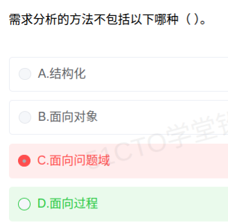

# 备考笔记：需求分析方法-三类清单辨析

## 一、题目
> 需求分析的方法不包括以下哪种（）。
> A. 结构化
> B. 面向对象
> C. 面向问题域
> D. 面向过程

**答案：D. 面向过程**

## 二、知识点：需求分析方法-三类清单辨析

### 1. 核心原理
软考教材中，需求分析方法的标准分类为**三大类**：
1. **结构化分析方法（SA，Structured Analysis）**：面向数据流，自顶向下分解。工具：数据流图（DFD）、数据字典（DD）、E-R 图、状态转换图、加工逻辑说明。
2. **面向对象分析方法（OOA，Object-Oriented Analysis）**：以对象/类为中心建模。产物：用例模型、分析类模型、状态模型等。
3. **面向问题域的分析方法（PDOA，Problem Domain Oriented Analysis）**：源自 Michael Jackson 的问题框架（Problem Frames），强调先理解**问题域本身的本质**，再谈解域方案。

**"面向过程"不属于需求分析方法**——它是**程序设计范式/开发方法**（以过程/函数为中心组织代码，典型如结构化程序设计），归入设计实现阶段的思想，而不是需求获取与分析阶段的建模方法。

### 2. 关键公式/规则

| 名称 | 内容 |
| --- | --- |
| 需求分析方法清单 | 结构化分析（SA）、面向对象分析（OOA）、面向问题域分析（PDOA） |
| 排除项 | 面向过程（属于设计/编程范式，非需求分析方法） |
| SA 核心工具口诀 | DFD + DD + E-R 图 + 状态转换图 |
| OOA 核心产物 | 用例模型、类模型（对象模型）、状态模型 |

### 3. 解题步骤
1. 先默写需求分析方法三件套：**SA、OOA、PDOA**。
2. 与选项比对，凡是清单之外又属于"开发范式"的词（面向过程、面向数据结构设计等）即为"不包括"项。
3. 遇到"面向问题域"这类生僻词不要慌——**教材明确将其列为需求分析方法**，反而是熟悉的"面向过程"要设防。

## 三、易错点
1. **误选 C 的根因**：对"面向问题域（PDOA）"陌生，凭直觉认为它不是正规方法；而"面向过程"耳熟能详，反而放松警惕。
2. 混淆"方法层次"：面向过程/面向对象既可以指编程范式，也可指设计方法，但**需求分析方法的标准命名**只有 SA、OOA、PDOA 三类。
3. 注意审题方向："不包括"类题目要选**不属于**的那项，别惯性选"属于"项。

## 四、扩展延伸
- PDOA/问题框架：由英国 Michael Jackson 提出，将问题域划分为问题框架类型（如信息显示、控制行为、工件变换等），是需求工程中"先问题后方案"的代表。
- 对比记忆：设计方法才谈**面向过程设计（SP 法：自顶向下、逐步求精、模块化）**与面向对象设计（OOD）。
- 相关既有笔记：50-面向对象-用例模型与分析模型辨析、31-面向对象分析-建模过程。

## 五、错题归档
| 题号 | 题型 | 考点 | 难度 | 掌握度 |
| --- | --- | --- | --- | --- |
| — | 单选 | 需求分析方法分类（PDOA 属于、面向过程不属于） | 易 | 薄弱 |

## 六、相关图片
原题截图：`./images/88-需求分析方法-三类清单辨析.png`（由用户上传的原题图复制改名而来）

