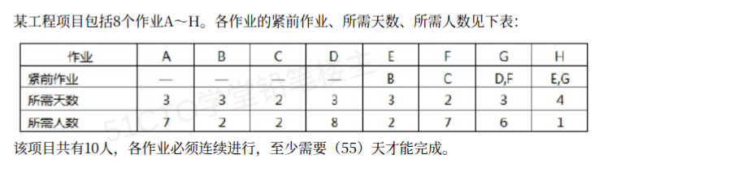

# 备考笔记：项目管理-资源约束工期计算

## 一、题目
> 某工程项目包括 8 个作业 A～H。各作业的紧前作业、所需天数、所需人数见下表。
> 该项目共有 10 人，各作业必须连续进行，至少需要（　）天才能完成。
> A. 11　　B. 12　　C. 13　　D. 14

| 作业 | A | B | C | D | E | F | G | H |
| --- | --- | --- | --- | --- | --- | --- | --- | --- |
| 紧前作业 | — | — | — | — | B | C | D，F | E，G |
| 所需天数 | 3 | 3 | 2 | 3 | 3 | 2 | 3 | 4 |
| 所需人数 | 7 | 2 | 2 | 8 | 2 | 7 | 6 | 1 |

**答案：B. 12 天**

## 二、知识点：资源受限的最短工期

### 1. 核心原理
工期由两个条件共同决定：**紧前作业关系**和**人员上限**。

先只看紧前作业关系，得到**关键路径**。关键路径是所有路径中最长的一条。它给出工期的**理论下界**。

再看人员上限。若并行作业的人数之和超过 10 人，就必须错开时间。错开会让工期变长。所以真实工期 = 关键路径下界，再被人员上限向上顶。

本题两步的结论：
- 关键路径是 C→F→G→H，长度 2+2+3+4 = **11 天**。
- 人员上限 10 人，11 天排不下，最终工期 **12 天**。

### 2. 关键公式/规则

| 名称 | 内容 |
| --- | --- |
| 作业最早开始时间 | 所有紧前作业都完成的最早时刻 |
| 关键路径 | 从起点到终点最长的路径，长度即工期下界 |
| 人员约束 | 任一时刻，正在进行的作业人数之和 ≤ 10 |
| 连续进行 | 作业一旦开始就不能中断，必须连续做到结束 |
| 冲突作业对 | 人数之和大于 10 的两个作业，不能同时进行 |

本题的冲突作业对（人数之和 > 10）：
- A(7)+D(8)=15、A(7)+F(7)=14、A(7)+G(6)=13
- D(8)+F(7)=15、D(8)+G(6)=14、F(7)+G(6)=13

注意：A、D、F、G 这四个"用人大户"两两都不能并行。它们只能各自搭配人少的小作业（B、C、E、H）。

### 3. 解题步骤
1. 先算关键路径，得到工期下界。本题下界是 11 天。
2. 列出冲突作业对，找出哪些作业不能并行。
3. 让冲突作业串行占用人员，并给小作业填缝。
4. 逐步计时，得到真正的工期。

一个最优安排如下：

| 时间段（天） | 进行中的作业 | 人数合计 |
| --- | --- | --- |
| 0～2 | C(2人) + D(8人) | 10 |
| 2～3 | B(2人) + D(8人) | 10 |
| 3～5 | B(2人) + F(7人) | 9 |
| 5～8 | E(2人) + G(6人) | 8 |
| 8～11 | A(7人) + H(1人) | 8 |
| 11～12 | H(1人) | 1 |

读表要点：
- D 占 8 人，只能再搭 2 人的 C 或 B。
- F 必须等 C 完成。C 在 0～2 天做，F 最早第 2 天开始。但第 2 天 D 还没结束，D(8)+F(7)=15，超员。所以 F 只能从第 3 天开始。
- G 必须等 D 和 F 都完成，最早第 5 天开始，做到第 8 天。
- H 必须等 E 和 G 完成，从第 8 天做到第 12 天。
- A 没有紧前作业，但和 D、F、G 都冲突，只能被挤到第 8 天以后，做 8～11 天。

总工期 = 12 天。

**为什么 11 天不可能**：若要在第 11 天完工，H 必须第 7 天开始（H 需要 4 天）。H 要等 G 结束，所以 G 必须第 7 天结束、第 4 天开始。G 要等 F 结束，所以 F 必须第 4 天结束、第 2 天开始。但第 2 天 D 仍在进行，F(7) 与 D(8) 相加 15 人，超员。矛盾。所以 11 天做不到，12 天是最少值。

## 三、易错点
1. **只算关键路径就选 11**。这是最常见错法。关键路径只给了下界，没有考虑人员上限。
2. **忘记 A 也要做**。A 没有紧前作业，也没有紧后作业，容易被忽略。它占 7 人 3 天，必须排进工期。
3. **误以为小作业可以随便并行**。B、C、E、H 人少，但也要逐个检查每个时刻的总人数。
4. **把"必须连续进行"当摆设**。它禁止把作业拆成两段，所以不能"做 1 天、停 1 天、再做 1 天"。

## 四、扩展延伸
- 这类题叫**资源受限项目调度**（RCPSP，Resource-Constrained Project Scheduling Problem）。规模小的时候可以直接手排。
- 与之相反的一类题叫**资源平滑**：工期固定不变，只要求"至少需要多少人"。区别是：本题人数固定、求工期；资源平滑是工期固定、求人数。
- 对比记忆：如果人员充足，答案就是关键路径长度 11 天；一旦资源受限，答案只会 ≥ 11 天。
- 相关既有笔记：29-最小生成树与图中心选址（同属图论与网络规划计算）。

## 五、错题归档
| 题号 | 题型 | 考点 | 难度 | 掌握度 |
| --- | --- | --- | --- | --- |
| — | 单选 | 关键路径 + 人员上限约束下的最短工期（含无紧后作业 A） | 中 | 待复习 |

## 六、相关图片
原题截图：`./images/89-项目管理-资源约束工期计算.png`（由用户上传的原题图复制改名而来）

