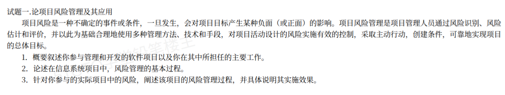

# 备考笔记：项目风险管理及其应用（论文写作要点）

## 一、题目

> **试题一 论项目风险管理及其应用**
>
> 项目风险是一种不确定的事件或条件，一旦发生，会对项目目标产生某种负面（或正面）的影响。项目风险管理是项目管理人员通过风险识别、风险估计和评价，并以此为基础合理地使用多种管理方法、技术和手段，对项目活动涉及的风险实施有效的控制，采取主动行动，创造条件，可靠地实现项目的总体目标。
>
> 请围绕"项目风险管理及其应用"论题，依次从以下三个方面进行论述。
>
> 1. 概要叙述你参与管理和开发的软件项目以及你在其中所担任的主要工作。
> 2. 论述在信息系统项目中，风险管理的基本过程。
> 3. 针对你参与的实际项目中的风险，阐述该项目的风险管理过程，并具体说明其实施效果。

**答案：论文题（无标准选项）——按"项目背景 → 理论论述 → 项目实践"三段结构作答，核心采分点为：①项目背景与本人工作；②风险管理的基本过程；③结合本项目实际风险，论述风险管理过程与实施效果。**

解析：题干已点明风险管理的几个关键动作——**风险识别、风险估计和评价、合理使用管理方法与技术手段、实施有效控制、采取主动行动**。第 2 问是**理论主体**，必须写出完整、成体系的**基本过程**（识别→估计→评价→规划/应对→监控）；第 3 问是**实践论证**，必须**落到本项目的具体风险**（不能只写通用风险），并给出**实施效果**。

## 二、知识点：项目风险管理

### 1. 核心原理

**项目风险** = 一种**不确定的事件或条件**，一旦发生，会对**项目目标**（范围、进度、成本、质量等）产生**负面（或正面）影响**。

三个要点：

1. 风险的本质是**不确定性**——"可能发生"而不是"一定发生"；同时它带有**后果**（对项目目标的影响）。
2. 风险**不等于问题**——**风险**是尚未发生的潜在事件，**问题**是已经发生的现实麻烦。风险管理强调**主动、提前**，而非事后补救。
3. 风险既可能**有害也可能有利**——传统风险管理聚焦"防范负面风险（威胁）"，现代项目管理也讲"利用正面风险（机会）"。

### 2. 关键公式/规则：风险管理的基本过程

风险管理是**持续、循环**的过程，教材标准划分为**五个基本过程**（立项/启动、识别、估计、评价、应对规划、监控），可归纳为"**识别 → 估计 → 评价 → 规划（应对） → 监控**"五步。

| 过程 | 主要工作 | 关键产物 |
| --- | --- | --- |
| **① 风险管理规划（立项）** | 确定风险管理的方法、角色职责、预算、时间安排与风险类别，形成风险管理计划 | 《风险管理计划》 |
| **② 风险识别** | 找出可能影响项目的风险，形成风险清单；方法有德尔菲法、头脑风暴、检查表、SWOT、访谈等 | **风险登记册（风险清单）** |
| **③ 风险估计（分析）** | 对每个风险估计**发生概率**与**后果影响**，可用定性或定量方法 | 风险概率/影响评定 |
| **④ 风险评价** | 综合概率与影响，对风险**排序、分级**，确定哪些是重点风险、哪些可接受 | 风险优先级排序 |
| **⑤ 风险应对规划** | 为每个重要风险制定应对策略与措施、责任人、触发条件 | 《风险应对计划》 |
| **⑥ 风险监控** | 跟踪已识别风险、识别新风险、执行应对措施、评估效果并调整 | 风险状态更新与控制 |

> 一句话抓手：**先规划 → 再识别 → 然后估计 → 评价排序 → 规划应对 → 全程监控**。其中"识别、估计、评价"常合称"**风险分析**"。

**风险应对的四种策略**（第 2、3 问都常用，务必背熟）：

| 策略 | 含义 | 举例（负面风险/威胁） |
| --- | --- | --- |
| **规避（回避）** | 改变方案，**消除风险来源** | 放弃采用不成熟的新技术，改用成熟框架 |
| **转移** | 把风险**后果和责任转给第三方** | 购买保险、外包、签订固定价合同 |
| **减轻（缓解）** | **降低概率或影响**，不消除风险 | 增加测试、关键人员备份、双机热备 |
| **接受（自留）** | 承认风险存在，**准备应急储备**，不主动措施 | 为小额风险预留时间/预算缓冲 |

> 补充：对**正面风险（机会）**，对应策略是**开拓、分享、提高、接受**。

### 3. 解题步骤（论文作答框架）

1. **摘要**：项目背景一句话 + 我的角色 + 本文论述的三点 + 效果。
2. **第 1 问（项目背景）**：选一个**真实、可讲清**的项目——名称、规模、业务与技术栈、我的岗位与职责（如项目经理兼风险管理负责人）。
3. **第 2 问（理论）**：写全**风险管理基本过程**（识别 → 估计 → 评价 → 规划应对 → 监控），逐一说明每个过程做什么、产出什么；并补充**四种应对策略**。**要点在于"过程完整 + 术语准确"**。
4. **第 3 问（结合项目）**：先列出**本项目的具体风险**（3~5 个，最好覆盖进度、技术、人员、需求/外部等不同类别），再按第 2 问的过程说明**如何识别、如何评估、如何应对、如何监控**，最后给出**实施效果**（量化）。
5. **收尾**：总结效果 + 不足与改进方向（**留一句反思**是高分特征）。

## 三、易错点

1. **第 2 问漏过程**：风险管理基本过程必须**完整**（识别→估计→评价→规划→监控）。漏掉"风险管理规划"或"监控"是常见失分点。注意区分**风险估计**（单个风险的概率与影响）与**风险评价**（对所有风险排序分级）。
2. **把"风险"写成"问题"**：风险是**未发生**的潜在事件，若只写"项目遇到了 X 困难并解决了"，就变成了问题管理，**跑题**。
3. **第 3 问不写具体风险**：题干要求"**针对你参与的实际项目中的风险**"，必须写**具体、可信**的风险（如"核心算法性能不达标""关键开发人员离职""第三方接口联调延期"），写成通用风险（如"需求变更风险""进度风险"）不给分。
4. **应对策略张冠李戴**：**规避 vs 减轻**最易混——**规避**是**消除风险来源**（改方案、不做这件事），**减轻**是**降低概率或影响**（做同一件事但加防护）。**转移**是"甩给别人"，**接受**是"认了并留应急储备"。
5. **只讲识别、不讲监控**：风险管理是**持续过程**，监控贯穿全程。缺监控会显得"纸上谈兵"。
6. **缺量化效果**：第 3 问要求"**实施效果**"，务必给数据（如"进度偏差控制在 5% 以内""关键风险 8 项全部化解"）。
7. **概念名称前后不统一**：同一概念始终用同一名称（本篇自定义指令也强调这点）。例如统一叫"风险估计"，不要一会儿"风险估算"、一会儿"风险分析"。

## 四、扩展延伸

- **风险管理与其他知识域的关系**：风险管理**贯穿全部项目过程**，与范围、进度、成本、质量、人力、沟通、采购等管理域**相互交叉**——如"进度风险"要靠进度管理措施缓解，"人员风险"要靠人力资源管理解决。
- **风险识别常用方法**：德尔菲法（专家背对背匿名多轮）、头脑风暴、检查表（基于历史项目）、SWOT 分析、访谈、假设分析、图解技术（因果图/鱼骨图）。**德尔菲法**是教材高频考点（强调匿名、多轮、专家意见收敛）。
- **定性 vs 定量风险分析**：**定性**用概率-影响矩阵排序（快、粗）；**定量**用蒙特卡洛模拟、决策树、敏感性分析、期望货币值（EMV）等（慢、精）。论文中一般先用定性排序、再对重点风险定量分析。
- **风险监控的触发与再评估**：设置**风险触发条件（阈值）**，一旦触发立即启动应对预案；同时定期**再评估**，因为风险会随项目推进而变化、消失或产生新风险。
- **风险与"应急储备"**：应对"接受"策略时通常预留**应急储备（时间/预算缓冲）**，这是成本管理与风险管理的交叠点。
- **论文得分要点（通用）**：**摘要简洁有力（约 300 字）、正文分点分段、理论与实践一一对应、有数据、有反思**。避免大段背诵教材、避免与题干无关的堆砌。
- **现实类比**：**风险识别**＝出门前查天气看预报；**风险估计/评价**＝判断"下不下雨、下多大、要不要紧"；**风险应对**＝带伞（减轻）、改天出行（规避）、买延误险（转移）、接受淋雨（接受）；**风险监控**＝路上时不时再看一次天。

## 五、错题归档

| 题号 | 题型 | 考点 | 难度 | 掌握度 |
| --- | --- | --- | --- | --- |
| 系统分析师-项目风险管理 | 论文 | 风险管理**基本过程**（识别→估计→评价→规划→监控）与各自产物 | 中 | 待复习 |
| 系统分析师-项目风险管理 | 论文 | 风险应对**四策略**（规避/转移/减轻/接受）及其区分 | 中 | 薄弱 |
| 系统分析师-项目风险管理 | 论文 | 结合项目具体风险论述管理过程与**实施效果** | 中 | 待复习 |

## 六、相关图片

原题截图：`./images/91-项目风险管理-论文写作要点.png`（由用户上传的原题图复制改名而来）

## 七、范文附录：论项目风险管理及其应用

> 说明：以下为按本题三段框架撰写的完整论文范文（约 2500 字），可直接作为考场仿写模板。第 2 问务必**写全风险管理基本过程**；第 3 问务必**列出本项目的具体风险**并逐一说明识别、评估、应对与监控；结尾留一句**不足与改进**。

### 摘要

2023 年 5 月，我参与了某城市商业银行"移动信贷风控系统"的建设工作，担任项目经理，全面负责项目的组织实施与风险管理。该系统面向个人消费信贷业务，需要在较短时间内完成需求多变、监管要求严格的系统建设，项目在进度、技术、人员与外部依赖等方面面临多重风险。本文结合该项目，首先简述了项目背景与本人承担的主要工作；其次论述了信息系统项目中风险管理的基本过程；最后针对本项目实际存在的风险，阐述了风险识别、估计、评价、应对与监控的过程，并具体说明了实施效果。通过规范的风险管理，项目主要风险均得到有效控制，进度偏差控制在 5% 以内，系统按期上线且未发生重大质量事故。

### 一、项目背景及本人承担的主要工作

2023 年 5 月，我所在公司承接了某城市商业银行"移动信贷风控系统"建设项目。该银行原有信贷审批依赖人工经验，审批周期长、风控标准不统一。新建系统旨在实现"申请—授信—审批—放款—贷后"全流程线上化与自动化，服务个人消费信贷业务，日均需处理申请数万笔，并满足金融监管对数据安全与合规的严格要求。

系统采用微服务架构，基于 Spring Cloud 构建，划分为申请受理、反欺诈、信用评分、额度授信、审批决策、贷后管理、报表分析等 10 个微服务；数据层采用 MySQL 集群，Redis 缓存会话与热点数据，引入消息队列实现审批流程异步解耦，并部署于符合金融监管要求的私有云环境。项目合同工期 10 个月，团队规模约 18 人（开发 11 人、测试 4 人、运维 2 人、业务 1 人）。

在该项目中，我担任项目经理，主要工作包括：一是组织需求调研与范围确认，制定项目总体计划与里程碑；二是负责项目团队的组建、任务分配与进度管控；三是牵头开展项目风险管理，组织风险识别、评估，制定并落实风险应对措施；四是统筹协调行方业务部门、监管方与开发团队的沟通，确保项目合规推进。项目于 2024 年 3 月按期上线，运行平稳。

### 二、信息系统项目中风险管理的基本过程

项目风险是一种不确定的事件或条件，一旦发生，会对项目目标产生某种负面（或正面）的影响。项目风险管理是通过风险识别、风险估计和评价，并以此为基础合理地使用多种管理方法、技术和手段，对项目涉及的风险实施有效控制、采取主动行动，从而可靠地实现项目总体目标的过程。在信息系统项目中，风险管理的基本过程包括以下五个环节。

**1. 风险管理规划。** 确定风险管理的方法、角色与职责、预算、时间安排和风险类别，形成《风险管理计划》。这是风险管理的"行动纲领"，明确"由谁、在何时、用什么方法"管风险。

**2. 风险识别。** 运用德尔菲法、头脑风暴、检查表、SWOT 分析、访谈等方法，找出可能影响项目目标的风险，形成**风险登记册（风险清单）**。风险识别不是一次性的，应贯穿项目全过程并持续更新。

**3. 风险估计。** 对已识别的每个风险，估计其**发生概率**和**可能产生的影响（后果）**，可采用定性或定量的方法。

**4. 风险评价。** 综合风险的概率和影响，对各风险进行**排序和分级**，确定哪些是必须重点管控的风险、哪些可以接受，为制定应对措施提供依据。

**5. 风险应对规划。** 针对重要风险制定应对策略与具体措施，明确责任人和触发条件。常用的应对策略有四种：**规避**（改变方案、消除风险来源）、**转移**（通过保险、外包、合同将风险后果与责任转给第三方）、**减轻**（降低风险发生概率或减轻其影响）、**接受**（承认风险存在并预备应急储备）。

**6. 风险监控。** 在项目全过程中跟踪已识别的风险、识别新出现的风险、执行风险应对措施、评估措施效果并适时调整。风险监控贯穿项目始终，是风险管理形成闭环的关键。

上述过程并非线性一次性完成，而是**循环往复、动态调整**的——随着项目推进，旧风险可能消解，新风险会不断出现，因此必须持续迭代。

### 三、结合项目论述风险管理的实践

#### （一）本项目的主要风险

在项目启动阶段，我组织团队与行方业务人员、技术骨干共同识别出本项目的主要风险，并将其分类登记，其中重点风险包括：

**一是需求变更风险。** 金融监管政策与行方业务规则在项目期间可能调整，导致需求频繁变更。
**二是技术风险。** 反欺诈与信用评分模型对实时性和准确性要求高，存在性能不达标的风险。
**三是进度风险。** 合同工期仅 10 个月，且须通过监管验收，进度压力大。
**四是人员风险。** 核心风控算法工程师稀缺，一旦离职将严重影响项目。
**五是外部依赖风险。** 系统需对接行方核心系统与第三方征信接口，接口联调进度不可控。
**六是合规与数据安全风险。** 涉及大量个人金融数据，须满足监管的数据安全与合规要求。

#### （二）风险估计、评价与应对

我们对上述风险逐一**估计概率与影响**，并用概率-影响矩阵进行**评价排序**，将"技术风险""人员风险""进度风险"列为**高优先级**重点管控，"需求变更""外部依赖""合规风险"列为中优先级。针对不同风险，分别采用了不同的应对策略：

对**技术风险**，采用**减轻**策略：在项目初期安排原型验证与性能预研，提前对风控模型进行压力测试，必要时采用成熟框架降低实现难度；同时预留 2 周技术攻关缓冲。
对**人员风险**，采用**减轻 + 转移**策略：为关键岗位配置 A/B 角色与知识留档，核心算法文档化；将部分非核心开发外包，通过合同约定交付责任。
对**进度风险**，采用**减轻 + 接受**策略：采用迭代式开发，优先交付高优先级功能；设置里程碑检查点，关键路径任务每日跟踪；并预留应急时间储备。
对**需求变更风险**，采用**接受 + 减轻**策略：与行方约定需求基线，变更走正式评审流程，小变更纳入下一迭代，重大变更评估工期后执行。
对**外部依赖风险**，采用**转移 + 减轻**策略：在合同中明确接口联调的责任与时点，提前与三方协调联调窗口，并准备接口模拟环境以便并行开发。
对**合规与数据安全风险**，采用**规避 + 减轻**策略：引入数据脱敏、加密传输与权限控制机制，严格按监管要求设计，并邀请合规部门参与关键评审。

#### （三）风险监控

项目期间，我建立了**风险登记册的动态更新机制**与**每周风险例会制度**：每周跟踪风险状态、复核概率与影响变化、检查应对措施落实情况，并识别新风险；对高优先级风险设置**触发条件（阈值）**，一经触发立即启动预案。例如，当"核心算法工程师提出离职意向"这一触发条件出现时，我们立即启动人员备份预案，由 A/B 角色快速接手，保证了工作连续性。

#### （四）实施效果

通过规范、持续的风险管理，本项目取得了良好效果：**一是风险整体可控**，识别出的 6 类主要风险中，5 类得到有效化解或控制，未发生因风险失控导致的重大事故；**二是进度偏差小**，项目整体进度偏差控制在 5% 以内，按期通过行方验收并上线；**三是质量与合规有保障**，系统上线后未发生重大质量与数据安全事件，顺利通过监管检查；**四是团队稳定**，关键岗位通过 A/B 角色与知识留档，避免了人员流动造成的交付中断，行方对项目成果给予高度认可。

### 四、总结

本文结合"移动信贷风控系统"项目，首先简述了项目背景与本人工作；其次论述了信息系统项目中风险管理的基本过程，即风险管理规划、风险识别、风险估计、风险评价、风险应对规划与风险监控；最后针对本项目在需求、技术、进度、人员、外部依赖和合规等方面的具体风险，阐述了风险识别、评估、应对与监控的全过程及实施效果。实践证明，**规范、持续、闭环的风险管理是项目成功的重要保证**。不足之处在于，本项目对风险的定量分析（如蒙特卡洛模拟）应用较少，主要依赖定性评估，后续将引入更成熟的定量分析工具，进一步提高风险判断的准确性。
